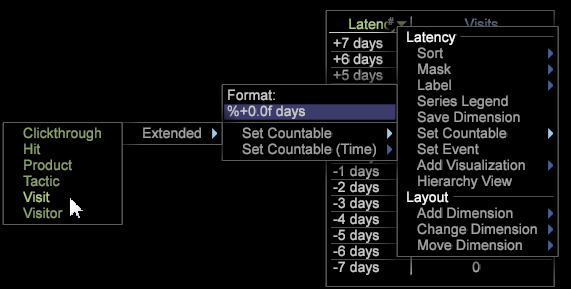

# Latenzanalyse{#latency-analysis}

{{eol}}

Mit der Latenzvisualisierung können Sie das latente Kundenverhalten innerhalb einer bestimmten Anzahl von Tagen vor oder nach dem Eintreten eines Ereignisses nach einer Kampagne oder einem anderen Ereignistyp oder Zeitraum analysieren.

Die **[!UICONTROL Latency]** Mit der Visualisierung können Sie eine Metrik festlegen, um das Verhalten vor, während oder nach dem Eintreten eines Ereignisses zu identifizieren und dessen Auswirkungen auf das Kundenverhalten zu bestimmen. Beispielsweise können Sie die Effektivität einer Marketing-Kampagne identifizieren, indem Sie den Umsatz eine Woche nach Eintreten eines Ereignisses anzeigen. Alternativ können Sie das Kundenverhalten in einer Woche vor dem Ereignis als Grundlage für die Auswirkungen eines Ereignisses auf das Verhalten anzeigen.

Mithilfe der Latenzvisualisierung können Sie die Zeitdimension von Tag, Stunde, Woche oder einem anderen Zeitraum ändern, um sie zu besuchen, durch sie zu klicken, zu treffen oder einer anderen zählbaren Dimension zuzuordnen.

**Einrichten der Latenzanalyse**

1. Öffnen Sie einen Arbeitsbereich und klicken Sie mit der rechten Maustaste [!DNL Visualization] > [!DNL Latency].

1. Wählen Sie im Menü die Anzahl der Tage aus, die auf Latenzereignisse analysiert werden sollen. 

1. Klicken Sie mit der rechten Maustaste auf die **[!UICONTROL Latency]** Titel, um das Menü zu öffnen.

   * Verwenden der **[!UICONTROL Set Countable]** festlegen, legen Sie eine zählbare Dimension wie Besuch, Clickthrough, Treffer und andere fest.
   * Verwenden der **[!UICONTROL Set Countable (Time)]** eine Zeitdimension wie Tag, Stunde, Woche, Tag der Woche und Stunde des Tages festlegen.

   

1. Ändern Sie die Latenzvisualisierung.

   Klicken Sie mit der rechten Maustaste auf die **[!UICONTROL Latency]** -Kopfzeile zur Auswahl von Menüoptionen, um Countables und Dimensionen zu ändern, eine neue Beschriftung zu erstellen oder andere Einstellungen auszuwählen oder zu ändern.
