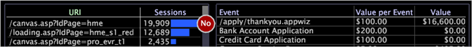
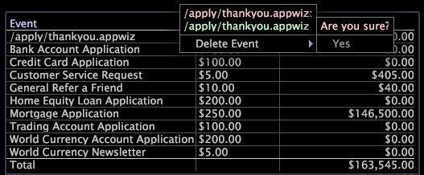

# Wertlegenden{#value-legends}

Eine Wertlegende zeigt definierte Wertereignisse an.

Die Wertelegende wird nur in HBX und [!DNL Site] Anwendungen konfiguriert, kann aber auch für andere Anwendungen konfiguriert werden. Weitere Informationen erhalten Sie bei Adobe Consulting Services.

In HBX und [!DNL Site]wird ein Wertereignis als Sitzung definiert, die einen Geschäftswert generiert hat. Beispielsweise können die Ereignisdatensätze, die mit bestimmten Seitenansichten verknüpft sind (z. B. eine Danksagungsseite für die Bestellung oder eine Antragsabschlussseite), Wertereignisse für ein Unternehmen darstellen.

Mit Wertereignissen können Sie die von der Website generierte Wertschöpfung messen und nachverfolgen. Sie können den Geschäftswert in Dollar für jedes Ereignis bewerten und Fragen wie die folgenden beantworten:

* Welcher ist der rentabelste Pfad durch die Website?
* Welche verweisende Stelle oder welche Kampagne hat den meisten Wert generiert?

Für jedes Ereignis zeigt die Legende den Einheitenwert des Ereignisses (Wert pro Ereignis) und den durch das Ereignis generierten Gesamtwert an. Mit der Legende können Sie Wertereignisse definieren und ändern und ihnen Einheitenwerte zuweisen.

In der folgenden Tabelle sind die Metriken zu Wertereignissen aufgeführt.

| Metrik | Beschreibung |
|---|---|
| Konversion | Der Prozentsatz der Sitzungen, die einen Geschäftswert generiert haben |
| Wert | Der generierte Geschäftswert insgesamt in Dollar |
| Durchschn. Wert | Der durchschnittliche Geschäftswert, der pro Sitzung in Dollar generiert wurde |

Sie können einfach alles, was Besucher auf der Website tun, als Wertereignis definieren: Senden einer Kundendienstanfrage, Ausfüllen einer Anwendung, Anzeigen eines Inhalts oder Abschluss eines Kaufs. Jedes Wertereignis entspricht einem Benutzer, der auf eine bestimmte Seite oder einen bestimmten Seitensatz auf der Website zugreift, und ist mit einem Geschäftswert in Dollar verknüpft. Sie können beispielsweise davon ausgehen, dass jeder Benutzer, der die Seite &quot;Vielen Dank für Ihren Einkauf&quot;aufruft, eine Beitragsmarge von durchschnittlich 20 USD erzielt. Sie würden ein Wertereignis für diese Seite mit einem Wert von $20 definieren.

## Definieren neuer Wertereignisse {#section-2ea4d168336e4d2e98b22b636ed43853}

**So definieren Sie ein neues Wertereignis in HBX oder[!DNL Site]**

Wenn Sie ein Wertereignis erstellen, ziehen Sie Webseiten, die einen Wert darstellen, aus einer Visualisierung in eine Wertelegende.

1. Öffnen Sie eine Wertelegende.

   

1. Fügen Sie der Legende aus Prozesszuordnungen, URI-Seitentabellen oder Seitenhierarchieansichten Wertereignisse hinzu:

   * Ziehen Sie aus einer Prozesszuordnung Knoten aus der Prozesszuordnung in die Legende.
   * Drücken Sie in einer Tabelle der URI-Seite Strg+Alt und ziehen Sie eine Seite aus der Tabelle in die Legende.
   * Klicken Sie in der Seitenhierarchieansicht links neben einem Knoten (Ordner, Seite oder Gruppe) und ziehen Sie ihn auf die Legende.
   

   Ihr Mauszeiger zeigt das Wort &quot;Nein&quot; an, bis die Maus zur Legende gelangt.

1. Weisen Sie jeder Sitzung, für die das Ereignis eintritt, in der Wertesammlung einen Geschäftswert zu:

   1. Klicken Sie in der [!DNL Value per Event] Spalte auf die Zelle, die der Seite entspricht, die Sie als Wertereignis hinzugefügt haben.
   1. Geben Sie den Dollarbetrag für den Wert dieses Ereignisses ein und drücken Sie die Eingabetaste.
   

   Standardmäßig wird die URL der Seite, die Sie als Wertereignis definiert haben, in der Wertelegende angezeigt. Bei Bedarf können Sie auf diese URL in der Legende doppelklicken, um in den Bearbeitungsmodus zu wechseln und das Ereignis umzubenennen. Sie können den Wert eines bestimmten Ereignisses jederzeit bearbeiten. Der Data Workbench-Server führt automatisch eine Neuberechnung wertereignisbasierter Metriken wie Durchschnittswert und Konversion durch.

Nachdem Sie mindestens ein Wertereignis definiert haben, steht die Dimension &quot;Wertsegment&quot;zur Verwendung zur Verfügung. Diese Dimension stellt den Gesamtwert dar, den ein Besucher in allen Sitzungen generiert hat.

## Wertereignisse entfernen {#section-25cd90a859384ca183c0fc0998f888cf}

* Klicken Sie mit der rechten Maustaste auf das gewünschte Ereignis und klicken Sie auf **[!UICONTROL Delete Event]**.

   

>[!NOTE]
>
>Der Data Workbench-Server berechnet Metriken für den gesamten Datensatz, auf den das von Ihnen verwendete Profil zugreifen kann. Standardmäßig [!DNL Data Workbench Server] berechnet die Variable Metriken wie Wert, Wertereignisse, Durchschnittlicher Wert und Konversion für alle Daten im Analytics-Datensatz, auch wenn die Daten nicht aus derselben logischen Quelle stammen.

## Nach Microsoft Excel exportieren {#section-feaa7a8eb8124fafbc74169bebaed6d8}

Informationen zum Exportieren von Fenstern finden Sie unter [Exportieren von Fensterdaten](../../../../home/c-get-started/c-wk-win-wksp/c-exp-win-data.md#concept-8df61d64ed434cc5a499023c44197349).
