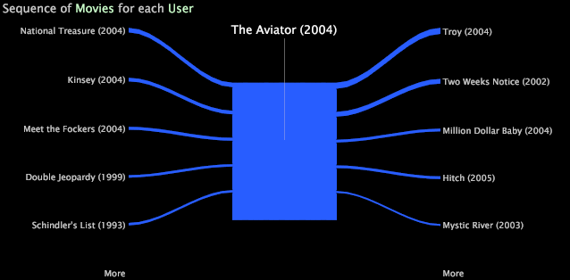
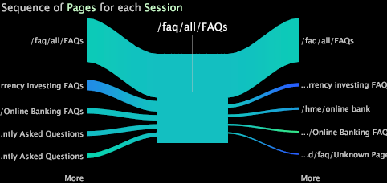

# Pfad-Browser{#path-browsers}

Mit einem Pfad-Browser können Sie die Sequenz analysieren, in der auf die Elemente einer bestimmten Dimension zugegriffen wurde.

Sie erstellen einen Pfad-Browser, indem Sie ein Element einer Dimension auf eine leere Pfad-Browser-Visualisierung ziehen und dort ablegen. Das Element, das Sie per Drag-and-Drop in den Pfad-Browser ziehen, wird zum Stamm des Pfad-Browsers. Der Pfad-Browser zeigt Pfade an, die durch den Stamm führen, sodass Sie die Sequenz der Elemente sehen können, auf die vor und nach dem Stamm zugegriffen wurde.

Der folgende Pfad-Browser zeigt die Abfolge von Filmen, die Betrachter vor und nach der Bewertung des Films *Der Aviator* bewertet haben, der die Wurzel des Pfad-Browsers ist. Jeder Filmname ist ein Element der Film-Dimension, die in einem Datensatz definiert ist, der aus Filmdaten besteht, die die Namen der Filme und die Anzeigereihenfolge der Betrachter dieser Filme enthalten.

Sie können Pfadbrowser erstellen, um die Sequenz anzuzeigen, in der auf Elemente einer beliebigen Dimension in Ihrem Datensatz zugegriffen wurde. Wenn Sie beispielsweise mit Website-Daten arbeiten, können Sie einen Pfad-Browser erstellen, der die Sequenz der Website-Seiten anzeigt, auf die vor und nach dem Stammordner für jede Sitzung zugegriffen wurde, in der der Stammordner angezeigt wurde, oder für jeden Site-Besucher, der den Stammordner angezeigt hat.

Jeder Pfadbrowser verfügt über eine zugehörige Basisdimension, Gruppendimension, Ebenendimension und Metrik, die Schlüssel zur Interpretation der im Pfadbrowser angezeigten Daten bereitstellen.

* **Basisdimension:** Wenn Sie ein Stammelement per Drag-and-Drop in den Pfadbrowser ziehen, ziehen Sie ein Element der Basisdimension in den Arbeitsbereich. Alle anderen Elemente, die in den Pfaden angezeigt werden, sind Elemente der Basisdimension. Sie können die Basisdimension ändern, indem Sie ein Element einer anderen Dimension in den Pfad-Browser ziehen und dort ablegen.
* **Ebenendimension:** Jede Dimension in Ihrem Datensatz hat eine zugeordnete Ebenendimension (auch als übergeordnetes Element bezeichnet). Die Ebenendimension für Ihren Pfadbrowser sollte mit der Ebenendimension (oder der übergeordneten Dimension) für die Basisdimension Ihres Pfadbrowsers übereinstimmen. Die Ebenendimension eines Pfad-Browsers ist aus zwei Hauptgründen wichtig:

   * Wenn Sie einem Pfad von einem grundlegenden Dimensionselement zum nächsten folgen, wechseln Sie von einem Dimensionselement auf der Ebene zum nächsten. Angenommen, Sie haben einen Pfad-Browser erstellt, der Seiten einer Website anzeigt. Jede Seite ist ein Element der Dimension Seite und die Ebenendimension für Seite ist Seitenansicht. Wenn Sie von einer Seite zur nächsten wechseln, wechseln Sie von einer Seitenansicht zur nächsten.
   * Wenn Sie einen Pfad von grundlegenden Dimensionselementen in einem Pfadbrowser auswählen, wählen Sie Daten für die entsprechenden Elemente der Ebenendimension aus. Die Auswahl umfasst immer die Elemente der Ebenendimension, die sich auf den Stamm beziehen, und wird durch Hinzufügen weiterer Elemente zum Pfad verfeinert. Wenn Sie beispielsweise einen Pfad von Seiten auswählen, z. B. Stamm > A > B, wählen Sie Daten für die Seitenansichten aus, die mit dem Stamm verknüpft sind, wobei die nächste Seite A und die nächste Seite B ist.

      Informationen zum Auswählen eines Pfads in einem Pfad-Browser finden Sie unter [Auswählen von Pfaden](../../../../home/c-get-started/c-analysis-vis/c-path-browsers/t-sel-paths.md#task-bf44d08c71954ef2adec4b82f840adeb). Weitere Informationen zu Auswahlen finden Sie unter [Auswahlen in Visualisierungen](../../../../home/c-get-started/c-vis/c-sel-vis/c-sel-vis.md#concept-012870ec22c7476e9afbf3b8b2515746).
   >[!NOTE]
   >
   >Der Pfad-Browser ignoriert die Elemente der Ebenendimension ohne zugehörige grundlegende Dimensionselemente. Diese Situation kann auftreten, wenn Sie einen Pfad-Browser aus einer Prozesszuordnung erstellen. Siehe [Erstellen von Pfad-Browsern](../../../../home/c-get-started/c-analysis-vis/c-path-browsers/c-create-path-browsers.md#concept-e120de6a740d4b6f98dda9e2b638f6ff).

* **Gruppendimension:** Die Gruppendimension bestimmt, wie die Elemente der Ebenendimension gruppiert werden, um die Pfade eines Pfadbrowsers zu bilden. Insbesondere dürfen die Dimensionselemente der Ebene, die mit einem einzelnen Pfad in einem Pfadbrowser verknüpft sind, nicht mehr als ein Element einer Gruppendimension umfassen.

   Um dies zu verstehen, sehen Sie sich ein Beispiel für die Verwendung von Webdaten an. Angenommen, die Basis-, Ebene- und Gruppendimensionen für Ihren Pfadbrowser sind &quot;Seite&quot;, &quot;Seitenansicht&quot;und &quot;Sitzung&quot;. Ein Pfad in Ihrem Pfadbrowser zeigt die Seitensequenz A > B > C an. Die Gruppendimension (Sitzung) teilt Ihnen mit, dass die Seitenansichten (Elemente der Seitenansichtsdimension), die mit der Seitensequenz A > B > C verknüpft sind, während einer einzelnen Sitzung aufgetreten sind. Es ist wichtig zu beachten, dass es mehrere Sitzungen geben kann, während denen Seitenansichten für die Seitensequenz A > B > C vorhanden waren. Daher stellt der Pfad, der die Seitensequenz A > B > C anzeigt, alle einzelnen Sitzungen dar, in denen die Seitenansichten für diese Sequenz aufgetreten sind.

* **Metrik**: Die Dicke des Pfads, der zu einem bestimmten Element führt, ist proportional zum Wert der Metrik für dieses Element. Je dicker die Pfade sind, desto größer sind die Metrikwerte als die dünnen Pfade.

Die Beschriftung in der oberen linken Ecke des Pfadbrowsers benennt die Basis- und Gruppendimensionen, die in der Visualisierung dargestellt werden. Der Name der Ebenendimension ist in der Pfadbrowser-Visualisierung nicht sichtbar. Die Beschriftung hat die Form &quot;Sequenz von *Basisdimensionsname*+s für jeden *Gruppendimensionsnamen*&quot;. Die Beschriftung Sequenz von Filmen für jeden Benutzer beispielsweise gibt an, dass die grundlegende Dimension &quot;Film&quot;und die Gruppendimension &quot;Benutzer&quot;lautet.

Wenn Sie mit der rechten Maustaste auf ein Element im Pfadbrowser klicken, können Sie den Namen der mit dem Pfadbrowser verknüpften Metrik und den zugehörigen Wert für dieses Element anzeigen.

>[!NOTE]
>
>Sie können die Standarddimensionen und Metriken für einen Pfad-Browser ändern. Anweisungen zum Konfigurieren einer Pfad-Browser-Visualisierung finden Sie unter [Konfigurieren von Pfad-Browsern](../../../../home/c-get-started/c-intf-anlys-ftrs/t-config-path-brwsr.md#task-bbb3ddaa140a414f984b697c2b8202a3).
