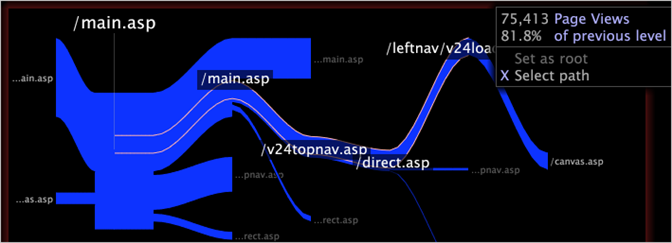

# Auswählen von Pfaden{#select-a-path}

{{eol}}

Sie können einen Pfad in einem Pfad-Browser auswählen, um Filter zu erstellen, die Daten enthalten, die mit den Elementen im Pfad verknüpft sind.

Wenn Sie einen Pfad von grundlegenden Dimensionselementen in einem Pfadbrowser auswählen, wählen Sie Daten für die entsprechenden Elemente der Ebenendimension aus.

Angenommen, Sie haben einen Pfad-Browser erstellt, der Seiten einer Website anzeigt. Jede Seite ist ein Element der Dimension Seite und die Ebenendimension für Seite ist Seitenansicht. Wenn Sie einen Pfad von Seiten in einem Pfad-Browser auswählen, wählen Sie Daten für die Seitenansichten aus, die diesen Seiten zugeordnet sind.

>[!NOTE]
>
>Sie können die Dimension der Standardebene für einen Pfad-Browser ändern. Anweisungen zum Konfigurieren eines Pfad-Browsers finden Sie unter [Konfigurieren von Pfad-Browsern](../../../../home/c-get-started/c-intf-anlys-ftrs/t-config-path-brwsr.md#task-bbb3ddaa140a414f984b697c2b8202a3).

1. Klicken Sie auf ein Element im Pfad-Browser, um den angezeigten Pfad links oder rechts vom Stammverzeichnis zu erweitern.
1. Klicken Sie mit der rechten Maustaste auf das gewünschte Element und klicken Sie auf **[!UICONTROL Select path]**. Der ausgewählte Pfad ist weiß dargestellt.

   >[!NOTE]
   >
   >Sie können keinen Start- oder Endknoten auswählen.

1. Wiederholen Sie Schritt 1 für jedes Element, das Sie dem Pfad hinzufügen möchten.

   Wenn Sie beispielsweise mit Website-Daten arbeiten, können Sie einen Pfad von Seiten auf Ihrer Website auswählen.

   

   Dieser Pfad stellt eine Auswahl dar und alle anderen offenen Visualisierungen im Arbeitsbereich (einschließlich Legenden) werden aktualisiert, um Daten anzuzeigen, die mit dem Pfad verknüpft sind, der von den ausgewählten Elementen erstellt wurde. Siehe [Auswahlen in Visualisierungen](../../../../home/c-get-started/c-vis/c-sel-vis/c-sel-vis.md#concept-012870ec22c7476e9afbf3b8b2515746).
