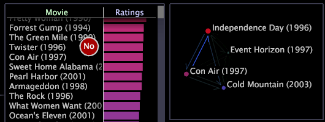

# Erstellen von Prozesskarten{#create-a-process-map}

Sie können 2D- und 3D-Prozesskarten erstellen, indem Sie Elemente aus Balkendiagrammen, Tabellen und Hierarchieansichten auf eine leere Zuordnung ziehen und ablegen.

Die Elemente, die Sie hinzufügen können, müssen Elemente der Basisdimension der Prozesskarte sein. Sie können Knoten auch von einer Prozesszuordnung zu einem anderen ziehen und ablegen, solange die Zuordnungen dieselbe Basisdimension verwenden. Darüber hinaus kann die gesamte Karte gezoomt oder verschoben werden, um sich auf einen bestimmten Knoten zu konzentrieren, oder sie kann in andere Visualisierungstypen geändert werden. Siehe [Zoomen in Visualisierungen](../../../../home/c-get-started/c-vis/c-zoom-vis.md#concept-7e33670bb5344f78a316f1a84cc20530).

**Hinzufügen von Elementen zu einer Prozesszuordnung mithilfe einer Tabelle oder eines Balkendiagramms**

* Drücken Sie aus einer Tabelle oder einem Balkendiagramm mit derselben Basisdimension wie der Prozesskarte Strg+Alt , während Sie auf einzelne Elemente klicken und sie in die Prozesskarte ziehen. Ihr Mauszeiger zeigt das Wort &quot;Nein&quot; an, bis Ihre Maus die Prozesskarte erreicht.

   >[!NOTE]
   >
   >Die Elemente, die Sie hinzufügen können, müssen Elemente der Basisdimension der Prozesskarte sein.

   

**Hinzufügen von Elementen zu einer Prozesszuordnung mithilfe einer Hierarchieansicht**

>[!NOTE]
>
>Adobe empfiehlt, Knoten der höchsten Ebene der Hierarchie hinzuzufügen, die Sie analysieren.

1. Klicken Sie in einer Tabelle oder einem Balkendiagramm mit derselben Basisdimension wie der Prozesskarte mit der rechten Maustaste auf ein Element oder den Titel der Basisdimension und klicken Sie auf **[!UICONTROL Hierarchy View]**.
1. Drücken Sie Strg+Alt , während Sie auf Elemente klicken und sie in die Prozesszuordnung ziehen. Ihr Mauszeiger zeigt das Wort &quot;Nein&quot; an, bis Ihre Maus die Karte erreicht.

   >[!NOTE]
   >
   >Die Elemente, die Sie hinzufügen können, müssen Elemente der Basisdimension der Prozesskarte sein.

   Wenn Sie ein einzelnes Element auf eine Prozesszuordnung ziehen, wird nur ein Zuordnungsknoten für dieses Element erstellt. Wenn Sie jedoch mehrere Elemente (eine Gruppe) oder einen Ordner mit mehreren Elementen auswählen, wird durch Ziehen aus der Hierarchie ein einzelner Knoten für diese Gruppe oder diesen Ordner erstellt. Wenn Sie beispielsweise mit Website-Daten arbeiten, wird durch Ziehen eines Ordners mit dem Namen [!DNL site.com/cgi-bin] auf eine Zuordnung ein Knoten mit dem Namen [!DNL site.com/cgi-bin/*] erstellt, der alle Seiten und Verzeichnisse darstellt, die untergeordnete Elemente dieses Ordners sind.

Weitere Informationen zu Seitenhierarchieansichten finden Sie unter [Anwenden von Hierarchieansichten](../../../../home/c-get-started/c-analysis-vis/c-tables/c-hier-vews.md#concept-b461183424a841eb94f8143a0eaf9bff).

**So fügen Sie Knoten zu einer Prozesszuordnung aus einer anderen Prozesszuordnung hinzu**

>[!NOTE]
>
>Die Prozesszuordnungen müssen dieselbe Basisdimension aufweisen.

* Kopieren Sie einen Knoten aus dem ersten in die zweite Prozesszuordnung mithilfe der folgenden Methoden:

   * Um einzelne Knoten zu kopieren, klicken Sie auf und ziehen Sie jeden Knoten in die zweite Prozesszuordnung.
   * Um mehrere Knoten zu kopieren, klicken und ziehen Sie bei gedrückter Strg-Taste, um ein Feld um die Knoten zu erstellen, die Sie kopieren möchten, und ziehen Sie dann die markierten Knoten in die zweite Prozesszuordnung. Alle hervorgehobenen Knoten werden in die zweite Prozesszuordnung kopiert.
