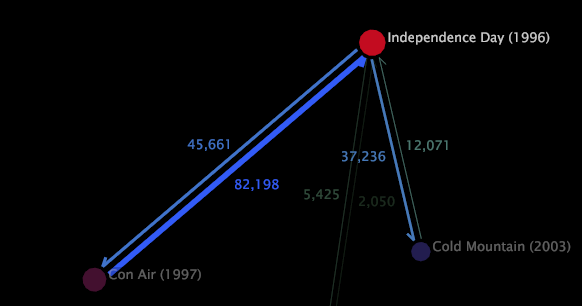
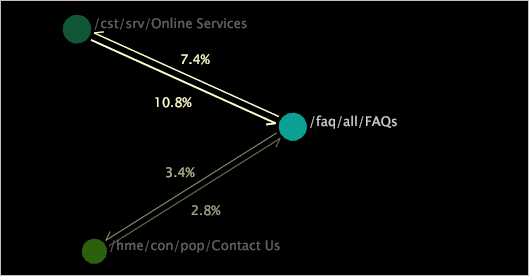

# Anzeigen der Quantifizierungen von Metrik{#display-a-metric-quantity}

Eine 2D-Prozesszuordnung kann die Metrikmengen anzeigen, die die Aktivität zu oder von einer Node auf der Karte darstellen.

Die eigentliche Sequenz der Aktivität enthält möglicherweise Knoten, die dieser Map nicht hinzugefügt wurden. Diese Menge wird als Prozentsatz, absoluter Wert oder gar kein Wert angegeben.

>[!NOTE]
>
>Sie können Metrikmengen nur für 2D-Prozesszuordnungen anzeigen.

**So zeigen Sie Metrikmengen in einer 2D-Prozesskarte an**

* Klicken Sie auf die gewünschte Node. Alle anderen Knoten im Prozess werden dim zugeordnet, damit Sie die Pfeile zur hervorgehobenen Node und die zugehörigen Metrikmengen einfacher sehen können.

**So wählen Sie aus, wie die Menge angezeigt wird**

1. Klicken Sie mit der rechten Maustaste auf einen Knoten und klicken Sie auf **[!UICONTROL Options]** > **[!UICONTROL Quantify Links]**.
1. Klicken Sie auf **[!UICONTROL Percentage]**, **[!UICONTROL Absolute Value]** oder **[!UICONTROL Off]**.

   

Die folgenden Beispiele zeigen Metrikmengen für zwei 2D-Prozesskarten.

