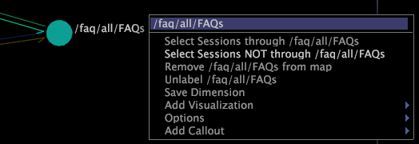

# Auswahl aus einer Prozesszuordnung vornehmen{#make-a-selection-from-a-process-map}

Sie können in Prozesszuordnungen eine Auswahl treffen, um Filter zu erstellen, die mit einer bestimmten Node verknüpfte Daten ein- oder ausschließen.

Eine Auswahl innerhalb einer Prozesszuordnung erfolgt über die Gruppendimension der Map, die bestimmt, wie die Elemente der Basisdimension (d. h. die Knoten in Ihrer Map) gruppiert werden, um die Verbindungen zwischen Knoten zu bilden.

>[!NOTE]
>
>Sie können die standardmäßige Gruppendimension für eine Prozesszuordnung ändern. Siehe [Konfigurieren von Prozesszuordnungen](../../../../home/c-get-started/c-intf-anlys-ftrs/t-config-proc-maps.md#task-4a95730b18a14bc790a77c013832b2d6).

Wenn Sie eine Auswahl basierend auf einer Node in einer Prozesszuordnung treffen, wählen Sie alle Elemente der Gruppendimension aus, an der diese Node beteiligt war. Um die Rolle der Gruppendimension besser zu verstehen, sollten Sie die folgenden Beispiele beachten:

* Filme können von den Viewern gruppiert werden, die sie bewertet haben. Jeder Viewer ist ein Element der User-Dimension. Daher ist die User-Dimension die Gruppendimension für die Prozesszuordnung. Wenn Sie eine Auswahl aus einem Knoten für einen bestimmten Film treffen, erstellen Sie einen Filter, der Daten zu den Benutzern anzeigt, die den Film bewertet haben oder nicht.
* Webseiten können nach Sitzungen gruppiert werden, in denen sie angezeigt wurden. Jede Sitzung ist ein Element der Sitzungsdimension, daher wäre die Sitzungsdimension die Gruppendimension für die Prozesszuordnung. Wenn Sie eine Auswahl aus einer Node für eine bestimmte Seite treffen, erstellen Sie einen Filter, der Daten zu den Sitzungen anzeigt, während denen diese Seite angezeigt wurde oder nicht.

**So treffen Sie eine Auswahl**

1. Klicken Sie mit der rechten Maustaste auf einen beliebigen Knoten in einer Prozesszuordnung.
1. Klicken Sie auf eine der folgenden Optionen, um eine Auswahl basierend auf der Node vorzunehmen:

   * **[!UICONTROL Select]*** **[!UICONTROL group dimension name +s]*** **[!UICONTROL through node name]**: Filtert die Daten, um alle Elemente der Gruppendimension einzuschließen, die durch den Knoten weitergegeben wurden, indem alle Sitzungen herausgefiltert werden, die nicht durch den Knoten weitergereicht wurden.

   * **[!UICONTROL Select]*** **[!UICONTROL group dimension name +s]*** **[!UICONTROL NOT through node name]**: Filtert die Daten, um alle Elemente der Gruppendimension einzuschließen, die nicht durch die Node geleitet wurden, indem alle Sitzungen herausgefiltert wurden, die über die Node weitergereicht wurden.

Wenn Sie eine Auswahl in einer 3D-Prozesszuordnung vornehmen, wird der Knoten, für den die Auswahl getroffen wird, umkreist. Anhand von Benchmarks können Sie die einzelnen Balken miteinander vergleichen, um die Metrikwerte mit und ohne Auswahl zu vergleichen. Siehe [Benchmarks](../../../../home/c-get-started/c-vis/c-ustd-benchmks.md#concept-c7b0f4102e92458096f8c4765cbe2914).

