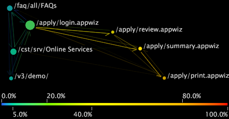

# Typen von Prozesskarten{#types-of-process-maps}

Informationen zu den verschiedenen Typen von Prozesskarten.

## 2D-Prozesszuordnungen {#section-ea7fbdb80b1b44aebcd9e4090b6540bf}

Zweidimensionale Prozesszuordnungen bieten eine zweidimensionale Ansicht der Aktivität zwischen Dimensionselementen. Die Größe einer Node in einer 2D-Prozesszuordnung ist proportional zum Wert der Metrik, die dieser Node zugeordnet ist. Darüber hinaus sind sowohl die Stärke als auch die Intensität eines Pfeils zwischen zwei Knoten proportional zum Durchschnitt der Metrikwerte für diese Knoten.

In einer 2D-Prozesszuordnung können Sie eine der folgenden Aufgaben ausführen:

* Auswählen, Verschieben, Entfernen und Bezeichnen von Knoten
* Auswahl vornehmen
* Dimensionen speichern
* Erstellen anderer Visualisierungen
* Farbverknüpfungen aktivieren
* Anzeigemetrikmengen
* Callouts hinzufügen

Die 2D-Prozesszuordnung im folgenden Beispiel zeigt Knoten, die den Namen von Filmen entsprechen. Jeder Filmname ist ein Element der Dimension &quot;Film&quot;, das in einem Datensatz aus Filmdaten definiert ist. Die Movie-Dimension ist die Basisdimension für diese Prozesszuordnung.

In diesem Beispiel sind die Größe der einzelnen Knoten sowie die Stärke und Intensität der einzelnen Pfeile proportional zur Metrik &quot;Bewertungen&quot;, d. h. der Anzahl der Bewertungen, die ein Film erhalten hat. Daher hat ein Film mit einem großen Knoten, wie z. B. *Unabhängigkeitstag*, mehr Bewertungen als ein Film mit einem kleinen Knoten, wie z. B. *Event Horizon*. Sie können auch sehen, dass mehr Zuschauer den *Unabhängigkeitstag* vor *Cold Mountain* bewertet haben, als die gleichen Filme in umgekehrter Reihenfolge. Beachten Sie, dass die Pfeile nicht angeben, dass die Betrachter den *Unabhängigkeitstag* bewertet und dann unmittelbar danach den *Cold Mountain* bewertet haben oder umgekehrt. Die Zuschauer haben vielleicht dazwischen noch andere Filme bewertet, aber diese Filme werden nicht auf dieser Karte angezeigt.

## 2D-Metrikzuordnungen {#section-a9b846fc71224058918fbc378315effe}

Zweidimensionale Metrikzuordnungen sind ein Typ von 2D-Prozesszuordnung, die Positionsknoten basierend auf dem Wert einer bestimmten Metrik darstellt. In vielen Fällen ist die Metrik, die mit der 2D-Metrikzuordnung verwendet wird, entweder Konversion oder Treue. Umrechnungs- und Aufbewahrungskarten helfen Ihnen zu verstehen, welche Schritte in den Prozessen Ihrer kundenorientierten Kanäle die Kundenumrechnung und -bindung beeinflussen.

>[!NOTE]
>
>Die Metrik, die Sie mit einer 2D-Metrikzuordnung verwenden, muss als Prozentsatz ausgedrückt werden.

In einer Konversionsmetrikzuordnung werden Knoten mit 0 % Konversion links im Diagramm dargestellt und Seiten mit 100 % Konversion werden rechts dargestellt. Die Aktivität zwischen Knoten wird angezeigt, sodass Sie leicht erkennen können, welche Schritte in einem Prozess zu einer erhöhten oder verringerten Umrechnung führen und welche Schritte zum Abbruch führen. Eine Prozesskonversionsanalyse ist eine effektive Methode zum Vergleichen von Prozessen oder zum Vergleichen verschiedener Implementierungen desselben Prozesses.

Auf ähnliche Weise zeigen Retentionskarten Elemente mit einer 0-prozentigen Beibehaltung links im Diagramm und Elemente mit einer 100-prozentigen Beibehaltung rechts an. Sie können die Retentionsrate für jeden Knoten auf der Karte sehen, was Ihnen dabei hilft, festzustellen, welche Elemente Kunden beeinflussen.

>[!NOTE]
>
>Sie können Knoten auf 2D-Metrikzuordnungen nicht horizontal verschieben. Metrikkarten dienen dazu, Nodes basierend auf ihren Metrikwerten von links nach rechts zu positionieren.

## 3D-Prozesszuordnungen {#section-80acb63ea0994af1af7faef3c6264e51}

Dreidimensionale Prozesskarten bieten eine dreidimensionale Ansicht der Aktivität zwischen Dimensionselementen. Die Höhe einer Leiste in einer 3D-Prozesszuordnung ist proportional zum Wert der Metrik, die dieser Node zugeordnet ist. Wie bei 2D-Prozesszuordnungen sind sowohl die Stärke als auch die Intensität der Verbindungen zwischen zwei Knoten proportional zum Durchschnitt der Metrikwerte für diese Knoten. In einer 3D-Prozesszuordnung können Sie eine der folgenden Aufgaben ausführen:

* Auswählen, Verschieben, Entfernen und Bezeichnen von Knoten
* Auswahl vornehmen
* Dimensionen speichern
* Erstellen anderer Visualisierungen
* Farbverknüpfungen aktivieren

Die 3D-Prozesszuordnung im folgenden Beispiel zeigt Knoten, die den Seiten einer Website entsprechen. Jede Seite ist ein Element der Seitendimension, die in einem Datensatz definiert ist, der aus Web-Traffic-Daten besteht. Die Dimension &quot;Seite&quot;ist die grundlegende Dimension für diese Prozesszuordnung.

In diesem Beispiel sind die Höhe der einzelnen Balken sowie die Stärke und Intensität der einzelnen Connectors proportional zur Metrik &quot;Sitzungen&quot;, einer Anzahl der Sitzungen, in denen die Seiten angezeigt wurden. Daher wurde eine Seite mit einer großen Leiste, wie z. B. /faq/all/FAQs, während mehr Sitzungen angezeigt als eine Seite mit einer kurzen Leiste wie /vs/demo. Beachten Sie, dass die Verbindungen zwischen zwei Seiten nicht anzeigen, dass eine Seite unmittelbar vor oder nach der anderen während einer bestimmten Sitzung angezeigt wurde. Andere Seiten wurden möglicherweise während derselben Sitzung angezeigt, aber diese Seiten werden nicht auf dieser Karte angezeigt.
