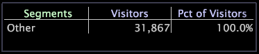

# Erstellen von Segmentdimensionen{#create-a-segment-dimensions}

Um eine Segmentdimension zu erstellen, müssen Sie zunächst eine Auswahl in einem Arbeitsbereich treffen und dann das Segment zu einer Visualisierung hinzufügen.

**So erstellen Sie eine Segmentdimension**

1. hinzufügen einer Segmentvisualisierung in den Arbeitsbereich. Beispiel:

   

1. hinzufügen Sie Visualisierungen für Ihren Arbeitsbereich, die Sie zum Definieren Ihres Segments verwenden möchten, und treffen Sie dann die gewünschten Auswahlmöglichkeiten, um Ihr Segment zu definieren.
1. Klicken Sie in der Segmentvisualisierung mit der rechten Maustaste auf die Bezeichnung des Segments, nach dem das neue Segment hinzugefügt werden soll, und klicken Sie auf **[!UICONTROL Add Segment]**.

   >[!NOTE]
   >
   >Um ein neues erstes Segment zu erstellen, klicken Sie mit der rechten Maustaste auf die Beschriftung **[!UICONTROL Segments]** und dann auf **[!UICONTROL Add Segment]**.

   

   Ein neues Segment (mit dem Namen Neues Segment) wird in der Visualisierung angezeigt. Das Segment Sonstige stellt alle Daten dar, die nicht in Ihren definierten Segmenten enthalten sind: Dies ist im Grunde der Unterschied zwischen Ihren Datensatzdaten und Ihren Segmentdaten.

1. Klicken Sie mit der rechten Maustaste auf das neu erstellte Segment und klicken Sie auf **[!UICONTROL Rename Segment]**.
1. Geben Sie einen beschreibenden Namen für Ihr neues Segment in das Namensfeld ein.

   >[!NOTE]
   >
   >Wenn ein Metrikwert, z. B. ein bestimmter Besucher in [!DNL Site], die Kriterien mehrerer Segmente erfüllt, wird der Metrikwert nur in dem ersten aufgelisteten Segment eingeschlossen, mit dem er übereinstimmt.

**So speichern Sie die Segmentdimension**

1. Klicken Sie mit der rechten Maustaste auf die Segmentbeschriftung und klicken Sie auf **[!UICONTROL Save Dimension]**. Das Fenster [!DNL Save Dimension As] wird angezeigt. Der Standardspeicherort ist der Ordner &quot;User\*Profil name*\Dimensionen&quot;.
1. Geben Sie im Feld [!DNL File name] einen beschreibenden Namen für die Segmente ein, die Sie als Dimension speichern, und klicken Sie auf **[!UICONTROL Save]**.

Sie können auf die Segmentdimension zugreifen, wenn Sie mit einer Visualisierung arbeiten. Sie können auch mit den Elementen in Ihrer gespeicherten Dimension verknüpfte Daten mithilfe der Segmentexportfunktion exportieren.

Weitere Informationen zur Segmentexportfunktion und Anweisungen zum Konfigurieren für Ihre Anforderungen finden Sie unter [Konfigurieren von Segmenten für den Export](../../../../home/c-get-started/c-exp-data-seg-exp/t-config-sgts-expt.md#task-8857f221fa66463990ec9b60db6db372).
