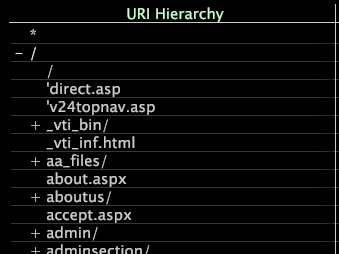

# Anwenden von Hierarchieansichten{#apply-hierarchy-views}

Hierarchie-Ansichten sind nur verfügbar, wenn Sie die Site- oder HBX-Anwendung verwenden.

Die Hierarchie-Ansicht zeigt die Seiten einer Website an, die hierarchisch nach Dateinamen geordnet und alphabetisch sortiert sind. Diese Hierarchie-Ansicht ist zwar für die Analyse selbst nützlich, kann aber auch verwendet werden, um solche erweiterten Visualisierungen als Prozesskarten einzurichten. Weitere Informationen zu Prozesszuordnungen finden Sie unter [Prozesszuordnungen](../../../../home/c-get-started/c-analysis-vis/c-proc-maps/c-proc-maps.md#concept-880aee224404429785b733a4e80d275e).

>[!NOTE]
>
>Wenn Ihr Datensatz für die Ausführung auf mehreren Servern in einem Cluster konfiguriert wurde und diese Funktion ordnungsgemäß funktioniert, muss Ihr Systemadministrator angeben, welche Maschine als Central Normalization Server fungiert. Anweisungen hierzu finden Sie im Kapitel Konfigurationsdatei für die Protokollverarbeitung im Handbuch *Konfiguration des Datensatzes*.

**So aktivieren oder deaktivieren Sie die Hierarchie-Ansicht**

* Klicken Sie in einer beliebigen Seiten- oder URI-Visualisierung mit der rechten Maustaste auf ein Element oder die Beschriftung der Seitendimension und klicken Sie auf **[!UICONTROL Hierarchy View]**.

   

   Ein X wird neben der Option angezeigt, wenn [!DNL hierarchy view] aktiv ist.

   Die Hierarchie ist mithilfe einer Baumstruktur in Website-Abschnitte und Seiten unterteilt. Abschnitte (Knoten) können mit dem +- oder --Symbol neben dem Abschnittsnamen erweitert oder verkürzt werden. Einzelne Seiten haben kein + oder - Symbol neben ihnen.

   

## Maskieren von Dimension-Elementen in einer Hierarchie-Ansicht {#section-e477c469934846da8d807f92fc2f3ed1}

Unter Maskierung versteht man die Auswahl einer Teilmenge Ihrer Daten oder einer Teilmenge der Elemente in einer Dimension. Sie können die Elemente, die nicht in der Analyse enthalten sein sollen, maskieren oder ausblenden. Mithilfe der Menüoptionen für Hierarchieelemente wählen Sie den Mindestprozentsatz einer Metrik aus, die in der Visualisierung angezeigt werden muss.[!DNL Mask]

**So maskieren Sie Daten mit der  [!DNL Mask] Menüoption**

1. Klicken Sie mit der rechten Maustaste auf ein Element oder die Bezeichnung der Dimension und klicken Sie auf **[!UICONTROL Mask]**.

   

1. Klicken Sie unter Mehr als auf den entsprechenden Prozentsatz und dann auf die Metrik, die Sie maskieren möchten.

Wenn Sie z. B. auf 0,1 % klicken und dann auf &quot;Seitenelemente&quot;klicken, werden alle Elemente mit einer Gesamtanzahl von Ansichten von weniger als 0,1 % maskiert (ausgeblendet) und alle Elemente angezeigt, die mehr als 0,1 % der Gesamtanzahl der Ansichten aufweisen. Wenn Sie auf 0 % klicken, maskieren Sie alle Elemente mit dem Wert 0 (Null) für die ausgewählte Metrik.
