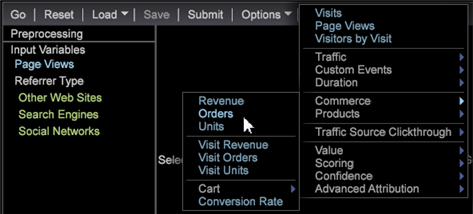

# Erstellen von Clustern{#building-clusters}

Wählen Sie Eingabevariablen, die Anzahl der Cluster und eine Population der Zielgruppe (falls gewünscht) aus, um Cluster im Datensatz zu definieren.

**Erstellen von Clustern**

1. Öffnen Sie den **[!UICONTROL Cluster Builder]**.

   Klicken Sie auf **Visualisierung** > **Prädiktive Analyse** > **Clustering** > **Cluster Builder**.

   

1. Wählen Sie Eingabevariablen.

   * hinzufügen Sie Metriken zur Liste **[!UICONTROL Input Variables]**, indem Sie in der Symbolleiste aus dem Menü **[!UICONTROL Metric]** wählen.

      

   * hinzufügen Sie Dimensionselemente in die Liste **[!UICONTROL Input Variables]**, indem Sie sie aus der Tabelle einer Dimension ziehen.

      Drücken Sie die Taste **[!UICONTROL Ctrl + Alt]** und ziehen Sie die ausgewählten Dimensionselemente in die Liste **[!UICONTROL Input Variables]** oder in das Feld **[!UICONTROL Element]** in der Symbolleiste.

      
   Standardmäßig wird das Clustering für den gesamten Datensatz durchgeführt. Sie können alle Eingabevariablen im linken Bereich **[!UICONTROL Preprocessing]** sehen.
1. Wählen Sie im Menü **[!UICONTROL Options]** die gewünschte Anzahl von Clustern aus.

   

1. Wenn Sie eine Untergruppe der Besucher im Datensatz gruppieren möchten, können Sie einen Populationsfilter definieren.

   

   Beginn durch Definieren der gewünschten Untergruppe mithilfe von Auswahlen in Ihrem Arbeitsbereich oder mithilfe von **[!UICONTROL Filter Editor]**. Nachdem Sie die gewünschte Untergruppe ausgewählt haben, legen Sie im Menü **[!UICONTROL Options]** die Zielgruppe Population fest. Es wird empfohlen, der Zielgruppe einen eindeutigen Namen zuzuweisen.

   Das Menü **[!UICONTROL Options]** enthält außerdem Einstellungen zur Steuerung der maximalen Anzahl der Pässe und des akzeptablen Schwellenwerts für die mittlere Konvergenz.

1. Nachdem die Eingaben und Optionen konfiguriert wurden, klicken Sie auf die Schaltfläche **Los**, um das Clustering lokal auszuführen, oder drücken Sie **[!UICONTROL Submit]**, um die Aufgabe an den Predictive Analytics-Server zu senden. Übermittlungen an den Server speichern die resultierende Dimension im Datensatz, wenn die Konvergenz abgeschlossen ist.

   Beim lokalen Ausführen sehen Sie, wie der Cluster Builder vier Baumkronen-Clustering-Phasen durchläuft, da er intelligente Zentren auf der Grundlage der Eingaben definiert.

   Sobald die Zentren der Cluster aufhören, mehr als den angegebenen Konvergenzschwellenwert zu ändern, wird die Cluster-Dimension konvertiert und der Cluster-Builder zeigt zusätzliche Informationen darüber an, wie relevant ein Input für jeden Cluster war.

1. Passen Sie die Cluster an.

   Wenn Sie mit der rechten Maustaste auf die Farbleiste der Statistik klicken, wird ein Kontextmenü geöffnet, in dem Sie die Relevanzschwellenwerte anpassen können. Im Fall der Dimensionselementverteilungen können Sie auswählen, welcher Test angezeigt wird.

   

   Metrikeingaben stellen einen T-Test für jeden Cluster bereit, während Dimensionselementeingaben drei Verteilungstests (Chi squared, eine entropy U-Statistik und Cramers V-Statistik) für jeden Cluster bereitstellen.

   >[!NOTE]
   >
   >Wenn Sie Eingaben während der Konvergenz hinzufügen oder entfernen, wird der Prozess angehalten, bis Sie erneut **Go** drücken.

   Nach dem Erstellen von Clustern können Sie die Farbauswahl öffnen, um Farben für unterschiedliche Verteilungsergebnisse zuzuweisen.

   

1. Wenn die Cluster-Dimension konvertiert ist, können Sie der Tabelle Metriken hinzufügen und die Auswahl als normal festlegen. Sie können auch mit der rechten Maustaste auf die Elementnamen (Cluster 1, Cluster 2 usw.) klicken, um das Kontextmenü zu öffnen, um sie in etwas aussagekräftigeres umzubenennen.

   

1. Wenn Sie diese Clusterdimension in anderen Visualisierungen verwenden möchten, können Sie sie lokal oder auf dem Server **[!UICONTROL Save]** verwenden.**[!UICONTROL Submit]**

Wenn Sie die Konvergenz erneut ausführen oder die Relevanz der Eingaben sehen möchten, können Cluster Builder auch vorhandene Clusterdimensionen laden.

>[!TIP]
>
>Wenn diese Option aktiviert ist, werden alle Eingabevariablen vollständig freigegeben und Sie erhalten eine leere Cluster-Builder-Visualisierung, um neue Cluster zu definieren.**[!UICONTROL Reset]**
