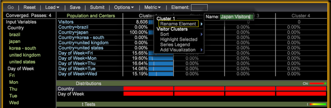

# Erstellen von Clustern{#building-clusters}

{{eol}}

Wählen Sie Eingabevariablen, die Anzahl der Cluster und eine Zielpopulation (falls gewünscht) aus, um Cluster in Ihrem Datensatz zu definieren.

**Erstellen von Clustern**

1. Öffnen Sie den **[!UICONTROL Cluster Builder]**.

   Klicken **Visualisierung** > **Predictive Analytics** > **Clustering** > **Cluster Builder**.

   

1. Wählen Sie Eingabevariablen aus.

   * Metriken zum **[!UICONTROL Input Variables]** Liste durch Auswahl aus **[!UICONTROL Metric]** in der Symbolleiste.

      

   * Fügen Sie Dimensionselemente zu der **[!UICONTROL Input Variables]** aus, indem Sie sie aus der Tabelle einer Dimension ziehen.

      Presse **[!UICONTROL Ctrl + Alt]** und ziehen Sie die ausgewählten Dimensionselemente in den **[!UICONTROL Input Variables]** oder **[!UICONTROL Element]** in der Symbolleiste.

      
   Standardmäßig wird das Clustering für den gesamten Datensatz durchgeführt. Alle Eingabevariablen werden links angezeigt **[!UICONTROL Preprocessing]** -Bereich.
1. Verwenden Sie die **[!UICONTROL Options]** -Menü, um die gewünschte Anzahl von Clustern auszuwählen.

   

1. Wenn Sie eine Untergruppe der Besucher in Ihrem Datensatz gruppieren möchten, können Sie einen Populationsfilter definieren.

   

   Definieren Sie zunächst die gewünschte Teilmenge mithilfe der Auswahl in Ihrem Arbeitsbereich oder mithilfe der **[!UICONTROL Filter Editor]**. Nachdem Sie die gewünschte Teilmenge ausgewählt haben, legen Sie die Zielpopulation im **[!UICONTROL Options]** Menü. Es wird empfohlen, der Zielgruppe einen Identifizierungsnamen zu geben.

   Die **[!UICONTROL Options]** -Menü verfügt auch über Einstellungen, um die maximale Anzahl der Pässe und den akzeptablen Schwellenwert für die mittlere Konvergenz zu steuern.

1. Nachdem die Eingaben und Optionen konfiguriert wurden, klicken Sie auf das **Los** -Schaltfläche, um das Clustering lokal auszuführen, oder drücken Sie **[!UICONTROL Submit]** , um die Aufgabe an den Predictive Analytics-Server zu senden. Durch Übermittlungen an den Server wird die resultierende Dimension im Datensatz gespeichert, wenn die Konvergenz abgeschlossen ist.

   Wenn Sie lokal ausführen, sehen Sie, wie sich der Cluster Builder durch vier Baumkronen-Clustering-Phasen bewegt, da er intelligente Zentren basierend auf den Eingaben definiert.

   Sobald die Cluster-Zentren aufhören, mehr als den angegebenen Konvergenzschwellenwert zu ändern, wird die Cluster-Dimension konvertiert und der Cluster-Builder zeigt zusätzliche Informationen darüber an, wie relevant ein Input für jeden Cluster war.

1. Passen Sie die Cluster an.

   Wenn Sie mit der rechten Maustaste auf die Farbleiste der Statistiken klicken, wird ein Kontextmenü geöffnet, in dem Sie die Relevanzschwellen anpassen können. Im Fall der Verteilung der Dimensionselemente können Sie festlegen, welcher Test angezeigt wird.

   

   Metrikeingaben bieten einen t-Test für jeden Cluster, während die Eingaben von Dimensionselementen drei Verteilungstests (Chi squared, eine entropy U-Statistik und Cramers V-Statistik) für jeden Cluster bereitstellen.

   >[!NOTE]
   >
   >Wenn Sie während der Konvergenz Eingaben hinzufügen oder entfernen, wird der Prozess angehalten, bis Sie die Taste drücken **Los** erneut.

   Nach dem Erstellen von Clustern können Sie die Farbauswahl öffnen, um Farben für unterschiedliche Verteilungsergebnisse zuzuweisen.

   

1. Wenn die Cluster-Dimension konvertiert ist, können Sie der Tabelle Metriken hinzufügen und Auswahlen wie gewohnt vornehmen. Sie können auch mit der rechten Maustaste auf die Elementnamen (Cluster 1, Cluster 2 usw.) klicken, um das Kontextmenü zu öffnen und sie in eine aussagekräftigere Bezeichnung umzubenennen.

   

1. Wenn Sie diese Clusterdimension in anderen Visualisierungen verwenden möchten, können Sie **[!UICONTROL Save]** lokal oder **[!UICONTROL Submit]** auf den Server.

Wenn Sie die Konvergenz erneut ausführen oder die Relevanz der Eingaben sehen möchten, kann Cluster Builder auch vorhandene Cluster-Dimensionen laden.

>[!TIP]
>
>Wenn ausgewählt, **[!UICONTROL Reset]** werden alle Eingabevariablen vollständig freigegeben und Sie erhalten eine leere Cluster-Builder-Visualisierung, um neue Cluster zu definieren.
