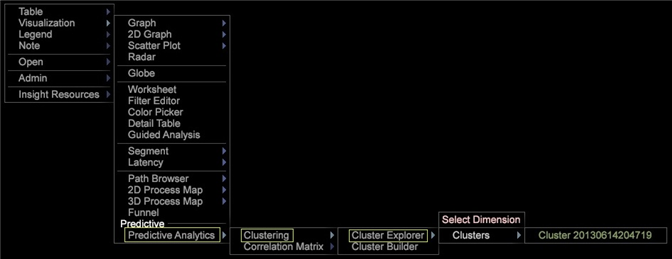

# Untersuchen von Clustern{#exploring-clusters}

Nachdem eine Cluster-Dimension erstellt wurde, können Sie sie speichern und mit dem Cluster Explorer prüfen.

1. Wählen Sie Visualisierung > Predictive Analytics > Clustering > Cluster Explorer > Cluster. Wählen Sie die Dimension des gespeicherten Clusters aus, die Sie untersuchen möchten.

   

1. Klicken Sie mit der rechten Maustaste auf den Titel der Visualisierung und klicken Sie auf Bezeichnungen umschalten, um sie zu aktivieren. Mit diesem Menü können Sie die zu untersuchende Clusterdimension ändern, die Radiusmetrik ändern, Trendlinien hinzufügen und die Korrelation anzeigen.

   

1. Um die von Ihnen untersuchte Cluster-Dimension zu ändern, ändern Sie die Radiusmetrik, fügen Sie Trendlinien hinzu und zeigen Sie die Korrelation mithilfe dieses Menüs an.

   

   Der Cluster Explorer zeigt die Zentren der Cluster jeweils entlang zwei Eingabachsen an. Dadurch können Sie ihre Trennung im multidimensionalen Raum untersuchen.

1. Klicken Sie mit der rechten Maustaste auf den Cluster, um das Menü anzuzeigen, und wählen Sie eine der Aufschlüsselungstypen: Bild- oder Textanmerkung, Metriklegende, Tabelle, Liniendiagramm oder Streudiagramm.

   
