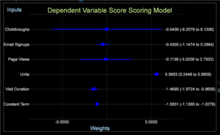

# Modell-Viewer{#model-viewer}

{{eol}}

Mit einem Modell-Viewer können Sie mithilfe der Funktion Tendenzauswertung ein logistisches Regressionsmodell generieren.

Der Modell-Viewer zeigt die Gewichtungen der einzelnen Eingabevariablen (einschließlich des konstanten Begriffs) und deren statistischen Fehlerbereich an. Eingabevariablen, die einen hohen absoluten Koeffizienten und eine geringe Fehlerquote aufweisen, sind die wichtigsten Prädikatoren im Modell.

**So öffnen Sie ein Modell-Viewer-Diagramm**

1. Auswählen [!DNL Add Visualization > Predictive Analytics > Scoring] .
1. Bewegen Sie den Mauszeiger über das Modell Umfassen eines gespeicherten Punkts.

Die Eingabevariablen mit einem Koeffizienten >= 1 sind positive Einflüsse auf das Tendenzmodell. Die Koeffizienten &lt; 1 sind negative Einflüsse auf das Tendenzmodell. Der in den Klammern definierte Bereich ist der Fehler und zeigt die Konsistenz der Eingabevariablen über die erfolgreiche Population hinweg an.
