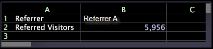

# Erstellen von Eingabezellen{#create-an-input-cell}

So erstellen Sie eine Eingabezelle.

Wenn Zelle B1 als Eingabezelle formatiert ist (durch Rechtsklicken auf die Zelle und Klicken auf **[!UICONTROL Format]** > **[!UICONTROL Input Cell]**) und Sie die Visualisierung sperren (durch Rechtsklicken auf den oberen Rand und Klicken auf **[!UICONTROL Locked]**), können Sie den Wert der Eingabezelle ändern, um die Ergebnisse &quot;on-the-fly&quot;anzuzeigen.

Das folgende Beispiel zeigt ein Arbeitsblatt, das die Formel für eine Eingabezelle anzeigt.

Dieses Beispiel zeigt das gleiche Arbeitsblatt, das das Ergebnis der Eingabezellformel anzeigt.

In beiden Beispielen zeigt Zeile 1 die verweisende Stelle, die derzeit berücksichtigt wird, Referrer A, während Zeile 2 die Anzahl der Besucher anzeigt, die von Referrer A verwiesen wurden.

Nachdem Sie B1 formatiert und die Visualisierung gesperrt haben, können Sie den Wert des in B1 aufgelisteten Referrers ändern, indem Sie einfach den neuen Wert eingeben:

