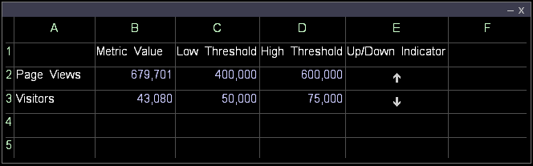

# Metrikindikator erstellen{#create-a-metric-indicator}

Sie können Arbeitsblätter verwenden, um anzugeben, dass eine Metrik einen definierten Schwellenwert erreicht hat.

Darüber hinaus können Sie einen Bericht automatisch erstellen und verteilen, wenn eine Metrik innerhalb eines bestimmten Zeitraums einen definierten Schwellenwert erreicht. [!DNL Report]

Weitere Informationen finden Sie [!DNL Report]im *Data Workbench Report Guide*.

* [Aufwärts- oder Abwärtsindikator](../../../../home/c-get-started/c-analysis-vis/c-wksts/c-metric-ind.md#section-40d7a2c3df0d40d4a7bb1a7e856abcba)
* [Prüfungsanzeiger](../../../../home/c-get-started/c-analysis-vis/c-wksts/c-metric-ind.md#section-98c5298a74f34dcbaaf151549fcc7090)

**So erstellen Sie einen Metrikindikator mithilfe eines Arbeitsblatts**

1. Definieren Sie den Inhalt der Zellen des Arbeitsblatts.

   1. Geben Sie in Spalte A den Namen der gewünschten Metrik ein (z. B. [!DNL Visitors]).
   1. Geben Sie in Spalte B den Wert der gewünschten Metrik ein (z. B. [!DNL =Visitors]).
   1. Geben Sie in Spalte C den unteren Schwellenwert der Metrik ein.
   1. Geben Sie in Spalte D den oberen Schwellenwert der Metrik ein.
   1. Geben Sie in Spalte E eine entsprechende Formel ein. Beispiele finden Sie unter [Aufwärts- oder Abwärtsindikator](../../../../home/c-get-started/c-analysis-vis/c-wksts/c-metric-ind.md#section-40d7a2c3df0d40d4a7bb1a7e856abcba) oder [Prüfindikator](../../../../home/c-get-started/c-analysis-vis/c-wksts/c-metric-ind.md#section-98c5298a74f34dcbaaf151549fcc7090).
   1. Klicken Sie in der Formelzelle (Spalte E) mit der rechten Maustaste und klicken Sie auf **[!UICONTROL Format]** > **[!UICONTROL Indicator]**, und klicken Sie dann auf einen der folgenden Schritte:

      * **[!UICONTROL None]**: Führt die genaue Berechnung anstelle eines Indikators auf.
      * **[!UICONTROL Check]**: Verwendet ein Häkchen oder ein X, um anzugeben, dass der Wert je nach Formel über oder unter dem von Ihnen festgelegten Schwellenwert liegt. Siehe [Prüfungsanzeige](../../../../home/c-get-started/c-analysis-vis/c-wksts/c-metric-ind.md#section-98c5298a74f34dcbaaf151549fcc7090).
      * **[!UICONTROL Up or Down]**: Verwendet einen Nach-oben- oder Nach-unten-Pfeil, um anzugeben, ob der Wert unter dem unteren Schwellenwert (Pfeil nach unten), über dem oberen Schwellenwert (Pfeil nach oben) oder zwischen den unteren und oberen Schwellenwerten (leer) liegt. Siehe [Aufwärts- oder Abwärtsindikator](../../../../home/c-get-started/c-analysis-vis/c-wksts/c-metric-ind.md#section-40d7a2c3df0d40d4a7bb1a7e856abcba).

1. Wiederholen Sie Schritt 1 für andere Metriken, für die Sie Indikatoren erstellen möchten.

Das resultierende Arbeitsblatt würde etwa wie folgt aussehen:

## Nach oben oder unten {#section-40d7a2c3df0d40d4a7bb1a7e856abcba}

Verwenden Sie für die [!DNL Up] oder [!DNL Down indicator]die folgende Formel:

[!DNL (metric value - low threshold)/(high threshold - low threshold)*2 - 1]

Beispiel: [!DNL =(b2-c2)/(d2-c2)*2-1]

Für jede Metrik sind drei Ergebnisse möglich, wenn diese Formel mit dem [!DNL Up] oder [!DNL Down indicator]:

* Wenn der Metrikwert zwischen den niedrigen und hohen Schwellenwerten liegt, wird die Formel als Zahl zwischen -1 und 1 ausgewertet (ausschließlich). Der Pfeil nach oben oder unten wird nicht im Arbeitsblatt angezeigt.
* Wenn der Metrikwert kleiner als oder gleich dem unteren Schwellenwert ist, wird die Formel als Wert kleiner oder gleich -1 ausgewertet. Der Metrikindikator ändert sich in einen Pfeil nach unten.
* Wenn der Metrikwert größer oder gleich dem hohen Schwellenwert ist, wird die Formel als Zahl größer oder gleich 1 ausgewertet. Der Metrikindikator ändert sich in einen Pfeil nach oben.

Die folgende Tabelle zeigt, wie die Beispielformel aussehen [!DNL =(b2-c2)/(d2-c2)*2-1] würde:

## Indikator {#section-98c5298a74f34dcbaaf151549fcc7090}

Für den [!DNL Check indicator]Bericht verwenden Sie eine Formel, die angibt, ob Sie benachrichtigt werden möchten, wenn der Metrikwert über oder unter dem angegebenen Schwellenwert liegt. Beispiel:

* Wenn Sie benachrichtigt werden möchten, wenn der Wert unter dem von Ihnen festgelegten Schwellenwert liegt, können Sie das folgende Format verwenden:

   * [!DNL threshold - metric]

      Beispiel: [!DNL =(c2-b2)]

* Wenn Sie benachrichtigt werden möchten, wenn der Wert über dem von Ihnen festgelegten Schwellenwert liegt, können Sie die folgende Formel verwenden:

   * [!DNL metric - threshold]

      Beispiel: [!DNL =(b3-c3)]

Wenn ein Häkchen angezeigt wird, wird die Formel als positive Zahl ausgewertet. Wenn ein X angezeigt wird, wird die Formel als negative Zahl ausgewertet.

Bei der Verwendung der [!DNL Check indicator]Variablen

* Wenn die Formel angibt, dass es wünschenswert ist, den Metrikwert über dem Schwellenwert zu halten, wird ein Häkchen angezeigt, wenn der Metrikwert größer oder gleich dem Schwellenwert ist, und ein X, wenn der Wert unter dem Schwellenwert liegt.
* Wenn die Formel angibt, dass es wünschenswert ist, den Metrikwert unter dem Schwellenwert zu halten, wird ein Häkchen angezeigt, wenn der Metrikwert kleiner oder gleich dem Schwellenwert ist, und ein X, wenn der Wert größer als der Schwellenwert ist.

Das folgende Arbeitsblatt zeigt an, was das Beispiel formuliert [!DNL =(c2-b2)] und anzeigen [!DNL =(b3-c3)] würde:

