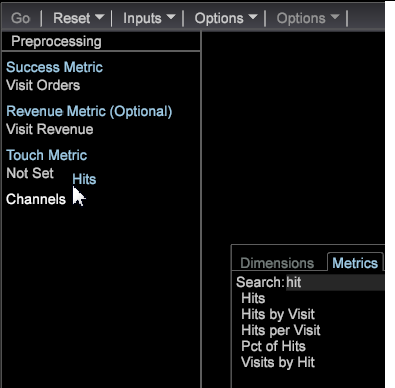

# Erstellen Sie ein passendes Zuordnungsmodell.{#build-a-best-fit-attribution-model}

Öffnen Sie Best Fit Attribution über das Premium-Menü und führen Sie die folgenden Schritte aus, um ein Best Fit Attribution-Modell zu erstellen.

Siehe eine Übersicht der [Best Fit Attribution](../../../../home/c-get-started/c-attribution-profiles/c-attrib-algorithmic/c-attrib-algorithmic.md#concept-237feb6e9c4d49efaf75399297dcb9d1).

1. Öffnen Sie die **Zuordnung**&quot;Beste passende&quot;.

   Öffnen Sie eine Arbeitsfläche und klicken Sie auf **[!UICONTROL Premium]** > **[!UICONTROL Best Fit Attribution]**.

   

   >[!NOTE]
   >
   >Best Fit Attribution ist eine Adobe Analytics Premium-Funktion, bei der Sie Premium in Ihrem Profil aktivieren müssen. Dazu müssen Sie Ihr Zertifikat aktualisieren und das Premium-Profil zu Ihrer Datei &quot;profile.cfg&quot;hinzufügen. Siehe [DWB Server-Aktualisierung: 6.2 bis 6.3](https://docs.adobe.com/content/help/en/data-workbench/using/install/upgrade-dwb/c-6-2-to-6-3-upgrade.html) für DWB 6.3.

1. Set the **[!UICONTROL Success]** metric.

   >[!NOTE]
   >
   >Sie können eine Metrik entweder aus einer **[!UICONTROL Finder]** Tabelle in den linken Bereich der Visualisierung der Zuordnung ziehen oder aus dem Menü &quot; **Eingaben** &quot;auswählen.

   Klicken Sie auf **[!UICONTROL Inputs]** > **[!UICONTROL Set Success]**. Das Menü &quot;Metrik&quot;wird geöffnet. 

   Wählen Sie eine Metrik aus, die eine erfolgreiche Konversion identifiziert.

1. (Optional) Legen Sie die **Umsatzmetrik** fest.

   Legen Sie eine Metrik fest, um den Umsatz während des Konvertierungsprozesses zu bewerten.

1. Legen Sie die **Touch** -Metrik fest.

   >[!NOTE]
   >
   >Das Festlegen einer Touch-Metrik ist nur erforderlich, wenn Sie versuchen, Erfolgsmetriken automatisch zu erstellen, indem Sie Dimensionselemente in die Visualisierung ziehen.

   Klicken Sie auf das **[!UICONTROL Inputs]** Menü und wählen Sie &quot;Touch **einstellen**&quot;oder ziehen Sie eine Metrik aus dem Finder. 

   Auf diese Weise werden Kanalmetriken abgeleitet, wenn Dimensionselemente als Eingaben verwendet werden.

1. Legen Sie ein **Erfolgsfenster** fest.

   Klicken Sie auf [!DNL Inputs > Success Window]. Wählen Sie einen Datumsbereich aus einer Tabelle und geben Sie dann einen Namen für das Fenster Erfolg. Klicken **[!UICONTROL Workspace Selection]** und die ausgewählten Daten werden als Zeitraum für die Erfolgsmetrik zugewiesen.

   

   >[!NOTE]
   >
   >Da das Fenster Erfolg eine Workstation-Auswahl ist, können Sie beliebige Dimensionen in Ihr Erfolgsfenster einbeziehen.

1. Legen Sie eine **[!UICONTROL Touch Window]** fest.

   Klicken Sie auf [!DNL Inputs > Touch Window]. Wählen Sie einen Datumsbereich aus einer Tabelle und geben Sie dann einen Namen für das Touch-Fenster ein. Klicken **[!UICONTROL Workspace Selection]** und die ausgewählten Daten werden als Zeitraum für die Erfolgsmetrik zugewiesen.

   

   Standardmäßig wird das **Touch** -Fenster auf denselben Zeitraum wie das **[!UICONTROL Success]** Fenster eingestellt.

1. (Optional) Legen Sie einen Schulungsfilter fest.

   Sie können auch einen **Schulungsfilter** im Arbeitsbereich angeben, um Besucherdaten zu filtern.

   >[!NOTE]
   >
   >Wenn Sie sowohl das Fenster &quot;Erfolg&quot;als auch das Fenster &quot;Touch&quot;einstellen, können Sie den Filter &quot;Schulung&quot;auf die aktuelle Arbeitsbereichsauswahl anwenden, um Ihre Daten weiter einzuschränken.

   

   >[!NOTE]
   >
   >Das Schulungsset wird immer von Besuchern gezogen, die das Fenster Erfolg erfüllen. Durch Filtern mit dem Filter-Editor können Sie eine Untergruppe von Besuchern erstellen, die im Erfolgsfenster gemeldet werden.

1. Geben Sie Kanalmetriken an, die Berührungen darstellen.

   Ziehen Sie Metriken entweder in die Visualisierung oder wählen Sie sie im Menü [!DNL Inputs] > [!DNL Add Channel] . Wenn Sie noch keine Metriken für Kampagnen oder Kanäle definiert haben, aber Dimensionen zur Darstellung von Kanälen haben, kann die Visualisierung diese automatisch mit der Angabe einer Touch-Metrik erstellen.

   Wenn die Touch-Metrik beispielsweise auf [!DNL Hits]festgelegt ist und ein [!DNL dimension] Aufruf mit Elementen wie [!DNL Media Type] , [!DNL Email], [!DNL Press Release]und [!DNL Print Ad]aufgeführt wird, generiert die Visualisierung Kanalmetriken des Formulars, [!DNL Social Media][!DNL Hits where Media Type = Email] wenn Sie die Elemente per Drag &amp; Drop in die Visualisierung ziehen.

1. Klicken Sie auf **Los**.

   Der Prozess der Analyse der besten Größe wird ausgeführt, und ein Diagramm zeigt die Zuordnungen pro Kanal basierend auf den ausgewählten Eingaben an.

   >[!NOTE]
   >
   >Klicken Sie mit der rechten Maustaste auf **Modellabschluss** , um Statistiken für das Zuordnungsmodell anzuzeigen.

   

Nach Abschluss des Vorgangs zeigt ein Diagramm ein pro Kanal berechnetes Zuordnungsmodell und eine Verteilung der *Umsatzmetrik* an (sofern festgelegt). Das Modell kann intern gespeichert oder in andere Systeme exportiert werden.

>[!NOTE]
>
>**[!UICONTROL Streaming]**, **[!UICONTROL Online]** und **[!UICONTROL Offline]** Modi erzeugen unterschiedliche Effekte, wenn ein Zuordnungsmodell basierend auf der Latenz der ausgewerteten Daten erstellt wird. Im Streaming-Modus wird die **[!UICONTROL Model Complete]** Detailmeldung angezeigt. Im Online- und Offline-Modus werden die Details angezeigt **[!UICONTROL Local Model Complete]** .

## Optionen, Menü {#section-22288867f6c8483a8a38410f4b948346}

Das Menü &quot; **Optionen** &quot;enthält erweiterte Funktionen zum Einrichten und Anzeigen der Analyse der optimalen Zuordnung.

<table id="table_8F6F517B7DBF4259814BEC6D07A72EAC"> 
 <thead> 
  <tr> 
   <th colname="col1" class="entry"> Optionen, Menü </th> 
   <th colname="col2" class="entry"> Beschreibung </th> 
  </tr>
 </thead>
 <tbody> 
  <tr> 
   <td colname="col1"> Schulungsfilter festlegen  </td> 
   <td colname="col2"> Der Schulungsfilter wird zusammen mit dem Erfolgsfenster verwendet, um die Population beim Erstellen des Zuordnungsmodells zu filtern. Dies stellt eine Untergruppe von Daten bereit, die nur die Besucher enthält, die Sie analysieren möchten. 
Hinweis: Erfahrene Benutzer können auch die Flexibilität von Filtern nutzen, um sich über die Zeitspanne von "Success"und "Touch Windows"hinaus zu konzentrieren. Sie können beispielsweise nicht nur einen Zeitraum auswählen, sondern auch einen Satz <i>Verweisende Domänen</i> auswählen, um nur die Zuordnung für Benutzer aus diesen Domänen zu untersuchen. 
 </td> 
  </tr> 
  <tr> 
   <td colname="col1"> Beschreibung komplexer Filter anzeigen  </td> 
   <td colname="col2"> Zeigt den Filtercode für den Schulungsfilter, das Erfolgsfenster und das Touch-Fenster an. </td> 
  </tr> 
  <tr> 
   <td colname="col1"> Modell speichern  </td> 
   <td colname="col2"> Speichert das aktuelle Zuordnungsmodell für die zukünftige Verwendung. </td> 
  </tr> 
  <tr> 
   <td colname="col1"> Load-Modell  </td> 
   <td colname="col2"> Öffnet ein zuvor gespeichertes Zuordnungsmodell. </td> 
  </tr> 
  <tr> 
   <td colname="col1"> Präsentationsansicht  </td> 
   <td colname="col2"> Blendet die obere Menüleiste für die Präsentation aus. </td> 
  </tr> 
  <tr> 
   <td colname="col1"> 
<b>"Optionen"&gt; "Erweitert</b> "enthält Funktionen zum Festlegen der Größe des Schulungssatzes und zum Angeben der Vorgehensweise bei einem Klassenungleichgewicht. 
 </td> 
   <td colname="col2"> </td> 
  </tr> 
  <tr> 
   <td colname="col1"> Erweitert &gt; Größe des Schulungssatzes  </td> 
   <td colname="col2"> 
Legt die Größe des Schulungssatzes fest. 
 
Hinweis:  Die standardmäßige Schulungsgröße ist groß für 250.000 Besucher. 
 
    <ul id="ul_5F17C60227C34A85A2C476A32F2B5DCD"> 
     <li id="li_A076FC2AD0214ADDBFCFD82AEA5F0880">Tiny = 50.000 </li> 
     <li id="li_17E77E01D5374068BEBC80B3AD4CCD41">Klein = 75.000 </li> 
     <li id="li_7F6B4834742A4BFCBC3DB214425B88C3">Normal = 100.000 </li> 
     <li id="li_0BB7F791603745028CFC661EBC94D8B4">Groß = 250,00 </li> 
     <li id="li_34B60233C84F48F1BCB8040C5195411A">Huge = 500.000 </li> 
    </ul> </td> 
  </tr> 
  <tr> 
   <td colname="col1"><b>Erweitert &gt; Klassenausgleich </b> </td> 
   <td colname="col2"> 
Identifiziert und definiert die Anzahl der Eingabedokumente, die für ein Klassenungleichgewicht-Problem basierend auf der Datensatzgröße generiert werden sollen. 
 </td> 
  </tr> 
 </tbody> 
</table>

| Optionen zum Zurücksetzen und Entfernen | Beschreibung |
|---|---|
| **[!UICONTROL Reset Model]** | Wählen Sie im **[!UICONTROL Reset]** Menü die Option **[!UICONTROL Reset Model]** , um die Visualisierung zu löschen, aber die Eingabemetriken beizubehalten. |
| **[!UICONTROL Reset All]** | Wählen Sie im **[!UICONTROL Reset]** Menü die Option **[!UICONTROL Reset All]** , um die Visualisierung und die Eingabemetriken zu löschen. |
| **[!UICONTROL Remove]** | Klicken Sie mit der rechten Maustaste auf eine Eingabe und wählen Sie **[!UICONTROL Remove]** die Option, um die Metrik aus der ausgewählten Eingabe zu löschen. |
| **[!UICONTROL Remove All]** | Klicken Sie mit der rechten Maustaste auf *Kanäle* und wählen Sie **[!UICONTROL Remove All]** die Option zum Löschen aller Eingabemetriken. |

