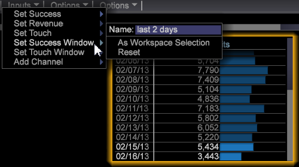
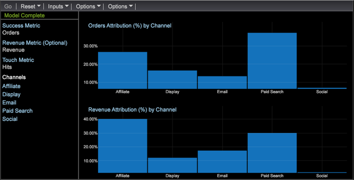

# Erstellen eines Best-Fit-Attributionsmodells{#build-a-best-fit-attribution-model}

{{eol}}

Öffnen Sie im Premium-Menü die Best Fit Attribution und führen Sie die folgenden Schritte aus, um ein Modell mit der besten Zuordnung zu erstellen.

Überblick über [Best Fit Attribution](../../../../home/c-get-started/c-attribution-profiles/c-attrib-algorithmic/c-attrib-algorithmic.md#concept-237feb6e9c4d49efaf75399297dcb9d1).

1. Öffnen **Best Fit Attribution**.

   Öffnen Sie einen Arbeitsbereich und klicken Sie auf **[!UICONTROL Premium]** > **[!UICONTROL Best Fit Attribution]**.

   

   >[!NOTE]
   >
   >Die optimale Zuordnung ist eine Adobe Analytics Premium-Funktion, für die Sie Premium in Ihrem Profil aktivieren müssen. Dazu müssen Sie Ihr Zertifikat aktualisieren und das Premium-Profil Ihrer Datei profile.cfg hinzufügen. Siehe [DWB Server-Upgrade: 6.2 bis 6.3](/help/home/c-inst-svr/c-upgrd-uninst-sftwr/c-upgrd-sftwr/c-6-2-to-6-3-upgrade.md) für DWB 6.3.

1. Legen Sie die **[!UICONTROL Success]** Metrik.

   >[!NOTE]
   >
   >Sie können eine Metrik entweder aus einer **[!UICONTROL Finder]** im linken Bereich der Visualisierung der Attribution angezeigt werden, oder wählen Sie aus der **Eingaben** Menü.

   Klicken Sie auf **[!UICONTROL Inputs]** > **[!UICONTROL Set Success]**. Das Metrikmenü wird geöffnet. 

   Wählen Sie eine Metrik aus, die eine erfolgreiche Konversion identifiziert.

1. (optional) Legen Sie die **Umsatz** Metrik.

   Legen Sie eine Metrik fest, um den Umsatz während des Konvertierungsprozesses zu bewerten.

1. Legen Sie die **Touch** Metrik.

   >[!NOTE]
   >
   >Das Festlegen einer Touch-Metrik ist nur erforderlich, wenn Sie versuchen, Erfolgsmetriken automatisch zu erstellen, indem Sie Dimensionselemente in die Visualisierung ziehen.

   Klicken Sie auf **[!UICONTROL Inputs]** Menü und wählen Sie **Touch einstellen** oder ziehen Sie eine Metrik aus dem Finder. 

   Dies wird verwendet, um Kanalmetriken abzuleiten, wenn Dimensionselemente als Eingaben verwendet werden.

1. Legen Sie eine **Erfolg** Fenster.

   Klicken Sie auf [!DNL Inputs > Success Window]. Wählen Sie einen Datumsbereich aus einer Tabelle aus und benennen Sie dann das Fenster Erfolg . Klicken **[!UICONTROL Workspace Selection]** und die ausgewählten Daten werden als Zeitbereich für die Erfolgsmetrik zugewiesen.

   

   >[!NOTE]
   >
   >Da es sich bei dem Erfolgsfenster um eine Workstation-Auswahl handelt, können Sie beliebige Dimensionen in Ihr Erfolgsfenster aufnehmen.

1. Legen Sie eine **[!UICONTROL Touch Window]**.

   Klicken Sie auf [!DNL Inputs > Touch Window]. Wählen Sie einen Datumsbereich aus einer Tabelle aus und benennen Sie dann das Touch-Fenster. Klicken **[!UICONTROL Workspace Selection]** und die ausgewählten Daten werden als Zeitbereich für die Erfolgsmetrik zugewiesen.

   

   Standardmäßig wird die **Touch** wird auf den gleichen Zeitraum wie die **[!UICONTROL Success]** Fenster.

1. (optional) Legen Sie einen Trainings-Filter fest.

   Sie können auch eine **Trainings-Filter** im Arbeitsbereich, um Besucherdaten zu filtern.

   >[!NOTE]
   >
   >Wenn Sie sowohl das Fenster Erfolg als auch das Fenster Touch festlegen, können Sie den Filter Training auf die aktuellen Workspace-Auswahlen anwenden, um Ihre Daten weiter zu beschränken.

   

   >[!NOTE]
   >
   >Der Trainings-Satz wird immer von Besuchern gezogen, die das Erfolgsfenster erfüllen. Durch Filterung mit dem Filter-Editor können Sie eine Untergruppe von Besuchern erstellen, die im Erfolgsfenster gemeldet werden.

1. Geben Sie Kanalmetriken an, die Touch darstellen.

   Ziehen Sie Metriken in die Visualisierung oder wählen Sie sie aus der [!DNL Inputs] > [!DNL Add Channel] Menü. Wenn Sie noch keine Metriken für Kampagnen oder Kanäle definiert haben, aber Dimensionen für Kanäle haben, kann die Visualisierung diese automatisch mit der Spezifikation einer Touch-Metrik erstellen.

   Beispielsweise mit der Touch-Metrik auf [!DNL Hits]und erhalten eine [!DNL dimension] aufgerufen [!DNL Media Type] mit Elementen, die Dinge wie [!DNL Email], [!DNL Press Release], [!DNL Print Ad]und [!DNL Social Media], generiert die Visualisierung die Kanalmetriken des Formulars [!DNL Hits where Media Type = Email] wenn Sie die Elemente per Drag-and-Drop in die Visualisierung ziehen.

1. Presse **Los**.

   Der Prozess Best Fit Analysis wird ausgeführt und je nach den ausgewählten Eingaben werden Attribute pro Kanal in einem Diagramm dargestellt.

   >[!NOTE]
   >
   >Rechtsklick **Modell abgeschlossen** in der abgeschlossenen Analyse, um Statistiken für das Attributionsmodell anzuzeigen.

   

Wenn das Diagramm abgeschlossen ist, zeigt es ein pro Kanal berechnetes Attributionsmodell und eine Verteilung der *Umsatz* Metrik (sofern festgelegt). Das Modell kann intern gespeichert oder in andere Systeme exportiert werden.

>[!NOTE]
>
>**[!UICONTROL Streaming]**, **[!UICONTROL Online]** und **[!UICONTROL Offline]** -Modi erzeugen unterschiedliche Effekte beim Erstellen eines Attributionsmodells basierend auf der Latenz der zu bewertenden Daten. Im Streaming-Modus die Details **[!UICONTROL Model Complete]** wird angezeigt. Im Online- und Offline-Modus wird die Detailansicht **[!UICONTROL Local Model Complete]** wird angezeigt.

## Optionen, Menü {#section-22288867f6c8483a8a38410f4b948346}

Die **Optionen** bietet erweiterte Funktionen zum Einrichten und Anzeigen der Analyse der besten Zuordnung.

<table id="table_8F6F517B7DBF4259814BEC6D07A72EAC">
 <thead>
  <tr>
   <th colname="col1" class="entry"> Optionen, Menü </th>
   <th colname="col2" class="entry"> Beschreibung </th>
  </tr>
 </thead>
 <tbody>
  <tr>
   <td colname="col1"> Trainings-Filter festlegen  </td>
   <td colname="col2"> Der Schulungsfilter wird zusammen mit dem Erfolgsfenster verwendet, um die Population beim Erstellen des Attributionsmodells zu filtern. Dadurch erhalten Sie eine Teilmenge von Daten, die nur die Besucher enthält, die Sie analysieren möchten. 
Hinweis: Erfahrene Benutzer können auch die Flexibilität von Filtern nutzen, um sich über die Zeitleiste von "Erfolg"und "Touch Windows"hinaus zu konzentrieren. Sie können beispielsweise nicht nur einen Zeitraum auswählen, sondern auch eine Reihe von <i>Referrerdomänen</i> , um nur die Attribution für Benutzer aus diesen Domänen zu untersuchen. 
 </td>
  </tr>
  <tr>
   <td colname="col1"> Beschreibung komplexer Filter anzeigen  </td>
   <td colname="col2"> Zeigt den Filtercode für Trainings-Filter, Erfolgsfenster und Touch-Fenster an. </td>
  </tr>
  <tr>
   <td colname="col1"> Modell speichern  </td>
   <td colname="col2"> Speichert das aktuelle Attributionsmodell für die zukünftige Verwendung. </td>
  </tr>
  <tr>
   <td colname="col1"> Lademodell  </td>
   <td colname="col2"> Öffnet ein zuvor gespeichertes Attributionsmodell. </td>
  </tr>
  <tr>
   <td colname="col1"> Präsentationsansicht  </td>
   <td colname="col2"> Blendet die obere Menüleiste für die Präsentation aus. </td>
  </tr>
  <tr>
   <td colname="col1"> 
<b>Optionen &gt; Erweitert</b> umfasst Funktionen, mit denen die Größe des Trainings-Sets festgelegt und der Ansatz für den Fall eines Klassenungleichgewichts festgelegt wird. 
 </td>
   <td colname="col2"> </td>
  </tr>
  <tr>
   <td colname="col1"> Erweitert &gt; Größe des Trainings-Sets  </td>
   <td colname="col2"> 
Legt die Größe des Trainings-Sets fest. 
 
Hinweis: Die standardmäßige Trainings-Größe ist groß für 250.000 Besucher. 

    <ul id="ul_5F17C60227C34A85A2C476A32F2B5DCD">
     <li id="li_A076FC2AD0214ADDBFCFD82AEA5F0880">Tiny = 50.000 </li>
     <li id="li_17E77E01D5374068BEBC80B3AD4CCD41">Klein = 75.000 </li>
     <li id="li_7F6B4834742A4BFCBC3DB214425B88C3">Normal = 100.000 </li>
     <li id="li_0BB7F791603745028CFC661EBC94D8B4">Groß = 250,00 </li>
     <li id="li_34B60233C84F48F1BCB8040C5195411A">Huge = 500.000 </li>
    </ul> </td>
  </tr>
  <tr>
   <td colname="col1"><b>Erweitert &gt; Klassenausgleich </b> </td>
   <td colname="col2"> 
Identifiziert und definiert die Anzahl der Eingabedaten, die für ein Klassenungleichgewicht-Problem basierend auf der Datensatzgröße generiert werden sollen. 
 </td>
  </tr>
 </tbody>
</table>

| Optionen zum Zurücksetzen und Entfernen | Beschreibung |
|---|---|
| **[!UICONTROL Reset Model]** | Aus dem **[!UICONTROL Reset]** Menü auswählen **[!UICONTROL Reset Model]** , um die Visualisierung zu löschen, aber Eingabemetriken beizubehalten. |
| **[!UICONTROL Reset All]** | Aus dem **[!UICONTROL Reset]** Menü auswählen **[!UICONTROL Reset All]** , um die Visualisierung und die Eingabemetriken zu löschen. |
| **[!UICONTROL Remove]** | Klicken Sie mit der rechten Maustaste auf eine beliebige Eingabe und wählen Sie **[!UICONTROL Remove]** , um die Metrik aus der ausgewählten Eingabe zu löschen. |
| **[!UICONTROL Remove All]** | Rechtsklick auf *Kanäle* und wählen Sie **[!UICONTROL Remove All]** , um alle Eingabemetriken zu löschen. |
