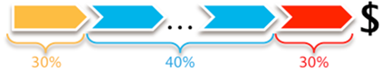

# Attributionsmodelle{#attribution-models}

{{eol}}

Es stehen sieben verschiedene Attributionsmodelle zur Verwendung mit dem Attributionsprofil zur Verfügung, um die Journey für das Kundenmarketing zu veranschaulichen und zu quantifizieren.

**Erste und letzte** **model**

Die ersten Attributionsmodelle sind die traditionellen **Erste** und **Letzte** Touches. Das Verständnis des ersten Schritts in die Konvertierung eines Verkaufs oder des Letztkontakts vor dem Auschecken und Kaufen eines Produkts vermittelt ein Verständnis der Kampagnentypen - für das Bewusstsein, den Erstkontakt und für Aktionsaufrufe den Letztkontakt.

**Sogar** **model**

Mit der Einführung von **Sogar**. Jede qualifizierende Marketing-Interaktion erhält den gleichen Anteil an der nachfolgenden Bestellung und dem aus der Konversion generierten Umsatz.

**Starter, Player und Closer** **model**

Und über eine gleichberechtigte Zuordnung hinaus **Starter, Player und Closer** -Modell bietet ein positionsbasiertes Gewichtungssystem mit anpassbarer Gewichtung. Die Gewichtungen können bei der Analyse untersucht werden.

Betrachten Sie dieses Beispiel: Der Starter (oder der erste) erhält 30 Prozent des konvertierten Umsatzes, der nähere (oder letzte) erhält 30 Prozent, und alle Spieler (diese Zwischenspieler) teilen sich einen gleichen Anteil der verbleibenden 40 Prozent.

>[!NOTE]
>
>Es ist ziemlich üblich, die Zuordnung wieder Marketing-Interaktionen zuzuweisen, basierend auf dem Umsatz oder dem Vorkommen der Bestellung. Diese beiden nächsten Modelle ordnen den Marketing-Interaktionen unterschiedliche Merkmale zu, um andere Erfolgsdynamiken aufzuzeigen.

**Adjaktionsmodell**

Das Adjacency-Modell bietet bei der Beantwortung der Frage einen Überblick über die Marketing-Position weg von der Konversion: Ist der Marketing-Kanal normalerweise der 1`st` (nächstgelegen), 5`th`oder 10`th` Marketingkanalinteraktion weg vom Erfolg?

**Latenzmodell**

Die **Latenz** -Modell hilft dabei, die Verzögerung zwischen der Interaktion mit dem Marketing-Kanal und dem Auftreten des Erfolgs zu beschreiben. Dies ist nützlich, um Kampagnen vom Typ Bewusstsein gegenüber Aktionsaufrufen zu präsentieren und zu wissen, welche Hebel das Unternehmen ziehen kann, um eine schnellere Antwort von einer Zielgruppe zu erhalten. (Ein Wert von null (0) Tagen bedeutet, dass die Marketing-Interaktion am selben Tag stattgefunden hat wie der Erfolg.)

**Pfadmodell**

Das Pfadsetzungsmodell bietet verschiedene Ansätze, um die Interaktion des Kunden mit dem Marketing und seine erfolgreiche Konversion zu untersuchen und so die Beziehungen zwischen Marketinginteraktionen innerhalb der Journey herzustellen. Erkunden Sie die Prozesskarten, um allgemeine Flüsse zwischen unterstützenden Marketing-Kanälen und Erfolg zu verstehen. Bewerten Sie direkte sequenzielle Marketing-Interaktionen mit dem Pfad-Browser.

Pfadbrowser-Visualisierung

**Visualisierung von 2D-Prozesskarten**

**Visualisierung von 3D-Prozesskarten**

