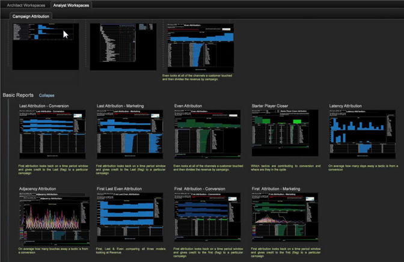

# Attributionsprofil{#attribution-profile}

Mithilfe des neuen regelbasierten Attributionsprofils in Data Workbench können Sie Attributionsereignisse schnell analysieren und Verantwortlichkeiten zuweisen, die zu einer von Ihnen definierten erfolgreichen Konvertierung führen. Das Attributionsprofil enthält alle Informationen, die erforderlich sind, damit Ihr Datenarchitekt seine Funktionen einrichten und erweitern kann. Außerdem enthält es vordefinierte Arbeitsbereiche, in die Ihr Analyst springen und mit der Analyse beginnen kann.

Mit dem Attributionsprofil können Sie eine neue Perspektive auf die Beziehungen zwischen Ihren Marketing-Maßnahmen und einer erfolgreichen Lead-Generierung oder Verkaufsumrechnung von Kunden gewinnen. Das Attributionsprofil hilft Ihnen dabei, Interaktionen zu qualifizieren, denen die Zuordnung des realisierten Umsatzes oder der Beteiligung nachgelagert an der Journey des Kunden zugeschrieben werden sollte. Sie hilft dabei, die Auswirkungen Ihrer Marketing-Bemühungen und -Kosten zu ermitteln, indem Sie Attributionsereignisse schnell analysieren und dann die Verantwortung für Erst- oder Letztkontakt oder andere Ereignisse zuweisen können, die zu einem erfolgreichen Verkauf führen.

<!--  -->

>[!IMPORTANT]
>
>Das Attributionsprofil wird für die sofortige Verwendung durch Benutzer konfiguriert, die das Adobe SC-Profil implementiert haben, das den Analytics (SC/Insight)-Daten-Feed verwendet. Standardmäßig werden die Marketing- und Konversionsereignisse als Standardtypen von Interaktionen verwendet, die in den bereitgestellten regelbasierten Modellen ausgewertet werden.

Weitere Informationen finden Sie unter [Bereitstellen des Attributionsprofils](../../../../home/c-get-started/c-attribution-profiles/c-rules-attrib/c-attrib-profile-deploy.md#concept-fbcb5800cd6a40cc901e61f3882988c0) und [Attributionsmodelle](../../../../home/c-get-started/c-attribution-profiles/c-rules-attrib/c-attrib-models.md#concept-e209c7e86a5c4008ad6d78fdf4ea032d) .

## Architektur- und Analyst-Arbeitsbereiche {#section-27c6aff70ba147cca6e11451e127afb4}

Im Attributionsprofil sind auf separaten Registerkarten der Workbench Workbench Workspaces für Architekten und Analyst definiert.

**Architektonische Arbeitsbereiche**

Klicken Sie auf der Registerkarte **Attribution** auf die Registerkarte **[!UICONTROL Architect Workspace]**, um Arbeitsbereiche zu öffnen, die speziell für die Einrichtung Ihrer Konfigurationsdateien für die grundlegende Attributionsmodellierung entwickelt wurden.

Die Registerkarte Architektur enthält Arbeitsbereiche, in denen Sie die einzelnen Konfigurationsdateien im Ordner des Profildatensatzes durchlaufen können. Beispielsweise können Sie mit **[!UICONTROL Attribution Configuration - Step 1]** die Attributionswerte im Abschnitt &quot;Transformation&quot;der Datei [!DNL profile.cfg] identifizieren.

**Analyst** WorkspacesKlicken Sie auf die  **[!UICONTROL Analyst]** **[!UICONTROL Workspaces]** Registerkarte, um vordefinierte Arbeitsbereiche zu öffnen, in denen die Dimensionen und Metriken verwendet werden, die im Attributionsprofil bereitgestellt werden.

Diese Arbeitsbereiche sind in vier Kategorien unterteilt:

1. **Grundlegende** Berichte stellen ein einzelnes Modell in einem Arbeitsbereich bereit.
1. **Vergleichende** Berichte weiteten die Analysen aus, indem sie mehrere Modelle in einer einzigen Ansicht präsentierten.
1. **Die** Analyseberichte erweitern die Berichtsvorlagen, um die Attributionsmodelle in verschiedenen Formaten darzustellen. In diesem Abschnitt werden auch die positionsbasierten Gewichtungskoeffizienten eingeführt und offen gelegt.
1. **Pfadberichte** bieten Einblicke in die Marketing-Journey des Kunden mit mehreren Pfadvisualisierungen, um die Prozessflüsse und Interaktionspfade vollständig zu untersuchen und auszudrücken.

Die Registerkarte &quot;Analyst&quot;enthält Arbeitsbereiche, die mit Berichten vorkonfiguriert sind. Beispielsweise können Sie mit **[!UICONTROL First Attribution]** aus der **[!UICONTROL Campaign]**-Tabelle auswählen, um die **[!UICONTROL Revenue]**-Attribution basierend auf **[!UICONTROL Time]** anzuzeigen.

