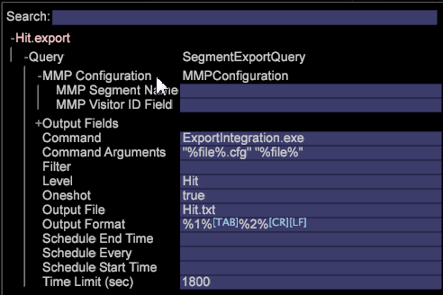

# Master-Marketing-Profilexport{#master-marketing-profile-export}

Mit Data Workbench können Sie Dateien exportieren, um sie als Teil einer integrierten Adobe Experience Cloud in Profile und Zielgruppen zu integrieren.

<!-- <a id="section_731922BC8628479198A41EF3EA72F2FF"></a> -->

Profile und Zielgruppen sind Teil des [Experience Cloud-Identitätsdienstes](https://docs.adobe.com/content/help/en/id-service/using/home.html), eines Hauptdiensts des [!DNL Adobe Experience Cloud]. Mit dem Export von Profilen und Zielgruppen können Zielgruppen über die Experience Cloud mit einer eindeutigen Experience Cloud ID (ECID) freigegeben werden, die jedem Besucher zugewiesen und dann von [Audience Manager](https://docs.adobe.com/content/help/en/audience-manager/user-guide/aam-home.html)verwendet wird. Die [!DNL ExportIntegration.exe] Anwendung ( [!DNL E:\Server\Scripts]) wird verwendet, um sowohl MMP- als auch Adobe Target-Exporte zu generieren.

**Konfigurieren des FSU-Servers für die Verwendung von Profiles and Audiences**

1. Greifen Sie auf Ihren FSU-Server zu.
1. Öffnen Sie die Datei &quot;MMPExport.cfg&quot;. `Server/Admin/Export/MMPExport.cfg`.
1. Geben Sie die erforderlichen Werte in alle Felder ein. Beispiel:

   >[!NOTE]
   >
   >Die Integration von MMP/AAM nutzt den Amazon s3-Behälter für die Datenübertragung.
   >
   >
   >Die für die Übertragung von MMP (s3) erforderlichen s3-Informationen können vom Audience Manager-Team abgerufen werden.

   ```
   Sample MMPExport.cfg
   MMP Export Configuration = MMPExportConfiguration: 
   s3 Bucket = string: aws_bucket_for_mmp 
   s3 Object Directory = string: test/files/ 
   s3 Region = string: us-east-1 
   s3 Access Key = string: ZZKI62OO5YBA 
   s3 Secret Key = string: ioqwa3OpNE5 
   data Provider Name = string: 895 
   client ID = string: mcprofile2-test 
   client Secret = string: saea1287617212987q 
   username = string: mmptest 
   password = string: pass 
   numRecordsPerChunk = int:  
   numThreads = int:  
   maxRetriesOnSendFailure = unsigned int:
   ```

   >[!NOTE]
   >
   >Mit der [!DNL MMPExport.cfg]Datei können Sie außerdem alle Datensätze aufnehmen, in Sätze unterteilen und Datensatzgruppen erstellen. Die Teile der Datensätze werden dann nach Amazon S3 exportiert. Zum Erstellen von Datensätzen sind drei obligatorische Parameter erforderlich: [!DNL numRecordsPerChunk], [!DNL numThreads]und [!DNL maxRetriesOnSendFailure].

**Definition der Parameter**

<table id="table_DDEFBC45895A4663973F9C2EB9052FEF"> 
 <thead> 
  <tr> 
   <th colname="col1" class="entry"> Parameter </th> 
   <th colname="col2" class="entry"> Definition </th> 
  </tr> 
 </thead>
 <tbody> 
  <tr> 
   <td colname="col1"> <i>s3-Behälter</i> </td> 
   <td colname="col2"> Der AWS S3-Behälter, in den der Export übertragen wird. </td> 
  </tr> 
  <tr> 
   <td colname="col1"> <i>s3-Objektverzeichnis</i> </td> 
   <td colname="col2"> Ein Pfad zum Speichern von s3-Dateien. Dies unterstützt Unterordner. <p> <p>Wichtig:  Leerzeichen und Multibyte-Zeichen sind im Pfad nicht zulässig und verursachen Fehler im Export. (Die Ausrichtung ist zulässig). </p> </p> </td> 
  </tr> 
  <tr> 
   <td colname="col1"> <i>s3-Region</i> </td> 
   <td colname="col2"> Die AWS s3-Region, an die der Export gesendet wird. Ex. us-east-1 </td> 
  </tr> 
  <tr> 
   <td colname="col1"> <i>s3-Zugriffsschlüssel</i> </td> 
   <td colname="col2"> AWS s3-Zugriffsschlüssel </td> 
  </tr> 
  <tr> 
   <td colname="col1"> <i>s3 Geheimer Schlüssel</i> </td> 
   <td colname="col2"> Geheimer AWS s3-Schlüssel </td> 
  </tr> 
  <tr> 
   <td colname="col1"> <i>Datenanbietername</i> </td> 
   <td colname="col2"> Dies ist der Ordnername, der zum Speichern von Segmenten und Eigenschaften in AAM verwendet wird. Dies sollte für jeden Kunden eindeutig sein. </td> 
  </tr> 
  <tr> 
   <td colname="col1"> <i>Client-ID</i> </td> 
   <td colname="col2"> Dies ist eine eindeutige Client-ID, die einem Kunden bereitgestellt wird, wenn sie für MMP bereitgestellt wird. </td> 
  </tr> 
  <tr> 
   <td colname="col1"> <i>Clientgeheimnis</i> </td> 
   <td colname="col2"> <p><i></i>Dies ist ein eindeutiges Kundengeheimnis, das einem Kunden bereitgestellt wird, wenn er für MMP bereitgestellt wird. </p> </td> 
  </tr> 
  <tr> 
   <td colname="col1"> <i>username</i> </td> 
   <td colname="col2"> MMP-Benutzername </td> 
  </tr> 
  <tr> 
   <td colname="col1"> <i>password</i> </td> 
   <td colname="col2"> MMP-Kennwort </td> 
  </tr> 
  <tr> 
   <td colname="col1"> <i>numRecordsPerChunk</i> </td> 
   <td colname="col2"> <p>Bestimmt die Größe des Stapels in Bezug auf die Anzahl der Datensätze. </p> <p>Die Implementierung beschneidet den vom Benutzer angegebenen Wert auf min = 1000 records&amp;nbsp;(~50-KB-Abschnitte)&amp;nbsp;und max = 50000 Datensätze (~2,5-MB-Abschnitte).&amp;nbsp;Der Standardwert 10000 wird verwendet, wenn der Benutzer diese Konfigurationseigenschaft nicht angibt. </p> </td> 
  </tr> 
  <tr> 
   <td colname="col1"> <i>numThreads</i> </td> 
   <td colname="col2"> <p>Bestimmt die Parallelität des Teilstücks, das gesendet wird. Es akzeptiert einen Wert zwischen 1 und 24 Threads und der Standardwert ist 12 Threads. </p> </td> 
  </tr> 
  <tr> 
   <td colname="col1"> <i>maxRetriesOnSendFailure</i> </td> 
   <td colname="col2"> <p>Bestimmt die Anzahl der Wiederholungsversuche im Falle von Fehlern bei Chunk-Senden. Der Standardwert ist 0, um keine Wiederholungen anzugeben. </p> <p>Zwischen Wiederholungen wird ein Ruheintervall von 2 Sekunden verwendet. </p> </td> 
  </tr> 
 </tbody> 
</table>

**Erstellen von MMP-Exporten vom Client**

1. Öffnen Sie auf dem Client eine Arbeitsfläche und klicken Sie mit der rechten Maustaste **[!UICONTROL Tools]**> **[!UICONTROL Detail Table]**.
1. Fügen Sie **Ebene** hinzu.
1. Klicken Sie mit der rechten Maustaste auf die Kopfzeile und wählen Sie **Attribute** hinzufügen.
1. Klicken Sie mit der rechten Maustaste auf die Kopfzeile und wählen Sie **Neuer Master-Marketingprofil-Export**. 
1. Erweitern Sie **Abfrage**.

   

1. Erweitern Sie die **MMP-Konfiguration**.
1. (erforderlich) Geben Sie den **MMP-Segmentnamen** und das **MMP-Besucher-ID-Feld** ein. Diese Parameter können nicht leer gelassen werden.
1. Der **MMP-Segmentname** sollte mit der im MMP definierten Segment-ID übereinstimmen.
1. Die **MMP-Besucher-ID** ist die in Schritt 4 definierte Attributspalte, die der **Besucher-ID** entspricht.
1. Sobald diese Felder eingegeben wurden, können Sie den Export speichern, indem Sie mit der rechten Maustaste auf die Überschrift für den Export klicken und &quot; **Speichern** als &quot;Benutzer\.export&quot;wählen.
1. Öffnen Sie **Admin** > **Profilmanager** und speichern Sie den Export in das Profil.

   Wenn alle Daten korrekt eingegeben wurden, wird eine Exportdatei im FSU ([!DNL Server/Exports]) generiert und der Export auf das AWS mit den Informationen unter [!DNL MMPExport.cfg]. Das Protokoll zu diesem Thema finden Sie in [!DNL Server/Trace/]. z. B. [!DNL MMP-102014-133651- `<Segment Export Name>` .log]

```
Query = SegmentExportQuery: 
Command = string: ExportIntegration.exe 
Command Arguments = string: \"%file%.cfg\" \"%file%\" 
Filter = string: 
Level = string: Page View 
MMP Configuration = MMPConfiguration: 
MMP Segment Name = string: 12345 
MMP Visitor ID Field = string: Tracking ID 
Oneshot = bool: true 
Output Fields = vector: 3 items 
0 = ColumnDefinition: 
Column Name = string: 
Field Name = string: Tracking ID 
1 = ColumnDefinition: 
Column Name = string: 
Field Name = string: PID 
2 = ColumnDefinition: 
Column Name = string: 
Field Name = string: SID 
Output File = string: MMPTest.txt 
Output Format = string: %1%\t%2%\t%3%\r\n 
Schedule End Time = string: 
Schedule Every = string: 
Schedule Start Time = string: 
Time Limit (sec) = double: 1800 
```

| Konfigurationsdetails | Beschreibung |
|---|---|
| MMP-Segment-ID | Erforderlich. Dies ist ein Bezeichner, den Sie zuerst in Audience Manager definieren würden. |
| Feld für MMP-Besucher-ID | Ordnen Sie die ECID zu. |

