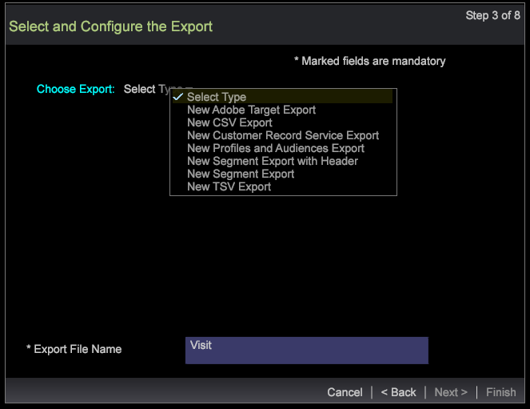

# Segment export wizard{#segment-export-wizard}

Exportieren von Segmenten mit dem Segmentexport-Assistenten

Der Assistent zum Segmentexport bietet einen schrittweisen Prozess zum Konfigurieren und Exportieren von Segmenten, anstatt Segmente aus einer Detailtabelle [zu exportieren](https://docs.adobe.com/content/help/en/data-workbench/using/client/export-data/c-sgmt-expt.html).

## Exportieren von Segmenten mit dem Assistenten {#section-b30f2699dbc7490bad18512b91cb0cb3}

Um den Assistenten zu öffnen, klicken Sie mit der rechten Maustaste in einen Arbeitsbereich und wählen Sie &quot; **Admin** &quot;> &quot; **Assistenten** &quot;> &quot;Assistent zum **Segmentexport&quot;**.

>[!NOTE]
>
>Es werden nur die Segmente erfasst, die vor dem Öffnen des Assistenten angewendet wurden. Außerdem können die vom Assistenten erstellten Segmentexporte keine externen Befehle hervorrufen.

1. Wählen Sie die verschiedenen übergeordneten Ebenen der Dimensionen und Metriken aus, die dem Export hinzugefügt werden sollen.

   Die angezeigten Ebenen hängen vom ausgewählten Profil ab. Sie können mehrere Dimensionsebenen basierend auf dem Profil auswählen.

   

1. Klicken Sie auf **Weiter**.
1. Wählen Sie die Dimension und die Metriken für die ausgewählten Ebenen aus.

   Wenn Sie beispielsweise &quot;Seitenansicht&quot;als übergeordnete Ebene auswählen, können Sie die zu exportierenden untergeordneten Dimensionen und Metriken auswählen.

1. Klicken Sie auf **Weiter**.

   

   

1. Wählen Sie das Exportformat und geben Sie einen Namen für die Exportdatei ein.

   

   Für CSV-, TSV-, Segmentexport- und Segmentexport mit Header-Typen ist keine zusätzliche Konfiguration erforderlich. In Schritt 3 müssen jedoch die Profile und der Zielgruppenexport, der benutzerdefinierte Datensatzdienst und Adobe Target Export konfiguriert werden. Siehe beispielsweise die Konfigurationsfelder für Profile und Zielgruppenexport. Konfigurieren Sie diese Exporttypen und klicken Sie auf **Weiter**.

   

   

   

1. Konfigurieren Sie den ausgewählten Exporttyp.

   Kopfzeile: Wenn die Kopfzeile &quot;True&quot;ist, geben Sie dem Feld &quot; **Ausgabedatei** &quot;einen Namen.

   Escape-Feld: Als **True** oder **False** festlegen.

   Reihenfolge der Felder: Wählen Sie ein Feld aus und verschieben Sie es nach oben oder unten, um die Reihenfolge in der Exportdatei festzulegen.

   

   Klicken Sie auf **Weiter**.

1. Zeigen Sie die Filter &quot;Ebene&quot;und &quot;Anwendung&quot;in diesem Dialogfeld an. Klicken Sie auf **Weiter**. 

1. Wenn **CSV**-, **TSV**-, **Segmentexport** - oder **Segmentexport mit Kopfzeile** ausgewählt ist, gibt es drei Optionen:

   Generischer Export: Die Ausgabedatei wird vom Server im Ordner Server/Export generiert.

   

   FTP-Export: Die Ausgabedatei wird auf den ausgewählten Server übertragen. (Die Serverliste wird aus der Datei FTPServerInfo.cfg ausgewählt.)

   

   SFTP-Export - Die Ausgabedatei wird sicher auf den ausgewählten Server übertragen.

1. Klicken Sie auf **Weiter**

   **Hinweis:** Wenn der ausgewählte Exporttyp **Profile und Zielgruppenexport**, **benutzerdefinierter Datensatzdienst** und **Adobe Target Export** sind, ist der Text basierend auf dem ausgewählten Export statisch.

1. Konfigurieren Sie die Planungsparameter.

   **Eine Aufnahme** kann auf &quot;True&quot;oder &quot;False&quot;eingestellt werden.

   **Die erweiterte Planung** kann durch Klicken auf die Schaltfläche Erweiterte Planungskonfiguration aktiviert oder deaktiviert werden.

   

   Wie beim Exportieren aus der Detailtabelle verschwindet One Shot, wenn Advanced Settings On (Erweiterte Einstellung aktiviert) ist. Klicken Sie auf **Weiter**.

1. Zeigen Sie die Exportdatei in der Vorschau an und klicken Sie dann auf Export **ausführen**.

   

   

Die folgenden Exporttypen sind über den Assistenten verfügbar:

**Segmentexport-Typen**

* Generisch
* FTP
* SFTP

**Segmentexport mit Kopfzeile**

* Generisch
* FTP
* SFTP

**CSV-Export**

* Generisch
* FTP
* SFTP

**TSV-Export**

* Generisch
* FTP
* SFTP

