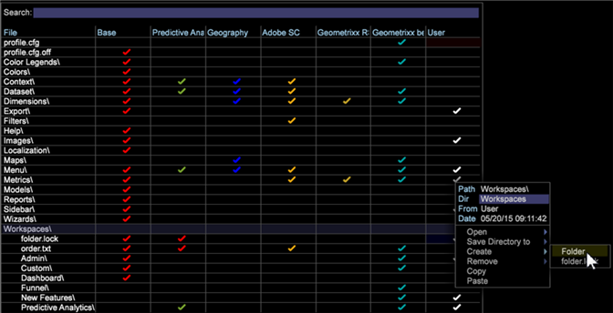

# Hinzufügen einer Registerkarte auf der Arbeitsfläche{#add-a-tab-to-the-worktop}

Fügen Sie der Arbeitsfläche eine Registerkarte hinzu, um schnell auf einen Arbeitsbereich zugreifen zu können.

Sie können einen Arbeitsbereich als Registerkarte auf der Arbeitsfläche hinzufügen. Sie können beispielsweise den Tab **Besucher** hinzufügen, um schnell auf einen Überblick über Ihren Traffic zugreifen zu können.

**Ordner im Profil-Manager hinzufügen**

1. Öffnen Sie den Arbeitsbereich, den Sie mit der neuen Registerkarte verknüpfen möchten, und klicken Sie dann mit der rechten Maustaste auf **Admin** > **Profil-Manager**.
1. Klicken Sie in [!DNL Profile Manager] auf **[!UICONTROL Workspaces]** , um den Inhalt anzuzeigen.
1. Klicken Sie mit der rechten Maustaste in die Spalte [!DNL User] für [!DNL Workspaces] und wählen Sie **[!UICONTROL Create]** > **[!UICONTROL Folder]** aus.

   

   Dadurch wird ein neuer Unterordner erstellt, der die Dateien enthält, die Sie auf Ihrer neuen Registerkarte verfügbar machen möchten. Es wird ein neuer Ordner mit dem Namen Neuer Ordner angezeigt.
1. Klicken Sie zum Umbenennen mit der rechten Maustaste in die Spalte [!DNL User] für den neuen Ordner und geben Sie einen Namen in den Parameter Dir ein.

   

   Der Ordnername wird auf der Arbeitsfläche als Registerkarte angezeigt.

   

1. (Optional) Um die Änderungen für alle Benutzer des Arbeitsprofils verfügbar zu machen, klicken Sie mit der rechten Maustaste auf das weiße Häkchen für die Datei [!DNL .vw] in der Spalte [!DNL User] und klicken Sie auf **[!UICONTROL Save to]** > *&lt;**[!UICONTROL working profile name]***.

   Um nur die Vollversion des Beschreibungsarbeitsbereichs und nicht die Miniaturansicht dieses Arbeitsbereichs anzuzeigen, müssen Sie den Arbeitsbereich im Arbeitsprofil speichern. Klicken Sie dazu in der Spalte [!DNL Profile Manager] mit der rechten Maustaste auf das weiße Häkchen für die Datei [!DNL description.vw] in der Spalte [!DNL User] und klicken Sie dann auf **[!UICONTROL Save to]** > *&lt;**[!UICONTROL working profile name]***.
