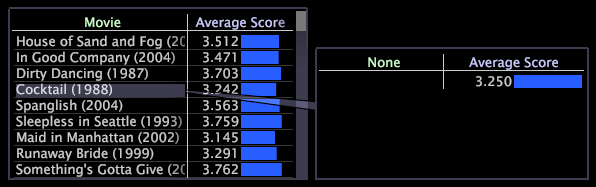
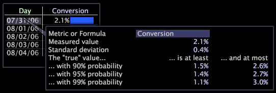

# Hinzufügen von Aufrufen zu einer Arbeitsfläche{#adding-callouts-to-a-workspace}

Bei den Schaltflächen handelt es sich um Fenster, die Sie einem Arbeitsbereich hinzufügen, um Aufmerksamkeit auf ein bestimmtes Dimensionselement zu lenken, indem Sie eine neue Visualisierung mit einer virtuellen Auswahl dieses Elements erstellen.

Data Workbench wird mit einem Standardsatz von Callout-Typen bereitgestellt. Da Ihre Implementierung vollständig angepasst werden kann, unterscheiden sich die verfügbaren Aufruftypen, die in Ihrer Implementierung angezeigt werden, möglicherweise von den in diesem Handbuch beschriebenen Typen.

Data Workbench stellt standardmäßig die folgenden Aufrufe bereit:

* [Anmerkung](../../../home/c-get-started/c-vis/c-call-wkspc.md#section-7b6742160b3f4aed872a09c8c023f90d)
* [Diagramm für leere Linien](../../../home/c-get-started/c-vis/c-call-wkspc.md#section-5dcc0504bdb64ed4976f880e2f7b277f)
* [Leeres Streudiagramm](../../../home/c-get-started/c-vis/c-call-wkspc.md#section-5dcc0504bdb64ed4976f880e2f7b277f)
* [Leere Tabelle](../../../home/c-get-started/c-vis/c-call-wkspc.md#section-5dcc0504bdb64ed4976f880e2f7b277f)
* [Vertrauenslegende](../../../home/c-get-started/c-vis/c-call-wkspc.md#section-386d1293ddc24a0c9cccb332e20db791)
* [Metriklegende](../../../home/c-get-started/c-vis/c-call-wkspc.md#section-daa6d372c22246d9827880a9d6e804d8)

>[!NOTE]
>
>Berechnungen funktionieren nur dann als Auswahlen (d. h., sie wirken sich nicht auf andere Visualisierungen innerhalb des Arbeitsbereichs aus), wenn Sie eine Auswahl innerhalb der Berechnung vornehmen.

Sie können Callout-Definitionen hinzufügen oder bearbeiten, indem Sie die im *Profilnamen*\Context\Callout folder of the [!DNL Server] -Installationsordner gespeicherten Callout-Dateien konfigurieren. Siehe [Konfigurieren von](../../../home/c-get-started/c-intf-anlys-ftrs/c-config-callouts.md#concept-f6e91e172f5e4c009245c9c549beb76a)Aufrufen.

## So fügen Sie einer Visualisierung einen Anmerkungsaufruf hinzu {#section-7b6742160b3f4aed872a09c8c023f90d}

1. Klicken Sie mit der rechten Maustaste auf das Element, für das Sie eine Berechnung erstellen möchten, und klicken Sie dann auf **[!UICONTROL Add Callout]** > **[!UICONTROL Annotation]** > **[!UICONTROL Image]** oder **[!UICONTROL Add Callout]** > **[!UICONTROL Annotation]** > **[!UICONTROL Text]**. Es wird ein leeres Fenster mit einer sichtbaren Verbindung zu diesem Element angezeigt.

   

   Um Berechnungen zu Diagrammvisualisierungen hinzuzufügen, müssen Sie mit der rechten Maustaste auf den unteren Rand der Visualisierung (die Basisachse) klicken, um ein Menü zu öffnen.

   

1. Führen Sie je nach Auswahl den entsprechenden Schritt aus:

   * Geben Sie für eine Textanmerkung den gewünschten Text ein oder fügen Sie ihn in die Beschriftung ein und formatieren Sie dann den Text entsprechend. Siehe [Arbeiten mit Textanmerkungen](../../../home/c-get-started/c-analysis-vis/c-annots/c-text-annots.md#concept-55b4aa3e0c58470b8e3c9d452e12a777).
   * Fügen Sie für eine Bildanmerkung das gewünschte Bild in die Berechnung ein, indem Sie das Bild kopieren und dann mit der rechten Maustaste in die Berechnung klicken. Klicken Sie auf **[!UICONTROL Paste image]**. Siehe [Arbeiten mit Bildnotationen](../../../home/c-get-started/c-analysis-vis/c-annots/c-image-annots.md#concept-02081ed7d91c4fdcb8fc863f2a51c962).

## So fügen Sie einer Visualisierung einen leeren Tabellen-, Liniendiagramm- oder Streudiagrammaufruf hinzu {#section-5dcc0504bdb64ed4976f880e2f7b277f}

1. Klicken Sie mit der rechten Maustaste auf das Element, für das Sie eine Berechnung erstellen möchten, und klicken Sie auf **[!UICONTROL Add Callout]** > *&lt;**[!UICONTROL callout type]**>*.

   Das folgende Beispiel zeigt eine leere Tabellenkalkulation.

   

1. Um eine Dimension auszuwählen, klicken Sie mit der rechten Maustaste **[!UICONTROL None]** und klicken Sie auf **[!UICONTROL Change Dimension]** > *&lt;**[!UICONTROL dimension name]**>*.

   >[!NOTE]
   >
   >Wenn Sie die Dimension in einer Visualisierung ändern, die einen Callout enthält, ändert sich der Callout von der Verbindung mit dem Element der ursprünglichen Dimension zur Verbindung mit der gesamten Visualisierung.

## So fügen Sie einer Visualisierung einen Berechtigungslegende-Callout hinzu {#section-386d1293ddc24a0c9cccb332e20db791}

1. Klicken Sie mit der rechten Maustaste auf das Element, für das Sie die Berechnung erstellen möchten, und klicken Sie auf **[!UICONTROL Add Callout]** > **[!UICONTROL Confidence Legend]**.

   

1. Ändern Sie bei Bedarf das [!DNL Metric or Formula] Feld.

Weitere Informationen zu Ausdruckssyntaxregeln finden Sie unter [Abfragesprachsyntax](../../../home/c-get-started/c-qry-lang-syntx/c-qry-lang-syntx.md#concept-15d1d3f5164a47d49468c5acb7299d9f). Siehe [Vertrauenslegende](../../../home/c-get-started/c-analysis-vis/c-legends/c-conf-leg.md#concept-73db81c2c218427786c04068aa778efd).

## So fügen Sie einer Visualisierung einen Metriklegendären-Callout hinzu {#section-daa6d372c22246d9827880a9d6e804d8}

1. Klicken Sie mit der rechten Maustaste auf das Element, für das Sie die Berechnung erstellen möchten, und klicken Sie auf **[!UICONTROL Add Callout]** > **[!UICONTROL Metric Legend]**.

   

1. Fügen Sie der Metriklegende bei Bedarf Metriken hinzu oder entfernen Sie sie.

Siehe [MetrikLegenden](../../../home/c-get-started/c-analysis-vis/c-legends/c-metric-leg.md#concept-e7195bc8f7844ae295bda3a88b028d5b).
