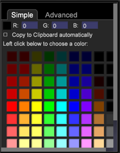

# Anmerkungen zu Visualisierungen{#annotating-visualizations}

{{eol}}

Auf der Präsentationsebene können Sie Ihre Workspace-Visualisierungen markieren und kommentieren und dann mit Ihren Ausrufen und Kommentaren veröffentlichen. Fügen Sie Textbeschreibungen, Grafikobjekte, Callout-Pfeile, Farbkodierung, Bilder und andere Funktionen zu einer Überlagerung hinzu, um Anmerkungen hinzuzufügen, wichtige Datenpunkte zu klären und diese dann für andere Benutzer freizugeben.

**Fügen Sie Ihren Visualisierungen Anmerkungen hinzu:**

1. Öffnen Sie einen Arbeitsbereich.
1. Navigieren Sie zu **Datei** > **Präsentationsschicht**.
1. Klicken **Präsentationsebene zulassen**.

   Schalten Sie den Befehl in diesem Menü um, um das Generieren einer Präsentationsebene zu ermöglichen oder zu deaktivieren. Wenn die Präsentationsebene zulässig ist, wird ein Häkchen angezeigt.

   

   Wenn Sie die Präsentationsschicht zulassen, wird rechts in der Symbolleiste ein anklickbares Symbol angezeigt.

    Dieses anklickbare Symbol zeigt, dass Sie sich im **Präsentationsebene ausblenden** -Modus, aber keine Anmerkungen anzeigen können.

1. Klicken Sie auf Symbol , um **Präsentationsebene anzeigen**.

   Anzeigen von Anmerkungen in der Präsentationsebene

    Dieses anklickbare Symbol zeigt, dass Sie sich im **Präsentationsebene anzeigen** -Modus, kann jedoch nicht bearbeitet werden.

   >[!NOTE]
   >
   >Sie können auch mit der rechten Maustaste in den Arbeitsbereich klicken, um die Modi mithilfe von Menübefehlen zu ändern.

   

1. **Bearbeiten Sie die Funktionen und fügen Sie sie hinzu.**

   Klicken Sie erneut auf das Symbol , um eine statische Darstellung der Workspace-Visualisierung zu erfassen und eine Überlagerung zum Hinzufügen oder Bearbeiten von Anmerkungen zu öffnen.

    Dieses anklickbare Symbol zeigt, dass Sie sich im **Präsentationsebene bearbeiten** Modus zum Hinzufügen und Bearbeiten von Anmerkungen.

   Im Bearbeitungsmodus wird eine graue Überlagerung angezeigt.

1. **Hinzufügen von Hinweissfunktionen**.

   Klicken Sie mit der rechten Maustaste auf die Visualisierung, um ein neues Textfeld hinzuzufügen. Pfeile und andere Funktionen zum Hervorheben und Kommentieren für die Präsentation.

   

1. **Festlegen von Grafikfunktionen**.

   Wählen Sie ein Grafikobjekt aus und klicken Sie mit der rechten Maustaste, um Optionen festzulegen. Sie können Farben für ein Feld oder ein anderes grafisches Objekt festlegen, Texteinstellungen in einem Textfeld anpassen und Pfeile hinzufügen oder die Zeilenebene festlegen.

   

1. **Bilder zum Arbeitsbereich hinzufügen**.

   Klicken Sie mit der rechten Maustaste, um die Bilder .png und .jpg zur Überlagerung hinzuzufügen und die Größe zu ändern.

1. **Weisen Sie Grafikobjekten Farben zu**.

   Sie können Objekte in der Präsentationsebene auswählen und mit der Farbauswahl Farben zuweisen. 

1. **Exportieren und Freigeben der Präsentationsschicht**.

   Nachdem Sie Ihre Workspace-Visualisierungen kommentiert haben, können Sie die Präsentationsebene mit Visualisierungen exportieren und als .png-Grafikdatei freigeben.

   Klicken **Export** > **PNG exportieren**.
