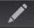
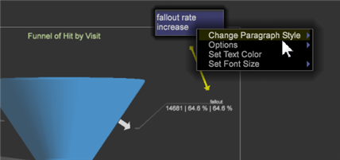

# Anmerkungen zu Visualisierungen{#annotating-visualizations}

Mit der Präsentationsebene können Sie Ihre Arbeitsflächen-Visualisierungen markieren, kommentieren und dann mit Ihren Ausrufen und Kommentaren veröffentlichen. Fügen Sie Textbeschreibungen, Grafikobjekte, Aufschlüsselungspfeile, Farbkodierung, Bilder und andere Funktionen in einer Überlagerung hinzu, um Anmerkungen hinzuzufügen, wichtige Datenpunkte zu klären und dann für andere Benutzer freizugeben.

**Fügen Sie Ihren Visualisierungen Anmerkungen hinzu:**

1. Öffnen Sie eine Arbeitsfläche.
1. Gehen Sie zu **Datei** > **Präsentationsebene**.
1. Klicken Sie auf Präsentationsebene **zulassen**.

   Schalten Sie den Befehl in diesem Menü um, um das Generieren einer Präsentationsebene zu ermöglichen oder zu deaktivieren. Wenn die Präsentationsebene zulässig ist, wird ein Häkchen angezeigt.

   

   Wenn Sie die Präsentationsebene zulassen, wird rechts in der Symbolleiste ein anklickbares Symbol angezeigt.

    Dieses anklickbare Symbol zeigt, dass Sie sich im Modus &quot;Präsentationsschicht **ausblenden&quot;befinden, dass Sie jedoch keine Anmerkungen anzeigen können** .

1. Klicken Sie auf das Symbol, um die **Präsentationsebene** anzuzeigen.

   Zeigen Sie Anmerkungen in der Präsentationsebene an.

    Dieses anklickbare Symbol zeigt an, dass Sie sich im Modus &quot;Präsentationsebene **anzeigen** &quot;befinden, aber nicht bearbeiten können.

   >[!NOTE]
   >
   >Sie können auch mit der rechten Maustaste auf den Arbeitsbereich klicken, um den Modus mithilfe von Menübefehlen zu ändern.

   

1. **Bearbeiten Sie die Funktionen und fügen Sie sie hinzu.**

   Klicken Sie erneut auf das Symbol, um eine statische Darstellung der Workspace-Visualisierung zu erfassen und eine Überlagerung zum Hinzufügen oder Bearbeiten von Anmerkungen zu öffnen.

    Dieses anklickbare Symbol zeigt, dass Sie sich im Modus &quot;Präsentationsebene **bearbeiten&quot;befinden, um Anmerkungen hinzuzufügen und zu bearbeiten** .

   Im Bearbeitungsmodus wird eine graue Überlagerung angezeigt.

1. **Fügen Sie Funktionen** zum Aufrufen hinzu.

   Klicken Sie mit der rechten Maustaste auf die Visualisierung, um ein neues Textfeld hinzuzufügen. Pfeile und andere Funktionen zum Aufzeichnen und Anmerkungen zur Präsentation.

   

1. **Legen Sie Grafikfunktionen** fest.

   Wählen Sie ein Grafikobjekt aus und klicken Sie mit der rechten Maustaste, um die Optionen festzulegen. Sie können Farben für ein Feld oder ein anderes grafisches Objekt festlegen, Texteinstellungen in einem Textfeld anpassen und Pfeile hinzufügen oder die Ebenen für Zeilen festlegen.

   

1. **Fügen Sie Bilder zum Arbeitsbereich** hinzu.

   Klicken Sie mit der rechten Maustaste, um Ihre PNG- und JPG-Bilder zur Überlagerung hinzuzufügen und deren Größe zu ändern.

1. **Weisen Sie Grafikobjekten** Farben zu.

   Sie können Objekte in der Präsentationsebene auswählen und Farben mit dem Farbwähler zuweisen. 

1. **Präsentationsebene** exportieren und freigeben.

   Nachdem Sie Ihre Workspace-Visualisierungen kommentiert haben, können Sie die Präsentationsebene mit Visualisierungen exportieren und als PNG-Grafikdatei freigeben.

   Klicken Sie auf **Exportieren** > PNG **exportieren**.
