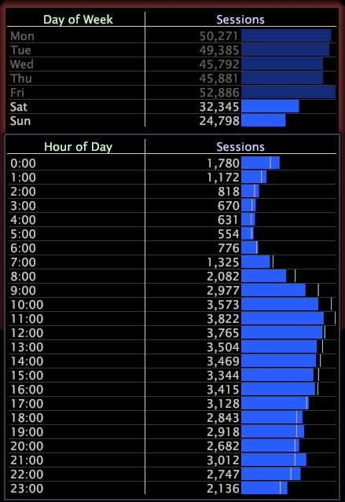

# Benchmarks{#benchmarks}

{{eol}}

Benchmarks zeigen qualitative Datenunterschiede an, indem sie die Verteilung einer Metrik auf der Basis aller Daten mit der Verteilung einer Metrik auf der Grundlage einer Auswahl in den Daten vergleichen.

Sie bieten einen schnellen Überblick über das normale Verhalten, indem sie veranschaulichen, wie eine Visualisierung aussehen würde, wenn keine Auswahl getroffen würde. Die Datenunterschiede basieren auf relativen Werten, nicht auf absoluten Werten.

>[!NOTE]
>
>Benchmarks können Datenunterschiede für den Datensatz oder für von Ihnen erstellte Datenuntergruppen darstellen. Weitere Informationen zu Teilmengen finden Sie unter [Arbeiten mit Teilmengen](../../../home/c-get-started/c-vis/c-wk-subsets/c-wk-subsets.md#concept-43809322b6374d5cb2536630a13e943b).

Die folgenden Diagramme zeigen die Sitzungen auf einer Website nach Wochentag und Stunde des Tages. Die Visualisierung auf der linken Seite bietet eine gute Darstellung des Musters, das der Site-Traffic im Laufe der Zeit nimmt. Um das allgemeine Site-Traffic-Muster mit dem Traffic-Muster an Wochenenden zu vergleichen, wählen Sie Samstag und Sonntag im Diagramm Sitzungen nach Wochentag aus, wie in der Visualisierung auf der rechten Seite dargestellt.

Nach einer Auswahl werden im Diagramm Sitzungen nach Tageszeit auf der rechten Seite Benchmarks (die dünnen weißen vertikalen Linien, die oben hervorgehoben sind) angezeigt. Anhand der Benchmarks können wir erkennen, dass das Traffic-Muster an Wochenenden im Vergleich zum gesamten Traffic-Muster im Allgemeinen weniger Sitzungen früher am Tag (08:00 bis 11:00 Uhr) umfasst.

Die Radar-Visualisierung ist auch für die Analyse von Benchmarks nützlich. Siehe [Radarvisualisierung](../../../home/c-get-started/c-analysis-vis/t-radar-vis.md#task-aeb2531e11ca48b597d5b0d704964dc8).
