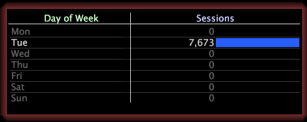

# Auswählen einer Ebene{#select-a-level}

Wenn Sie eine Teilmenge erstellen, müssen Sie eine Ebene angeben.

Eine Ebene ist eine beliebige zählbare Dimension. Wenn Sie beispielsweise mit Website-Daten arbeiten und das Element Tue aus der Dimension Wochentag auswählen und eine Teilmenge erstellen, müssen Sie die Ebene auswählen, die angezeigt werden soll: Seitenansicht, Sitzung oder Besucher.

* **Day of Week=&quot;Tue&quot; by Page View:**  Die Seitenansichtsebene zeigt nur die Seitenansichten an, die an einem Dienstag stattgefunden haben.

   

* **Wochentag=&quot;Tue&quot; nach Sitzung:**  Die Sitzungsebene zeigt nur die Sitzungen an, die an einem Dienstag stattgefunden haben.

   

* **Wochentag=&quot;Tue&quot; nach Besucher:** Die Besucherebene zeigt alle Besucher an, die am Dienstag auf die Site kamen, zeigt aber auch an anderen Tagen, dass dieselben Besucher zur Site kamen.

   
