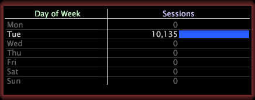

# Ebene auswählen{#select-a-level}

Wenn Sie eine Untergruppe erstellen, müssen Sie eine Ebene angeben.

Eine Ebene ist jede zählbare Dimension. Wenn Sie beispielsweise mit Website-Daten arbeiten und das Element Tue aus der Dimension Wochentag auswählen und eine Untergruppe erstellen, müssen Sie die Ebene auswählen, die Sie anzeigen möchten: Seitenansicht, Sitzung oder Besucher.

* **Wochentag=&quot;Tue&quot; nach Seitenansicht:** Die Seitenansichtsebene zeigt nur die Seitenansichten an, die am Dienstag stattgefunden haben.

   

* **Wochentag=&quot;Tue&quot; nach Sitzung:** Die Sitzungsebene zeigt nur die Sitzungen an, die am Dienstag stattgefunden haben.

   

* **Wochentag=&quot;Tue&quot; nach Besucher:** Die Besucherebene zeigt Ihnen alle Besucher, die am Dienstag zur Site kamen, zeigt aber auch an anderen Tagen, dass dieselben Besucher zur Site kamen.

   

