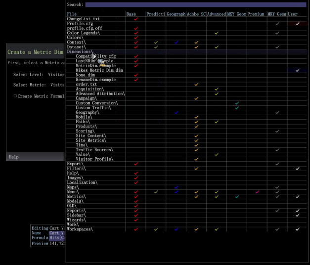
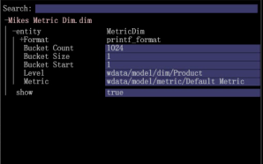

# Bearbeiten der Metrikdimension{#editing-the-metric-dim}

{{eol}}

Bearbeiten Sie eine Metrikdimension im Profil-Manager.

So bearbeiten Sie eine vorhandene Metrikdimension:

1. Klicken Sie in einem Arbeitsbereich mit der rechten Maustaste auf **Admin** > **Profil-Manager**. Öffnen **Dimension** und wählen Sie die Metrik Dim aus. 

1. Klicken Sie mit der rechten Maustaste auf das Häkchen in der Benutzerspalte und wählen Sie **Öffnen** und wählen Sie dann metric dim aus. 

1. Nehmen Sie im Feld Metrikdimension bearbeiten die erforderlichen Änderungen vor. 
