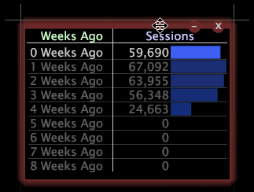

# Anpassen von Fenstern in einem Arbeitsbereich{#manipulate-windows-in-a-workspace}

Die verfügbaren Fenstertypen hängen vom Profil und der Anwendung ab, mit der Sie arbeiten.

**So fügen Sie ein Fenster hinzu**

1. Klicken Sie mit der rechten Maustaste in den Arbeitsbereich und klicken Sie auf die gewünschte Menüoption.
1. Wählen Sie in den angezeigten Menüs den Fenstertyp aus, der Ansicht werden soll.

**So verschieben Sie ein Fenster**

Setzen Sie den Mauszeiger auf den oberen Rand des Fensters, bis er als Vierfachpfeil dargestellt wird, und ziehen Sie ihn dann an die gewünschte Position in Ihrer Arbeitsfläche.

**So ändern Sie die Größe eines Fensters**

Setzen Sie den Mauszeiger auf eine beliebige Seite oder Ecke des Fensters, bis er zu einem zweizeiligen Pfeil wird, und ziehen Sie dann die Ecke oder Seite des Fensters, bis die gewünschte Größe erreicht ist.

**So kopieren Sie ein Fenster und fügen es ein**

Sie können Fenster in und zwischen Arbeitsbereichen kopieren und einfügen.

1. Klicken Sie mit der rechten Maustaste auf den oberen Rand des Fensters und klicken Sie auf **[!UICONTROL Copy]** > **[!UICONTROL Window]**.
1. Klicken Sie im gewünschten Arbeitsbereich auf **[!UICONTROL Open]** > **[!UICONTROL From Clipboard]**.

**So kopieren Sie ein Fenster und fügen es als Callout für eine Visualisierung ein**

1. Klicken Sie mit der rechten Maustaste auf den oberen Rand des Fensters und klicken Sie auf **[!UICONTROL Copy]** > **[!UICONTROL Window]**.
1. Klicken Sie in der gewünschten Visualisierung mit der rechten Maustaste auf das gewünschte Element und klicken Sie auf **[!UICONTROL Add Callout]** > **[!UICONTROL From Clipboard]**.
