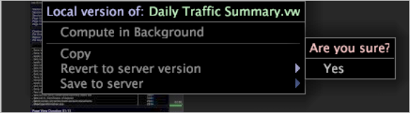

# Löschen von Arbeitsbereichen{#deleting-a-workspaces}

Informationen zum Löschen von Arbeitsbereichen aus der Arbeitsfläche.

Eine lokale Arbeitsfläche ist eine lokale Version einer Arbeitsfläche, die auf dem Server vorhanden ist. Eine Benutzerarbeitsfläche ist nur auf dem lokalen Computer vorhanden.

**So löschen Sie lokale Arbeitsflächen aus dem[!DNL Worktop]**

Klicken Sie mit der rechten Maustaste auf den zu löschenden Arbeitsbereich und klicken Sie auf **[!UICONTROL Revert to server version]** > **[!UICONTROL Yes]**. Die lokale Version wird gelöscht, aber die Serverversion bleibt erhalten.

>[!NOTE]
>
>Wenn Sie über eine lokale Version eines Serverarbeitsbereichs verfügen, müssen Sie die Änderungen verlieren, indem Sie zur Serverversion zurückkehren, bevor Sie eine aktualisierte Version des Serverarbeitsbereichs herunterladen können.

**So löschen Sie Benutzerarbeitsflächen aus dem[!DNL Worktop]**

Klicken Sie mit der rechten Maustaste auf den zu löschenden Arbeitsbereich und klicken Sie auf **[!UICONTROL Delete]**.

