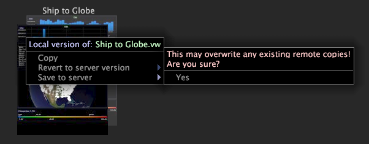

# Speichern eines Arbeitsbereichs{#save-a-workspace}

{{eol}}

Beim Schließen eines entsperrten Arbeitsbereichs werden standardmäßig alle Änderungen gespeichert, die am Arbeitsbereich vorgenommen wurden.

Wenn es sich bei dem Arbeitsbereich um einen Serverarbeitsbereich handelt, werden Ihre Änderungen nur lokal gespeichert, es sei denn, Sie speichern den aktualisierten Arbeitsbereich speziell auf dem Data Workbench-Server. Weitere Informationen zu gesperrten Arbeitsbereichen finden Sie unter [Entsperren eines Arbeitsbereichs](../../../home/c-get-started/c-work-worksp/c-unlock-wksp.md#concept-18ada952aecf45c79a806b31b294023e).

## Speichern eines Arbeitsbereichs lokal {#section-3f331c880f1a490c96844103c2432d61}

Der standardmäßige Speicherort ist der **User\profile name\Workspaces\tab name** im Installationsordner der Data Workbench. Wenn Sie beispielsweise mit dem Profil &quot;Filme&quot;arbeiten und einen Arbeitsbereich lokal über die [!UICONTROL Custom] auf, wird der Arbeitsbereich im **User\Movies\Workspaces\Custom** Ordner in Ihrem Installationsverzeichnis der Data Workbench.

**So speichern Sie Änderungen an einem Arbeitsbereich**

* Klicken Sie im Arbeitsbereich auf **[!UICONTROL File]**, dann **[!UICONTROL Save]**.

**So speichern Sie einen vorhandenen Arbeitsbereich als neuen Arbeitsbereich**

1. Auf Wunsch [!DNL Worktop] klicken Sie auf die Miniaturansicht des Arbeitsbereichs, den Sie anzeigen möchten.
1. Klicken Sie im Arbeitsbereich auf **[!UICONTROL File]** Klicken Sie auf **[!UICONTROL Save Copy As]**.
1. Im [!DNL Save Workspace As] Geben Sie den Namen und Speicherort an, in dem Sie den kopierten Arbeitsbereich speichern möchten, und klicken Sie auf **[!UICONTROL Save]**.

## Speichern eines Arbeitsbereichs auf dem Data Workbench-Server {#section-65a23da852ee4186880e002f7c87ea81}

>[!NOTE]
>
>Nur Benutzer mit den entsprechenden Berechtigungen können Arbeitsbereiche auf dem Data Workbench-Server speichern. Weitere Informationen erhalten Sie von Ihrem Systemadministrator.

Das Speichern von Arbeitsbereichen auf dem verbundenen Data Workbench-Server wird auch als das Veröffentlichen eines Arbeitsbereichs bezeichnet, da der Arbeitsbereich anderen Benutzern zur Verfügung gestellt wird. Arbeitsbereiche werden standardmäßig im *Name des Arbeitsprofils*\Workspaces\*tab name* folder of the Data Workbench server. Wenn Sie beispielsweise mit dem Filmprofil arbeiten und einen Arbeitsbereich auf dem verbundenen Data Workbench-Server speichern, der über das [!DNL Custom] auf, wird der Arbeitsbereich im Ordner &quot;Movies\Workspaces\Custom&quot;des Data Workbench-Servers gespeichert.

**So speichern Sie einen Arbeitsbereich auf dem Data Workbench-Server**

* Auf Wunsch [!DNL Worktop] Registerkarte klicken Sie mit der rechten Maustaste auf die Miniaturansicht des Arbeitsbereichs, den Sie auf dem Data Workbench-Server speichern möchten, und klicken Sie auf **[!UICONTROL Save to server]**.

