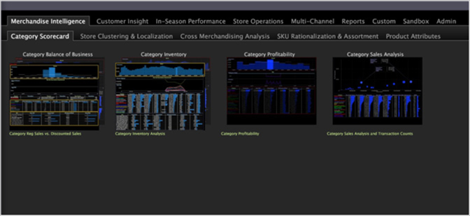

# Anzeigen von Arbeitsbereichen{#display-workspaces}

Ein Arbeitsbereich ist ein Container für eine bestimmte Analyse- und Visualisierungsaufgabe.

Ein Arbeitsbereich kann mehrere Visualisierungen enthalten, die alle für einen gemeinsamen Datensatz verwendet werden (d. h. alle Visualisierungen im Arbeitsbereich rendern denselben Satz von Abfrageergebnissen). Wenn Sie einen Filtervorgang in einer Visualisierung durchführen, wird die ausgewählte Teilmenge im gesamten Arbeitsbereich angezeigt.

Nachfolgend finden Sie ein Beispiel für mehrere Workspace-Miniaturansichten auf der [!DNL Worktop].

>[!NOTE]
>
>Da Ihre Implementierung der Data Workbench vollständig angepasst werden kann (d. h. weil die in Ihrer Implementierung angezeigten Registerkarten, Arbeitsbereiche und Menüelemente von den in diesem Handbuch beschriebenen abweichen können), müssen Sie beachten, dass Sie durch Rechtsklicken fast überall eine Liste von Optionen im Zusammenhang mit dem Arbeitsbereich oder der Visualisierung anzeigen können, in dem bzw. der Sie arbeiten.

Sie analysieren Ihre Daten, indem Sie verschiedene Arten von Visualisierungen in einem Arbeitsbereich kombinieren. Leistungsstarke Abfragen werden durch Auswahl aus den Daten erstellt, die in diesen Visualisierungen angezeigt werden und deren Ergebnisse in allen Visualisierungen visuell im Arbeitsbereich angezeigt werden. Mithilfe von Arbeitsbereichen können Sie den Umfang jeder Abfrage steuern: Jede Auswahl, die innerhalb einer Visualisierung vorgenommen wird, ändert die aktuelle Abfrage und wirkt sich auf die Abfragen in anderen Visualisierungen im Arbeitsbereich aus. Siehe [Auswahlen in Visualisierungen](../../../home/c-get-started/c-vis/c-sel-vis/c-sel-vis.md#concept-012870ec22c7476e9afbf3b8b2515746).

>[!NOTE]
>
>Nach dem Öffnen eines neuen Arbeitsbereichs müssen Sie möglicherweise auf **[!UICONTROL Add]** > **[!UICONTROL Temporarily Unlock]** klicken, um den Bildschirm zu entsperren.
