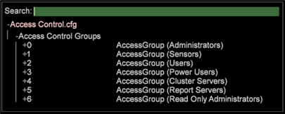

# Zugriffsebenen verstehen{#understanding-access-levels}

Zugriffsebenen beschreiben, welche URIs auf dem Computer eine Benutzergruppe lesen oder ändern darf.

Beachten Sie die folgenden Richtlinien, um die Zugriffsebenen für die Benutzer Ihrer Organisation zu definieren:

* Bestimmte URIs ohne nachfolgende Schrägstriche beschränken den Zugriff auf diese URI. Beispielsweise [!DNL /Components/Communications.cfg] können Sie nur auf die [!DNL Communications.cfg]Datei zugreifen.

* Ein nachfolgender Schrägstrich (/), der ein Verzeichnis angibt, gibt den Gruppenmitgliedern Zugriff auf jeden URI, der mit dieser Zeichenfolge beginnt. Beispielsweise bietet /Profiles/ Zugriff auf den gesamten Profilordner.
* Ein Dollarzeichen ($) schränkt den Zugriff auf den exakten URI nur ein, auch wenn es sich um einen Ordner handelt. Beispielsweise kann /Profiles/$ den Ordner &quot;Hauptprofile&quot;lesen, jedoch keine Dateien in diesem Verzeichnis.

   Für den Zugriff auf bestimmte Dateien müssen Sie kein $ nach dem Komma verwenden.

   Geben Sie beispielsweise denselben Zugriff ein [!DNL /Components/Communications.cfg] und [!DNL /Components/Communications.cfg$] gewähren Sie ihn.

* Ein Prozentsymbol (%) kann mit CN (Common Name) verwendet werden, um den Zugriff zu ermöglichen. Beispiel: /Users/%CN%/ erlaubt den Zugriff auf den Benutzerordner, der dem gemeinsamen Namen des [!DNL Insight] Benutzers mit dem SSL-Zertifikat entspricht. Beachten Sie, dass diese Syntax nur einmal in einem URI verwendet werden kann.

Die URIs in den vordefinierten Zugriffskontrollgruppen wurden wie folgt konfiguriert:

<table id="table_8E6FDD741BF24E2DAD96A2919FAE6C7F"> 
 <thead> 
  <tr> 
   <th colname="col1" class="entry"> Gruppenname </th> 
   <th colname="col2" class="entry"> Schreibgeschützter Zugriff </th> 
   <th colname="col3" class="entry"> Schreibzugriff </th> 
   <th colname="col4" class="entry"> Beschreibung </th> 
  </tr> 
 </thead>
 <tbody> 
  <tr> 
   <td colname="col1"> 
Administratoren 
 </td> 
   <td colname="col2"> </td> 
   <td colname="col3"> 
/ 
 </td> 
   <td colname="col4"> 
Lese- und Schreibzugriff auf alle  Insight Server -Ordner. 
 </td> 
  </tr> 
  <tr> 
   <td colname="col1"> 
Sensoren 
 </td> 
   <td colname="col2"> </td> 
   <td colname="col3"> 
/SensorInit.vsp 
 
/Submit.vsp 
 </td> 
   <td colname="col4"> 
Lesen und schreiben Sie den Zugriff auf die beiden Dateien, die die  Sensoren zur Kommunikation mit dem  Insight-Serververwenden. 
 </td> 
  </tr> 
  <tr> 
   <td colname="col1"> 
Benutzer 
 </td> 
   <td colname="col2"> 
/Profile/ 
 
/Status/ 
 
/Software/ 
 
/Addresses/ 
 
/Benutzer/$ 
 </td> 
   <td colname="col3"> /Users/%CN%/ </td> 
   <td colname="col4"> 
Lesen und schreiben Sie den Zugriff auf den Benutzerordner, der dem gemeinsamen Namen des SSL-Zertifikats des  Insight -Benutzers entspricht. 
 </td> 
  </tr> 
  <tr> 
   <td colname="col1"> 
Power-Benutzer 
 </td> 
   <td colname="col2"> 
/Profile/$ 
 
/Status/ 
 
/Software/ 
 
/Addresses/ 
 
/Benutzer/$ 
 </td> 
   <td colname="col3"> 
/Profile/ 
 
/Users/%CN%/ 
 </td> 
   <td colname="col4"> 
Power Users haben denselben Zugriff wie Benutzer, mit der zusätzlichen Möglichkeit, in den Profilordner zu schreiben. Diese Benutzer können Profile bearbeiten und die automatische Aktualisierung von Änderungen für andere  Insight -Benutzer aktivieren, z. B. bei der Verteilung neu definierter Arbeitsbereiche. 
 </td> 
  </tr> 
  <tr> 
   <td colname="col1"> 
Clusterserver 
 </td> 
   <td colname="col2"> 
/Components for processing servers/ 
 
/Addresses/ 
 
/Profile/ 
 
/Suchen/ 
 
/Access Control/ 
 
/bin/ 
 
/Protokolle/ 
 </td> 
   <td colname="col3"> 
/Cluster/ 
 </td> 
   <td colname="col4"> 
Lese- und Schreibzugriff auf den Cluster-Ordner. 
 </td> 
  </tr> 
  <tr> 
   <td colname="col1"> 
Berichtsserver 
 </td> 
   <td colname="col2"> 
/Profile/$ 
 
/Status/ 
 
/Software/ 
 
/Addresses/ 
 
/Benutzer/$ 
 </td> 
   <td colname="col3"> 
/Profile/ 
 
/Users/%CN%/ 
 
/ReportStatus.vsp 
 </td> 
   <td colname="col4"> 
Berichtscomputer haben denselben Zugriff wie Power Users, mit der zusätzlichen Möglichkeit, in die Datei ReportStatus.vsp zu schreiben  . 
 </td> 
  </tr> 
 </tbody> 
</table>

**So konfigurieren Sie die Zugriffssteuerung**

Beim Definieren von Zugriffskontrollgruppen müssen Sie alle Systemadministratoren, Benutzer, Cluster-Server und Berichtsserver-Benutzer einbeziehen, die Zugriff auf diesen [!DNL Insight Server] Computer benötigen. Sie können den Zugriff über IP-Adresse oder SSL-Zertifikatsinformationen, wie z. B. den gemeinsamen Namen oder die allgemeine Organisation, gewähren.

>[!NOTE]
>
>Wenn die [!DNL Access Control.cfg] Datei geändert wird [!DNL Insight Server], werden alle vorhandenen Verbindungen beendet und müssen erneut eine Verbindung hergestellt werden. Verbindungen werden mit den Berechtigungen in der aktualisierten [!DNL Access Control.cfg] Datei verglichen. In der Benutzeroberfläche des Servers Manager wird das [!DNL Insight Server] Symbol vorübergehend rot und dann grün, da die Verbindung beendet wird und eine erneute Verbindung mit allen anderen hergestellt werden muss.

1. Klicken Sie auf der Registerkarte [!DNL Admin] > [!DNL Dataset and Profile] auf die **[!UICONTROL Servers Manager]** Miniaturansicht, um den Arbeitsbereich &quot;Server Manager&quot;zu öffnen.

1. Klicken Sie mit der rechten Maustaste auf das Symbol des zu konfigurierenden [!DNL Insight Server] Objekts und klicken Sie auf **[!UICONTROL Files]**.

1. Klicken Sie im [!DNL Server Files Manager]Fenster auf **[!UICONTROL Access Control]** , um den Inhalt anzuzeigen. Die [!DNL Access Control.cfg] Datei befindet sich in diesem Ordner.

1. Klicken Sie mit der rechten Maustaste auf das Häkchen in der Spalte *Servername* für [!DNL Access Control.cfg] und klicken Sie auf **[!UICONTROL Make Local]**. In der [!DNL Temp] Spalte für wird ein Häkchen angezeigt [!DNL Access Control.cfg].

1. Klicken Sie mit der rechten Maustaste auf das neu erstellte Häkchen in der [!DNL Temp] Spalte und klicken Sie auf **[!UICONTROL Open]** > **[!UICONTROL in Workstation]**.

1. Klicken Sie im [!DNL Access Control.cfg] Fenster auf **[!UICONTROL Access Control Groups]** , um den Inhalt anzuzeigen.

   

1. So fügen Sie eine neue Zugriffskontrollgruppe hinzu:

   1. Klicken Sie mit der rechten Maustaste **[!UICONTROL Access Control Groups]** und klicken Sie auf **[!UICONTROL Add new]** > **[!UICONTROL Group]**.

   1. Klicken Sie mit der rechten Maustaste **[!UICONTROL Members]** und klicken Sie auf **[!UICONTROL Add new]** > **[!UICONTROL Member]**.

      Die Mitglieder für die Standardgruppen sind nicht vordefiniert. Standardmäßig wird dem Administrator der Zugriff auf 127.0.0.1 (lokaler Host) gewährt und IP wird [!DNL Sensor] Zugriff gewährt:*. Alle anderen Zugriffssteuerungsgruppenmitglieder müssen definiert sein.

   1. Füllen Sie die Parameter aus.

1. So fügen Sie einer vorhandenen Zugriffskontrollgruppe neue Mitglieder hinzu:

   1. Klicken Sie mit der rechten Maustaste **[!UICONTROL Members]** unter der entsprechenden Zugriffskontrollgruppe und klicken Sie auf **[!UICONTROL Add new]** > **[!UICONTROL Member]**.

1. Speichern Sie die Datei, indem Sie mit der rechten Maustaste **[!UICONTROL (modified)]** am oberen Rand des Fensters klicken und dann auf **[!UICONTROL Save]**.

1. Um die lokal vorgenommenen Änderungen am [!DNL Insight Server] Computer zu speichern, klicken Sie mit der [!DNL Server Files Manager]rechten Maustaste auf das Häkchen [!DNL Access Control.cfg] in der [!DNL Temp] Spalte und dann auf **[!UICONTROL Save to]** &lt; *>**[!UICONTROL server name]***.

