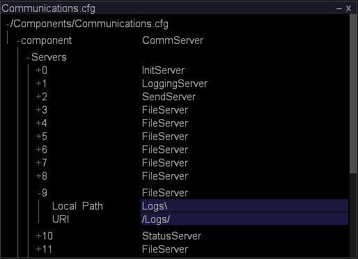

# Überwachen des Festplattenspeichers für Ereignisdaten{#monitoring-event-data-space}

{{eol}}

Informationen zur Überwachung des Ereignisdatenspeichers und zum Ändern des Protokollverzeichnisses für Sensor-Daten.

**Empfohlene Häufigkeit:** Alle 5-10 Minuten

[!DNL Insight Server] speichert eine Protokolldatei pro [!DNL Sensor] pro Tag entweder auf der Datenverarbeitungseinheit oder der Dateiservereinheit, je nach Konfiguration. Die Größe der Protokolldateien und der für sie erforderliche Datenspeicherplatz hängen von vielen Variablen ab, z. B. von der Anzahl der protokollierten Websites und der Anzahl der Anfragen, die Ihre Webserver pro Sekunde erhalten.

Eine typische Installation von [!DNL Insight Server] (oder [!DNL Insight Server] Cluster) mehrere Terabyte von Daten speichern kann, vorausgesetzt, die Implementierung verwendet die von der Adobe für die [!DNL Insight Server] Maschine(n).

Normalerweise bleiben alle Protokolldaten auf der [!DNL Insight Server] Maschine. Wenn es erforderlich wird, mehr Datenspeicherplatz auf dem Computer verfügbar zu machen, können Sie alle Protokolldateien des aktuellen Tages auf einen anderen Computer oder ein Datenspeichermedium verschieben (ZIP-Laufwerk, Band usw.). Das Verschieben der Daten erfordert nicht, dass Sie [!DNL Insight Server]und hat keine Auswirkungen auf die in den [!DNL Insights] die [!DNL Insight Server] und mit kontinuierlichen Daten arbeiten. Sofern Sie einen Analysedatensatz nicht verarbeiten oder erneut verarbeiten, behalten Sie den Zugriff auf alle vorherigen Daten bei und neue Daten stehen weiterhin in zur Verfügung. [!DNL Insight]. Wenn Sie einen Analysedatensatz verarbeiten oder erneut verarbeiten, können Sie erst nach Abschluss der Verarbeitung auf die Daten zugreifen.

Standardmäßig werden Ereignisdaten von [!DNL Sensor] und übermittelt [!DNL Insight Server] wird im [!DNL Logs] -Ordner in [!DNL Insight Server] Installationsverzeichnis. Die Konfigurationsdatei für die Kommunikation, [!DNL Communications.cfg]gibt den Speicherort der Ereignisdatenprotokolldateien an, die von gelesen werden [!DNL Insight Server].

**So ändern Sie das Protokollverzeichnis für [!DNL Sensor] data**

1. In [!DNL Insight]auf [!DNL Admin] > [!DNL Dataset and Profile] klicken Sie auf die **[!UICONTROL Servers Manager]** Miniaturansicht, um den Arbeitsbereich &quot;Server Manager&quot;zu öffnen.
1. Klicken Sie mit der rechten Maustaste auf das Symbol der [!DNL Insight Server] Sie möchten konfigurieren und klicken Sie auf **[!UICONTROL Server Files]**.
1. Im [!DNL Server Files Manager]klicken **[!UICONTROL Components]** , um den Inhalt anzuzeigen. Die [!DNL Communications.cfg] -Datei befindet sich in diesem Verzeichnis.
1. Klicken Sie mit der rechten Maustaste auf das Häkchen im *Servername* Spalte für [!DNL Communications.cfg] und klicken Sie auf **[!UICONTROL Make Local]**. Ein Häkchen wird im [!DNL Temp] Spalte für [!DNL Communications.cfg].
1. Klicken Sie mit der rechten Maustaste auf das neu erstellte Häkchen im [!DNL Temp] Spalte und klicken Sie auf **[!UICONTROL Open]** > **[!UICONTROL in Insight]**.
1. Im [!DNL Communications.cfg] Fenster, klicken Sie auf **[!UICONTROL component]** , um den Inhalt anzuzeigen.
1. Im [!DNL Communications.cfg] Fenster, klicken Sie auf **[!UICONTROL Servers]** , um den Inhalt anzuzeigen. Es können verschiedene Servertypen auftreten: Dateiserver, Protokollierungsserver, Init-Server, Statusserver, Sendeserver oder Replizierungsserver.
1. Suchen Sie den LoggingServer, der sich an der Stelle befindet. [!DNL Sensor] schreibt seine Protokolldateien, die von [!DNL Insight Server]und klicken Sie auf die zugehörige Nummer, um das Menü anzuzeigen.

   

   Der standardmäßige Protokollordner ist der [!DNL Logs] -Ordner in [!DNL Insight Server] Installationsverzeichnis.

1. Bearbeiten Sie den Parameter Protokollverzeichnis , um den gewünschten Speicherort der Protokolldateien anzuzeigen.

   >[!NOTE]
   >
   >Ändern Sie keine anderen Parameter für den LoggingServer.

   

   Mehrere FileServer-Server können unter dem Server-Knoten aufgelistet werden. Daher müssen Sie möglicherweise den Inhalt vieler dieser Server anzeigen (indem Sie auf ihre Zahlen im [!DNL Servers] list), um den Server mit einem lokalen Pfad von Protokollen zu finden, der geändert werden soll.

1. Bearbeiten Sie den lokalen Pfad, um die gewünschte Position des [!DNL .vsl] Dateien.

   >[!NOTE]
   >
   >Ändern Sie keine anderen Parameter für den FileServer.

   Obwohl der Speicherort der Protokolldateien im [!DNL Communications.cfg] -Datei, können Sie diese Dateien dem Protokollverzeichnis der [!DNL Server Files Manager] indem Sie /Logs/ als URI für den FileServer angeben.

1. Speichern Sie Ihre Änderungen auf dem Server, indem Sie Folgendes ausführen:

   1. Rechtsklick **[!UICONTROL (modified)]** Klicken Sie oben im Fenster auf **[!UICONTROL Save]**.

   1. Im [!DNL Server Files Manager]klicken Sie mit der rechten Maustaste auf das Häkchen für die Datei im [!DNL Temp] und wählen Sie **[!UICONTROL Save to]** > *&lt;**[!UICONTROL server name]**>*.
