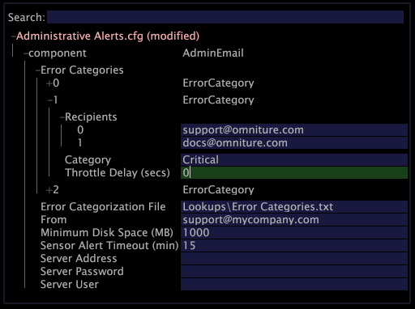

# Konfigurieren administrativer Warnhinweise{#configuring-administrative-alerts}

Bei Administratorwarnungen werden E-Mail-Benachrichtigungen an die angegebenen E-Mail-Adressen gesendet, wenn während des normalen Betriebs vom Insight-Server Fehler erkannt werden.

**Empfohlene Häufigkeit:** Vor der Produktion

>[!NOTE]
>
>Für die Verwendung von Administratorwarnungen ist es erforderlich, dass Sie Zugriff auf einen SMTP-Server haben, um Warnungen per E-Mail zu senden. [!DNL Insight Server]

Die Empfänger der E-Mail-Benachrichtigungen sollten für Verwaltungsmitarbeiter und Hauptakteure von entscheidender Bedeutung sein.

Die Datei &quot;Administrative Warnungen&quot; [!DNL Administrative Alerts.cfg]dient zum Konfigurieren der Administratorwarnungen für [!DNL Insight Server].

>[!NOTE]
>
>Wenn Sie einen Cluster ausführen, müssen Sie Warnungen auf dem Übergeordnete [!DNL Insight Server] im Cluster erstellen oder ändern.

**So erstellen oder ändern Sie eine Administratorwarnung**

1. Klicken Sie [!DNL Insight]auf der Registerkarte [!DNL Admin] > [!DNL Dataset and Profile] auf die **[!UICONTROL Servers Manager]** Miniaturansicht, um den Arbeitsbereich &quot;Server Manager&quot;zu öffnen.
1. Klicken Sie mit der rechten Maustaste auf das Symbol des zu konfigurierenden [!DNL Insight Server] Objekts und klicken Sie auf **[!UICONTROL Server Files]**.
1. Klicken Sie im [!DNL Server Files Manager]Fenster auf , **[!UICONTROL Components]** um den Inhalt der Datei Ansicht. Die [!DNL Administrative Alerts.cfg] Datei befindet sich in diesem Ordner.
1. Klicken Sie mit der rechten Maustaste auf das Häkchen in der Spalte *Servername *für [!DNL Administrative Alerts.cfg] und klicken Sie auf **[!UICONTROL Make Local]**. In der [!DNL Temp] Spalte für wird ein Häkchen angezeigt [!DNL Administrative Alerts.cfg].
1. Klicken Sie mit der rechten Maustaste auf das neu erstellte Häkchen in der [!DNL Temp] Spalte und klicken Sie auf **[!UICONTROL Open]** > **[!UICONTROL in Insight]**.
1. Klicken Sie im [!DNL Administrative Alerts.cfg] Fenster auf **[!UICONTROL component]** , um den Inhalt des Fensters Ansicht.
1. Füllen Sie die Parameter wie gewünscht aus. Eine Liste der in dieser Datei verfügbaren Parameter finden Sie unter Konfigurationseinstellungen für [Administratorwarnungen](../../../home/c-inst-svr/c-cfg-stgs-ref/c-admin-alts-cfg-stgs.md#concept-14c3c3ed797f47c5900ec04cae2fc491).

   

1. Speichern Sie Ihre Änderungen auf dem Server, indem Sie folgende Schritte ausführen:

   1. Klicken Sie mit der rechten Maustaste **[!UICONTROL (modified)]** am oberen Rand des Fensters und klicken Sie auf **[!UICONTROL Save]**.

   1. Klicken Sie in der [!DNL Server Files Manager]Spalte mit der rechten Maustaste auf das Häkchen für die Datei und wählen Sie [!DNL Temp] > **[!UICONTROL Save to]** &lt; *>**[!UICONTROL server name]***.

1. (Optional) Wenn Sie in einem Cluster arbeiten und für jede Datenverarbeitungseinheit dieselben Administratorwarnungen gelten sollen, müssen Sie die aktualisierte [!DNL Administrative Alerts.cfg] Datei kopieren und in den [!DNL Components for Processing Servers] Ordner im Übergeordnet [!DNL Insight Server] Installationsordner einfügen.
