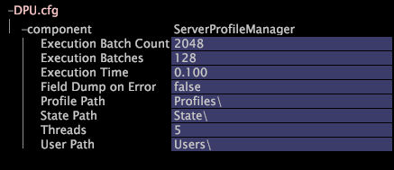

# Konfigurieren der Datei „DPU.cfg“{#configuring-dpu-cfg}

{{eol}}

Die DPU-Konfigurationsdatei DPU.cfg gibt verschiedene Leistungsparameter für Insight Server an.

Wie Sie diese Parameter festlegen, hängt von Ihrer Datensatzgröße und vielen anderen Faktoren ab. Wenden Sie sich an Adobe Consulting Services, um Hilfe bei der Leistungsoptimierung zu erhalten.

**Empfohlene Häufigkeit:** Nur bei Bedarf

**Zum Ändern [!DNL Insight Server] DSGVO-Leistungseinstellungen**

1. In [!DNL Insight]auf [!DNL Admin] > [!DNL Dataset and Profile] klicken Sie auf die **[!UICONTROL Servers Manager]** Miniaturansicht, um den Arbeitsbereich &quot;Server Manager&quot;zu öffnen.
1. Klicken Sie mit der rechten Maustaste auf das Symbol der [!DNL Insight Server] Sie möchten konfigurieren und klicken Sie auf **[!UICONTROL Server Files]**.
1. Im [!DNL Server Files Manager]klicken **[!UICONTROL Components]** , um den Inhalt anzuzeigen. Die [!DNL DPU.cfg] -Datei befindet sich in diesem Verzeichnis.
1. Klicken Sie mit der rechten Maustaste auf das Häkchen im *Servername* Spalte für [!DNL DPU.cfg] und klicken Sie auf **[!UICONTROL Make Local]**. Ein Häkchen wird im [!DNL Temp] Spalte für [!DNL DPU.cfg].
1. Klicken Sie mit der rechten Maustaste auf das neu erstellte Häkchen im [!DNL Temp] Spalte und klicken Sie auf **[!UICONTROL Open]** > **[!UICONTROL in Insight]**.
1. Im [!DNL DPU.cfg] auf Komponente klicken, um deren Inhalt anzuzeigen.
1. Ändern Sie bei Bedarf die Leistungs- und Pfadeinstellungen. Eine Liste der in dieser Datei verfügbaren Parameter finden Sie unter [DSGVO-Leistungseinstellungen](../../../home/c-inst-svr/c-cfg-stgs-ref/c-dpu-perf-stgs.md#concept-477c4c526de44bda84176e62266c3df1).

   >[!NOTE]
   >
   >Wenden Sie sich an die Adobe, bevor Sie einen der Parameter in dieser Datei ändern.

   

1. Speichern Sie Ihre Änderungen auf dem Server, indem Sie Folgendes ausführen:

   1. Rechtsklick **[!UICONTROL (modified)]** Klicken Sie oben im Fenster auf **[!UICONTROL Save]**.

   1. Im [!DNL Server Files Manager]klicken Sie mit der rechten Maustaste auf das Häkchen für die Datei im [!DNL Temp] und wählen Sie **[!UICONTROL Save to]** > *&lt;**[!UICONTROL server name]**>*.
