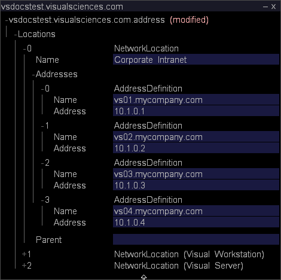

# Konfigurieren des Master-Insight-Servers für das Clustering{#configuring-the-master-insight-server-for-clustering}

Informationen zum Konfigurieren des Clusters auf dem Übergeordnet Insight-Server, zum Aktualisieren der Zugriffskontrolle-Datei für einen Cluster und mehr.

Um den Cluster zu konfigurieren, führen Sie die folgenden Schritte für Übergeordnet [!DNL Insight Server] aus:

* hinzufügen die Verarbeitung von [!DNL Insight Servers’] allgemeinen Namen und Adressen in der Adressdatei.
* hinzufügen Sie alle [!DNL Insight Servers] in der [!DNL Access Control.cfg]-Datei zur Gruppe Cluster-Server.

* Aktualisieren Sie die Datei [!DNL Synchronize.cfg] im Ordner &quot;Components for Processing Servers&quot;so, dass sie auf Übergeordnet [!DNL Insight Server] verweist.

* Ändern Sie bei Bedarf die Datei [!DNL Disk Files.cfg] im Ordner &quot;Komponenten für Verarbeitungsserver&quot;, um den Speicherort der Datei [!DNL temp.db] bei der Verarbeitung [!DNL Insight Servers] anzugeben.

Um diese Schritte durchzuführen, müssen Sie die allgemeinen Namen (wie in den digitalen Zertifikaten für die einzelnen [!DNL Insight Server] angegeben) und die IP-Adressen der einzelnen [!DNL Insight Server] im Cluster kennen. Wenn Sie noch nicht über diese Informationen verfügen, holen Sie diese vor dem Fortfahren ab.

>[!NOTE]
>
>Die in diesem Abschnitt beschriebenen Verfahren erfordern [!DNL Insight]. Wenn Sie [!DNL Insight] noch nicht installiert haben, befolgen Sie die Anweisungen im **[!DNL Insight]Benutzerhandbuch**, bevor Sie fortfahren.

## Hinzufügen der Processing Insight-Server zur Adressdatei {#section-2fe5298180164e8dbaa59ea6b6ff682d}

Verwenden Sie das folgende Verfahren, um der Adressdatei auf dem Übergeordnet [!DNL Insight Server] die allgemeinen Namen und IP-Adressen für die Verarbeitung hinzuzufügen. [!DNL Insight Servers’] (Obwohl die Adressdatei auf dem Übergeordnet [!DNL Insight Server] verwaltet und verwaltet wird, wird sie von allen [!DNL Insight Servers] im Cluster verwendet.)

>[!NOTE]
>
>Im Folgenden wird davon ausgegangen, dass die Adressdatei bereits für Übergeordnet [!DNL Insight Server] konfiguriert wurde. Wenn Sie der Adressdatei noch nicht die Übergeordnet [!DNL Insight Server’s]-IP-Adresse(n) hinzugefügt haben, führen Sie das unter [Definieren der Netzwerkadresse des Servers](../../../../../../home/c-inst-svr/c-install-ins-svr/t-install-proc-inst-svr-dpu/c-svrs-ntwk-loc/c-svrs-ntwk-loc.md#concept-87dd2aa3448c415ca1285bc445a8c649) beschriebene Verfahren aus, bevor Sie beginnen.

**So fügen Sie die Verarbeitung  [!DNL Insight Servers] der Adressdatei hinzu**

1. Beginn [!DNL Insight] und laden Sie das Configuration-Profil (falls es noch nicht geöffnet ist), indem Sie mit der rechten Maustaste auf die Titelleiste klicken und auf **[!UICONTROL Switch Profile]** > **[!UICONTROL Configuration]** klicken.

1. Klicken Sie in [!DNL Insight] auf der Registerkarte [!DNL Admin] > [!DNL Dataset and Profile] auf die Miniaturansicht **[!UICONTROL Servers Manager]**, um den Arbeitsbereich &quot;Server Manager&quot;zu öffnen.

1. Klicken Sie mit der rechten Maustaste auf das Symbol des Übergeordneten **[!UICONTROL Insight Server]** und klicken Sie auf **[!UICONTROL Server Files]**.

1. Öffnen Sie in [!DNL Server Files Manager] den Adressordner und führen Sie die folgenden Schritte aus, um die Adressdatei [!DNL Insight Server’s] zu öffnen:

   1. Klicken Sie mit der rechten Maustaste auf das Häkchen in der Spalte *Servername* und klicken Sie auf **[!UICONTROL Make Local]**.

   1. Klicken Sie mit der rechten Maustaste auf das Häkchen in der Spalte [!DNL Temp] und klicken Sie auf **[!UICONTROL Open]** > **[!UICONTROL in Insight]**.

1. Erweitern Sie den Inhalt der [!DNL Locations]-Struktur und erweitern Sie dann NetworkLocation 0, Addresses und AddressDefinition.
1. Führen Sie die folgenden Schritte aus, um eine AddressDefinition zu NetworkLocation 0 für jede Verarbeitung von [!DNL Insight Server] im Cluster hinzuzufügen:

   1. Klicken Sie mit der rechten Maustaste auf **[!UICONTROL AddressDefinition]** und klicken Sie auf **[!UICONTROL Add New]** > **[!UICONTROL Address Definition]**.

   1. Geben Sie im Parameter Name den allgemeinen Namen für die Verarbeitung von [!DNL Insight Server’s] an.
   1. Geben Sie im Parameter Adresse die IP-Adresse für die Verarbeitung [!DNL Insight Server’s] an.

      Sie können ein Sternchen als Platzhalter im Feld &quot;Adresse&quot;verwenden, z. B. 10.10.116.* zur Vereinfachung des Clustering. Siehe [Die Zugriffsebenen](../../../../../../home/c-inst-svr/c-admin-inst-svr/c-config-acs-ctrl/c-undst-acc-lvls.md#concept-6b292edf79214750a8d0525097b8795a).

      Im folgenden Beispiel wird ein Cluster definiert, der zwei [!DNL Insight Servers] enthält:

      

1. Wenn die Server mit mehreren Netzwerken verbunden sind, wiederholen Sie Schritt 6, um die Verarbeitung [!DNL Insight Servers] zu den NetworkLocations für diese Netzwerke hinzuzufügen.

   Das folgende Beispiel zeigt einen Cluster von vier [!DNL Insight Servers], das an zwei Netzwerke (&quot;Corporate Intranet&quot;und &quot;Internet&quot;) angeschlossen ist.

   

1. Speichern Sie Ihre Änderungen auf dem Server, indem Sie folgende Schritte ausführen:

   1. Klicken Sie mit der rechten Maustaste auf **[!UICONTROL (modified)]** oben im Fenster und klicken Sie auf **[!UICONTROL Save]**.

   1. Klicken Sie in der Spalte [!DNL Server Files Manager] mit der rechten Maustaste auf das Häkchen für die Datei in der Spalte [!DNL Temp] und wählen Sie **[!UICONTROL Save to]** > *&lt;**[!UICONTROL server name]***.

## Aktualisieren der Zugriffskontrolle-Datei für einen Cluster {#section-fce1367d92a445168c35e9ca506e7d6b}

Um [!DNL Insight Servers] in einem Cluster zu verwenden, muss jeder [!DNL Insight Server] im Cluster (einschließlich Übergeordnet [!DNL Insight Server]) zur Zugriffskontrolle der Clusterserver gehören. Die Gruppe Cluster-Server identifiziert die Server (nach IP-Adresse), die am Cluster teilnehmen dürfen. Obwohl diese Datei auf dem Übergeordnet [!DNL Insight Server] verwaltet und verwaltet wird, wird sie von allen [!DNL Insight Servers] im Cluster verwendet.

**So bearbeiten Sie die Zugriffskontrolle**

1. Klicken Sie in [!DNL Insight] auf der Registerkarte [!DNL Admin] > [!DNL Dataset and Profile] auf die Miniaturansicht **[!UICONTROL Servers Manager]**, um den Arbeitsbereich &quot;Server Manager&quot;zu öffnen.

1. Klicken Sie mit der rechten Maustaste auf das Symbol des Übergeordneten [!DNL Insight Server] und klicken Sie auf **[!UICONTROL Server Files]**.

1. Öffnen Sie im Ordner [!DNL Server Files Manager] den Ordner &quot;Zugriffskontrolle&quot;.
1. Führen Sie die folgenden Schritte aus, um die Datei [!DNL Access Control.cfg] zu öffnen:

   1. Klicken Sie mit der rechten Maustaste auf das Häkchen in der Spalte *Servername* und klicken Sie auf **[!UICONTROL Make Local]**.

   1. Klicken Sie mit der rechten Maustaste auf das Häkchen in der Spalte [!DNL Temp] und klicken Sie auf **[!UICONTROL Open]** > **[!UICONTROL in Insight]**.

1. Erweitern Sie die Gruppenstruktur und erweitern Sie dann AccessGroup (Cluster Servers).
1. Führen Sie für jeden [!DNL Insight Server] im Cluster (einschließlich des Übergeordnet [!DNL Insight Server]) folgende Schritte aus:

   1. Klicken Sie mit der rechten Maustaste auf **[!UICONTROL Members]** und klicken Sie auf **[!UICONTROL Add New]** > **[!UICONTROL New Member]**.

   1. Geben Sie die IP-Adresse [!DNL Insight Server’s] (ihre numerische IP-Adresse, nicht ihren Namen) an. Wenn die [!DNL Insight Servers] mit mehreren Netzwerken verbunden sind, sollte diese AccessGroup nur die internen Adressen enthalten, die [!DNL Insight Servers] für die Kommunikation zwischen Servern im Cluster verwenden.

      Im Folgenden sehen Sie die AccessGroup (Cluster Servers) für einen Cluster von vier [!DNL Insight Servers].

      

1. Speichern Sie Ihre Änderungen auf dem Server, indem Sie folgende Schritte ausführen:

   1. Klicken Sie mit der rechten Maustaste auf **[!UICONTROL (modified)]** oben im Fenster und klicken Sie auf **[!UICONTROL Save]**.

   1. Klicken Sie in der Spalte [!DNL Server Files Manager] mit der rechten Maustaste auf das Häkchen für die Datei in der Spalte [!DNL Temp] und klicken Sie auf **[!UICONTROL Save to]** > *&lt;**[!UICONTROL server name]***.

## Konfigurieren der Synchronisierungsdatei {#section-d23e751771c84da6bab6a34a8db867bc}

Sie können das folgende Verfahren verwenden, um die zentrale Kopie der Datei [!DNL Synchronize.cfg] zu konfigurieren. Die zentrale Kopie dieser Datei wird auf dem Übergeordnet [!DNL Insight Server] gespeichert. Die Verarbeitung von [!DNL Insight Servers] im Cluster initiiert die Kommunikation mit dem Übergeordnet [!DNL Insight Server], um eine aktualisierte Kopie dieser Datei abzurufen.

Die Datei [!DNL Synchronize.cfg] gibt den Speicherort des Übergeordnet [!DNL Insight Server] an. Er identifiziert außerdem den Satz von Verwaltungsdateien, die von jeder der verarbeitenden [!DNL Insight Servers] im Cluster aus dem Übergeordnet [!DNL Insight Server] abgerufen werden. Die Verarbeitung [!DNL Insight Servers] lädt diese Dateien automatisch vom Übergeordnet [!DNL Insight Server] herunter, wenn sie Beginn werden. Außerdem werden aktualisierte Kopien dieser Dateien dynamisch vom Übergeordnet [!DNL Insight Server] abgerufen, wenn sich die Dateien ändern.

>[!NOTE]
>
>Obwohl Sie die Datei [!DNL Synchronize.cfg] auf dem Übergeordnet [!DNL Insight Server] konfigurieren, verwendet das Übergeordnet [!DNL Insight Server] diese Datei nicht. Sie aktualisieren diese Datei auf dem Übergeordnet [!DNL Insight Server], sodass sie korrekt konfiguriert ist, wenn die Verarbeitung [!DNL Insight Servers] die Datei abruft.

**So aktualisieren Sie die Datei &quot;Synchronize.cfg&quot;auf dem Übergeordnete[!DNL Insight Server]**

1. Klicken Sie in [!DNL Insight] auf der Registerkarte [!DNL Admin] > [!DNL Dataset and Profile] auf die Miniaturansicht **[!UICONTROL Servers Manager]**, um den Arbeitsbereich &quot;Server Manager&quot;zu öffnen.

1. Klicken Sie mit der rechten Maustaste auf das Symbol des Übergeordneten [!DNL Insight Server] und klicken Sie auf **[!UICONTROL Server Files]**.

1. Öffnen Sie in [!DNL Server Files Manager] den Ordner **[!UICONTROL Components]** für Verarbeitungsserver.

1. Führen Sie die folgenden Schritte aus, um [!DNL Synchronize.cfg] zu öffnen:

   1. Klicken Sie mit der rechten Maustaste auf das Häkchen in der Spalte *Servername* und klicken Sie auf **[!UICONTROL Make Local]**.

   1. Klicken Sie mit der rechten Maustaste auf das Häkchen [!DNL Temp] und klicken Sie auf **[!UICONTROL Open]** > **[!UICONTROL in Insight]**.

1. Erweitern Sie die Komponentenstruktur.
1. Geben Sie im Parameter &quot;Cluster Primär Server Address&quot;die IP-Adresse des Übergeordnet (primären) **[!UICONTROL Insight Server]** an.

   

   Um ein Protokoll zu erstellen, das jedes Mal aufzeichnet, wenn eine Synchronisierung zwischen dem Übergeordnet [!DNL Insight Server] und der Verarbeitung [!DNL Insight Servers] stattfindet, stellen Sie sicher, dass der Parameter &quot;Synchronisierungsprotokoll aktivieren&quot;auf &quot;true&quot;eingestellt ist.

1. Speichern Sie Ihre Änderungen auf dem Server, indem Sie folgende Schritte ausführen:

   1. Klicken Sie mit der rechten Maustaste auf **[!UICONTROL (modified)]** oben im Fenster und klicken Sie auf **[!UICONTROL Save]**.

   1. Klicken Sie in [!DNL Server Files Manager] mit der rechten Maustaste auf das Häkchen für die Datei in der Spalte [!DNL Temp] und klicken Sie dann auf **[!UICONTROL Save to]** > *&lt;**[!UICONTROL server name]***.

## Konfigurieren des Datensatzstandorts (temp.db) {#section-5ec257a4b4c64fb58baec1f12119a822}

Führen Sie das folgende Verfahren aus, wenn die Verarbeitung [!DNL Insight Servers] [!DNL temp.db] (den Datensatz) in einem Verzeichnis oder Laufwerk, das sich vom Standardspeicherort unterscheidet, beibehalten oder [!DNL temp.db] auf mehreren Laufwerken verteilt werden soll.

>[!NOTE]
>
>Da für die Verarbeitung [!DNL Insight Servers] alle die gleichen [!DNL Disk Files.cfg]-Werte verwendet werden, müssen alle die Dateispeicherorte unterstützen, die Sie in dieser Datei angeben. Wenn Sie beispielsweise [!DNL temp.db] dem E zuweisen: Laufwerk, muss jede Verarbeitung von [!DNL Insight Server] im Cluster ein E haben: Laufwerk.

**So konfigurieren Sie den Speicherort von &quot;temp.db&quot;**

1. Klicken Sie in [!DNL Insight] auf der Registerkarte [!DNL Admin] > [!DNL Dataset and Profile] auf die Miniaturansicht **[!UICONTROL Servers Manager]**, um den Arbeitsbereich &quot;Server Manager&quot;zu öffnen.

1. Klicken Sie mit der rechten Maustaste auf das Symbol des Übergeordneten [!DNL Insight Server] und klicken Sie auf **[!UICONTROL Server Files]**.

1. Öffnen Sie im Ordner [!DNL Server Files Manager] den Ordner **[!UICONTROL Components for Processing Servers]**.

1. Führen Sie die folgenden Schritte aus, um [!DNL Disk Files.cfg] zu öffnen:

   1. Klicken Sie mit der rechten Maustaste auf das Häkchen in der Spalte *Servername* und klicken Sie auf **[!UICONTROL Make Local]**.

   1. Klicken Sie mit der rechten Maustaste auf das Häkchen in der Spalte [!DNL Temp]und klicken Sie auf **[!UICONTROL Open]** > **[!UICONTROL in Insight]**.

1. Erweitern Sie die DiskSpaceManagerComponent-Struktur und dann die Liste Disk Files.
1. Bearbeiten Sie den Eintrag 0, um den Speicherort der Datei [!DNL temp.db] zu ändern.
1. Wenn Sie [!DNL temp.db] über mehrere Laufwerke verteilen möchten, führen Sie die folgenden Schritte aus, um einen zusätzlichen Eintrag für jedes zusätzliche Laufwerk zu erstellen.

   1. Klicken Sie mit der rechten Maustaste auf **[!UICONTROL Disk Files]** und klicken Sie auf **[!UICONTROL Add New]** > **[!UICONTROL Disk File]**.

   1. Geben Sie im neuen Eintrag den Speicherort an, an dem [!DNL temp.db] geschrieben werden soll.
   Die folgende Abbildung zeigt [!DNL temp.db], die auf vier Laufwerke geschrieben wurden.

   

1. Speichern Sie Ihre Änderungen auf dem Server, indem Sie folgende Schritte ausführen:

   1. Klicken Sie mit der rechten Maustaste auf **[!UICONTROL (modified)]** oben im Fenster und klicken Sie auf **[!UICONTROL Save]**.

   1. Klicken Sie in [!DNL Server Files Manager] mit der rechten Maustaste auf das Häkchen für die Datei in der Spalte [!DNL Temp] und klicken Sie dann auf **[!UICONTROL Save to]** > *&lt;**[!UICONTROL server name]***.
