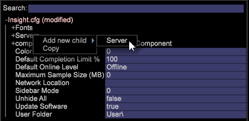

# Konfigurieren der Verbindung zu Insight Server{#configuring-the-connection-to-insight-server}

{{eol}}

Nachdem Sie Ihre Insight-Software und Ihr digitales Zertifikat installiert haben, müssen Sie Insight starten und die Verbindung zu Insight Server konfigurieren.

>[!NOTE]
>
>In einigen Fällen wurde die Verbindung zu Insight Server möglicherweise von Adobe Consulting Services oder Ihrem Systemadministrator vorkonfiguriert. In diesem Fall müssen Sie diese Aufgabe nicht abschließen.

Wenn Sie Insight zum ersten Mal starten, stellt es automatisch eine Verbindung zum Adobe License Server her, um Ihr digitales Zertifikat zu registrieren. Um den Registrierungsprozess erfolgreich abzuschließen, muss Ihr Computer mit dem Internet verbunden sein, wenn Sie die folgenden Schritte ausführen.

>[!NOTE]
>
>Wenn Sie bereits ein vorgesperrtes Zertifikat angefordert, heruntergeladen und installiert haben, wie hier beschrieben: [Herunterladen und Installieren des digitalen Zertifikats](../../../home/c-install-insight/install-setup/c-dgtl-crtf.md#topic-fed3b44e472c4e4ca6dd5852af14cdb9), versucht Insight nicht, eine Verbindung zum Lizenzserver herzustellen, und Sie erhalten keinen Fehler.

**So konfigurieren Sie die Verbindung zu Insight Server**

Bei der Arbeit in einer Clusterumgebung sollte Insight so konfiguriert werden, dass auf den Übergeordnet Insight Server zugegriffen wird, um Synchronisierungsprobleme zu vermeiden. In Insight können Sie Informationen zur Verarbeitung anzeigen [!DNL Insight Servers] in Ihrem Cluster mithilfe der [!DNL Related Servers] Menüelement in [Server-Manager](https://experienceleague.adobe.com/docs/data-workbench/using/client/admin-ui/c-svrs-mgr.html).

1. Starten Sie Insight.
1. Im [!DNL Worktop]klicken **[!UICONTROL Admin]**, dann **[!UICONTROL First Steps]**.

1. Klicken Sie auf **[!UICONTROL Configure Connection to Servers]** Miniaturansicht.

   Die [!DNL Servers Manager], die [!DNL Insight.cfg] -Datei sowie Anweisungen zum Konfigurieren Ihrer [!DNL Insight.cfg]angezeigt.

1. Im [!DNL Insight.cfg] Fenster, Rechtsklick **[!UICONTROL Servers]** und klicken Sie auf **[!UICONTROL Add new child]** > **[!UICONTROL Server]**.

   

1. Vervollständigen oder ändern Sie die Serverparameter, um Insight Zugriff auf Ihren Übergeordnet Insight Server zu gewähren. Detaillierte Beschreibungen der Parameter in der Datei Insight.cfg finden Sie unter [Konfigurationsparameter](https://experienceleague.adobe.com/docs/data-workbench/using/client/c-insght-config-param.html).

   

1. Wiederholen Sie Schritt 4 und Schritt 5 für jeden Insight Server, zu dem Sie eine Verbindung konfigurieren möchten.
1. Um Ihre Konfigurationsänderungen zu speichern, klicken Sie mit der rechten Maustaste auf **[!UICONTROL Insight.cfg (modified)]** Klicken Sie oben im Fenster auf **[!UICONTROL Save as Insight.cfg]**.

   Insight versucht, eine Verbindung zum [!DNL Insight Server(s)] unter Verwendung der von Ihnen angegebenen Einstellungen. Wenn eine Verbindung hergestellt wurde, wird ein grüner Knoten im [!DNL Servers Manager] wie auf der folgenden Seite gezeigt.

   

   * **Grün:** Gibt an, dass die Verbindung zum Insight Server aktiv ist.
   * **Hellrot:** Gibt ein potenzielles Problem mit dem Server an, z. B. einen Abfluss bei der Serververarbeitung, eine hohe Speicherbelegung oder geringen Festplattenspeicher.
   * **Rot:** Gibt an, dass die Verbindung zum Insight Server nicht aktiv ist.

   Wenn Insight mit den angegebenen Einstellungen keine Verbindung herstellen kann, wird ein roter Knoten im [!DNL Servers Manager]. In diesem Fall finden Sie weitere Informationen unter [Verbindungsproblem](../../../home/c-install-insight/install-setup/t-conn-trbsh.md#task-034e588c5ce04c4a8f6d0097364d3b2b).

<!--
c_dir_crt_setup.xml
-->

Wenn Sie ein zu verwendendes Profil auswählen, werden die Profilinformationen (einschließlich der zugehörigen Daten und der für das Profil definierten Arbeitsbereiche oder Visualisierungen) auf Ihren Computer heruntergeladen. Beim Herunterladen der einzelnen Profile erstellt Insight einen Ordner im Installationsordner unter Verwendung des Profilnamens.

Wenn Sie beispielsweise ein Profil mit dem Namen Vertrieb auswählen, wird in Ihrem Insight-Verzeichnis ein Ordner mit dem Namen Verkauf angezeigt. Dieser Ordner enthält die Metriken, Dimensionen, Arbeitsbereiche und Visualisierungen, die im Profil &quot;Verkauf&quot;definiert sind. Nach dem ersten Laden des Profils kann das Profil verwendet werden, wenn es offline funktioniert. Siehe [Arbeiten offline und online](https://experienceleague.adobe.com/docs/data-workbench/using/client/c-off-on.html).

Darüber hinaus erstellt Insight Server bei der erstmaligen Verbindung mit Insight Server die folgenden Ordner im Insight-Installationsordner.

* **[!DNL Trace]directory:** Innerhalb der [!DNL Trace] directory ist die Insight-Protokolldatei ( [!DNL insight.log]). Wenn die Größe der [!DNL Insight.log] erreicht 100 MB, wird die Datei in [!DNL insight-1.log]. Wenn eine Datei des Namens [!DNL insight-1.log] bereits existiert, dann [!DNL insight-1.log] wird in [!DNL insight-2.log]usw. mit einem Maximum von [!DNL insight-9.log]. Die Datei [!DNL insight.log] enthält immer die neuesten Protokollinformationen und [!DNL insight-max.log] enthält den ältesten.

* **[!DNL User]directory:** Innerhalb der [!DNL User] Ordner sind Ordner, die jedem bisher verwendeten Profil entsprechen, und in jedem Profilordner befinden sich Ordner namens [!DNL Work] und [!DNL Workspaces]. Der Ordner `User\*profile name*\Workspaces` ist der Standardspeicherort, in dem Insight Workspace-Dateien gespeichert werden. `User\*profile name*\Work` ist der Standardspeicherort, an dem Insight-Visualisierungen und andere benutzerdefinierte Aufgaben, die vom Insight-Benutzer ausgeführt werden, gespeichert werden.

In der folgenden Tabelle sind die Standardspeicherorte häufig aufgerufener Komponenten aufgeführt.

<table id="table_0254A8C25AF5400F89F87A242746D07E"> 
 <thead> 
  <tr> 
   <th colname="col1" class="entry"> Komponente </th> 
   <th colname="col2" class="entry"> Verzeichnisspeicherort </th> 
  </tr>
 </thead>
 <tbody> 
  <tr> 
   <td colname="col1"> 
Gespeicherte Visualisierungen 
 </td> 
   <td colname="col2"> 
<i>Insight</i>\User\<i>Profilname</i>\Work\ 
 </td> 
  </tr> 
  <tr> 
   <td colname="col1"> 
Gespeichert  Arbeitsbereiche 
 </td> 
   <td colname="col2"> 
<i>Insight</i>\User\<i>Profilname</i>\Workspaces\<i>tab name</i>\ 
 </td> 
  </tr> 
  <tr> 
   <td colname="col1"> 
Gespeichert .png files 
 </td> 
   <td colname="col2"> 
<i>Insight</i>\User\<i>Profilname</i>\Work\ 
 </td> 
  </tr> 
  <tr> 
   <td colname="col1"> 
Datencache 
 </td> 
   <td colname="col2"> 
<i>Insight</i>\User\Cache.db 
 </td> 
  </tr> 
  <tr> 
   <td colname="col1"> 
 Insight.log file 
 </td> 
   <td colname="col2"> 
<i>Insight</i>\Trace\ 
 </td> 
  </tr> 
 </tbody> 
</table>

<!--
c_config_file_ent.xml
-->

Sie können nach Schlüsselname, Schlüsseltyp oder Wert suchen, um einen Eintrag schnell zu finden, sodass Sie nicht mehr durch erweiterte, große Dateien für verschachtelte Informationen blättern müssen. Sie können Dimensionsnamen, Servernamen usw. suchen. Das folgende Beispiel zeigt Übereinstimmungen für eine Suche in der Phrase-Zuordnung.

Geben Sie einen Suchbegriff in dieses Feld ein, um die Daten zu suchen. Je nach Erfolg einer Übereinstimmung ändert sich die Farbe des Felds. Übereinstimmungen werden hervorgehoben und Nicht-Übereinstimmungen werden abgeblendet angezeigt. Wenn keine Treffer vorliegen, wird der Hintergrund des Suchfelds rot. Wenn Sie die Eingabetaste drücken, erweitert der Konfigurationsbaum jeden Ort, an dem eine Übereinstimmung vorliegt, und reduziert, wo keine Übereinstimmung vorliegt.

Sie können auch reguläre Ausdrücke im [!DNL Search] -Feld. Sie können beispielsweise Folgendes verwenden: [!DNL *zip.*] für jeden Eintrag, der das Wort &quot;zip&quot;enthält.

Um eine Suche zu löschen, drücken Sie die **[!UICONTROL Escape]**.
