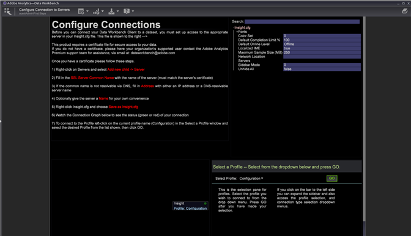

# Workstation-Einrichtungsassistent{#workstation-setup-wizard}

{{eol}}

Data Workbench bietet einen Einrichtungsassistenten zur Installation der Workstation (Client)-Anwendung.

## Workstation mit dem Einrichtungs-Assistenten installieren {#section-58da9bb6196c46eab3b54146913fdcb8}

Starten Sie die ausführbare Datei des Installationsassistenten und gehen Sie durch jeden Schritt, um das Client-Programm der Workstation zu installieren. Nach der Installation der Workstation können Sie eine Verbindung zu Servern und Profilen herstellen.

1. Doppelklicken Sie auf die ausführbare Datei des Workstation-Installationsprogramms.
1. Klicken **Ja** , damit das Programm unter Windows installiert werden kann.
1. Wählen Sie eine **Sprache** für den Einrichtungsassistenten.

   Der Assistent wird geöffnet:

   

1. Klicken **Nächste** auf **Willkommen beim Einrichtungs-Assistenten für Data Workbenchs** angezeigt.

1. Wählen Sie zum Installieren einer **Neue Installation** oder **Upgrade oder Reparatur** eine bestehende Installation.

   **Neue Installation** überschreibt alle zuvor installierten Dateien.

   **Upgrade** aktualisiert Ihre Workstation auf die neueste Version oder ermöglicht Ihnen die Reparatur einer vorhandenen Installation. Data Workbench vergleicht installierte **Insight.exe** Dateien und führen Sie den Workstation-Einrichtungs-Assistenten aus, wenn eine neuere Version des Clients verfügbar ist.

1. Wählen Sie den Installationsspeicherort aus:

   **Typisch** installiert in einen Standardordner und -speicherort.

   * Programmdateien werden standardmäßig wie folgt gespeichert:

      ```
      C:\Program Files\Adobe\Adobe Analytics\Data Workbench
      ```

   * Datendateien (Profile, Zertifikate, Ablaufverfolgungsprotokolle und Benutzerdateien) werden standardmäßig in folgenden Ordnern gespeichert:

      ```
      C:\Users\<username>\AppData\Local\Adobe\Adobe Analytics\Data Workbench\
      ```

      >[!IMPORTANT]
      >
      >Ein generisches ***Insight.cfg*** -Datei ohne Serverdetails installiert werden. Es wird empfohlen, die neu installierte ***Insight.cfg*** und passen Sie sie an, anstatt eine Datei aus einer vorherigen Installation zu verschieben. Da sich der Pfad für die Installation der Workstation geändert hat, wurde das Hinzufügen von Schriftarten und das Entfernen der *Benutzerordner* und das Entfernen der *TraceFileComponent * wird empfohlen.

1. (optional) Wählen Sie **Benutzerdefiniert** , um das Sprachpaket und den Speicherort des Programms und der Datendateien auszuwählen.
1. Speicherort auswählen für **Tastaturbefehle im Startmenü**.

   

   Klicken **Erstellen Sie keinen Ordner &quot;Startmenü&quot;** um keinen Tastaturbefehl im Windows-Startmenü zu installieren.

1. Klicken Sie auf **Weiter.** Eine Zusammenfassung der ausgewählten Dateispeicherpfade und Sprachen wird angezeigt. Klicken **Installieren.**

1. Suchen Sie die **Data Workbench-Zertifikat**.

   Wenn der Einrichtungsassistent das Zertifikat während der Data Workbench nicht finden kann, wird ein Dialogfeld geöffnet, in dem Sie zum Speicherort des Zertifikats navigieren können (ein **.pem** Datei, die sich standardmäßig im Client befindet **Zertifikate** Ordner) oder klicken Sie auf **Überspringen** um das Zertifikat nach der Installation zu finden.

   Klicken **Installieren** nach dem Speicherort des Zertifikats.

1. Nachdem der Setup-Assistent abgeschlossen und die Data Workbench installiert ist, klicken Sie auf **Beenden** , um die Einrichtung abzuschließen.

   >[!NOTE]
   >
   >Der standardmäßige Protokollspeicherort für den Assistenten zur Workstation-Einrichtung unter  `C:\Users\<userName>\AppData\Local\Temp`.

   Wählen Sie die **Launch-Anwendung** aktivieren, um die Workbench nach der Einrichtung zu öffnen.

1. **Verbindungen konfigurieren** zu Servern in **[!DNL Insight.cfg]** -Datei.

   Nach der Installation der Workstation wird der Arbeitsbereich &quot;Erweiterte Workstation-Konfiguration - Erlebnis&quot;mit zusätzlichen Informationen zu [Serververbindungsinformationen eingeben](/help/home/c-get-started/c-insght-config-param.md) im *Insight.cfg* und eine Option zur Auswahl eines Profils aus der Dropdown-Liste. Sie können auch den Verbindungsstatus zu Ihren Servern anzeigen.

   

## Installationsordner {#section-b5ea5a3b3ecb4622aef713972f3f8ebd}

Die Ordnerstruktur der Data Workbench umfasst zwei Installationsspeicherorte:

* **Programmdateien** Die **Insight.exe** und unterstützende Clientdateien (**Insight.ini**) befinden sich jetzt standardmäßig unter

   ```
   C:\Program Files\Adobe\Analytics\DataWorkbench
   ```

* Die **Appdata** Ordner.

   **Insight.cfg**, Profile, Zertifikate, Ablaufverfolgungsprotokolle und Benutzerdateien befinden sich jetzt standardmäßig unter

   ```
   C:\Users\<Winuser>\AppData\Adobe\Analytics\DataWorkbench\ 
   ```

   Sie können den Pfad für die **Appdata** im Ordner `Insight.ini` Datei:

   ```
   [InitialSettings] 
   AppDataFolder=C:\Users\mhiatt\AppData\Local\Adobe\Adobe Analytics\Data Workbench\ 
   Locale=en-us
   ```

## Deinstallieren der Workstation {#section-5ce2e233fe4348469ef1b3c451dd5b70}

Die Data Workbench enthält jetzt eine ausführbare Datei zur Deinstallation der Workstation (standardmäßig unter **`Program Files\Adobe\Adobe Analytics\Data Workbench\ unins000.exe`**).

Starten Sie und führen Sie die Schritte aus, um die Data Workbench Workstation-Dateien von Ihrer Festplatte zu entfernen.

>[!NOTE]
>
>Sie können die **unins000.exe** ausführbare Datei aus dem Ordner mithilfe der **Data Workbench deinstallieren** Tastaturbefehl im Startmenü oder aus **[!UICONTROL Control Panel]** > **[!UICONTROL Program and Features]**.
