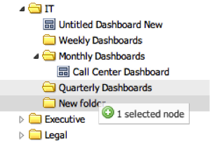

# Verschieben von Dashboards und Ordnern{#moving-dashboards-and-folders}

1. Um Ordner und Dashboards zwischen Ordnern zu verschieben, ziehen Sie einfach vorhandene Ordner und Dashboards in andere Ordner.

   

   Änderungen werden live auf dem Server aktualisiert, während Sie Änderungen vornehmen.
