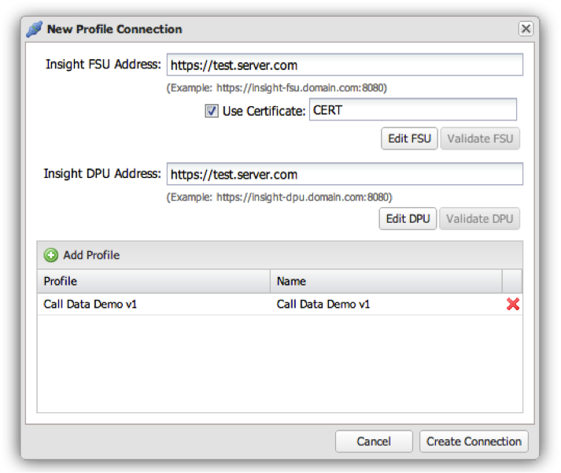

# Hinzufügen einer Profilverbindung{#adding-a-profile-connection}

{{eol}}

1. Klicken **[!UICONTROL Add Profile Connection]** um **[!UICONTROL New Profile Connection]** Fenster.
1. Füllen Sie die erforderlichen Felder mithilfe des unten stehenden Formulars aus:

   

   1. **[!UICONTROL Insight FSU Address]**: Geben Sie die Adresse an die FSU ein, die die Profile hostet, die Sie zum Dashboard hinzufügen möchten.

   1. **[!UICONTROL Use Certificate]**: Klicken Sie neben dem CN des Zertifikats auf die erforderliche Authentifizierung (dieses Zertifikat muss mithilfe des Windows-Zertifikatmanagers im Voraus zum Dashboard-Server hinzugefügt werden).
   1. **[!UICONTROL Insight DPU Address]**: Geben Sie die Adresse in die DPU ein, unter der die Profile gespeichert sind, die Sie zum Dashboard hinzufügen möchten.
   1. **[!UICONTROL Profiles]**: Wenn in den oben genannten FSU/DPU-Einträgen mehrere Profile vorhanden sind, können hier mehrere Profile hinzugefügt werden, indem Sie auf die Schaltfläche Profil hinzufügen klicken.
   * **[!UICONTROL Profile]**: Geben Sie den Namen des Profils ein, wie er in Insight angezeigt wird.
   * **[!UICONTROL Name]**: Geben Sie den Namen des Profils ein, wie er im Dashboard angezeigt werden soll.

1. Nachdem das Formular entsprechend konfiguriert wurde, klicken Sie auf **[!UICONTROL Create Connection]** , um die Profilverbindung zum System hinzuzufügen.

   Wenn der Vorgang erfolgreich war, wird eine Eingabeaufforderung angezeigt, die angibt, dass die Profilverbindung erstellt wurde.
