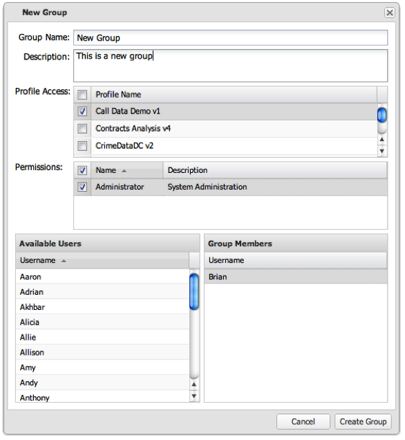

# Erstellen einer Benutzergruppe{#creating-a-user-group}

1. Klicken Sie auf **[!UICONTROL Create Group]** , um das **[!UICONTROL New Group]** Formular aufzurufen.

   

1. Füllen Sie die erforderlichen Felder aus, um das Formular auszufüllen:

   <table id="choicetable_3AE53AAC8A07471394EA993917B6AE33"> 
    <thead class="chhead sthead"> 
    <th class="choptionhd"> Option</th> 
    <th class="chdeschd"> Beschreibung</th> 
    </thead> 
    <tr class="chrow strow"> 
    <td class="choption"><strong>Gruppenname</strong></td> 
    <td class="chdesc stentry"> Geben Sie einen eindeutigen Gruppennamen ein.</td> 
    </tr> 
    <tr class="chrow strow"> 
    <td class="choption"><strong>Beschreibung</strong></td> 
    <td class="chdesc stentry"> Geben Sie eine kurze Beschreibung der Gruppe ein (optional).</td> 
    </tr> 
    <tr class="chrow strow"> 
    <td class="choption"><strong>Profilzugriff</strong></td> 
    <td class="chdesc stentry"> Wählen Sie die Profile aus, auf die diese Gruppe Zugriff haben soll.</td> 
    </tr> 
    <tr class="chrow strow"> 
    <td class="choption"><strong>Zugriffsberechtigung</strong></td> 
    <td class="chdesc stentry"> 
  Administrator: Speichern, anzeigen, ändern und löschen Sie alle Dashboards für alle Profile. Administratorberechtigungen ermöglichen es einem Benutzer, sich im Verwaltungsbereich anzumelden und alle Verwaltungsfunktionen auszuführen. 
 
  Schreibgeschützt: Berechtigungen auf schreibgeschützt für Dashboards beschränken. Der Benutzer kann keine Visualisierungen hinzufügen oder ändern oder Dashboards speichern. 
 
 <b>Keine Berechtigungen aktiviert </b>(Standard): Keine aktivierten Berechtigungen gewähren normalen Benutzern Berechtigungen für die Gruppe. Diese Benutzer können Visualisierungen erstellen und ändern, Dashboards speichern und die Dashboards anzeigen, auf die sie Zugriff haben. 
 </td> 
    </tr> 
    <tr class="chrow strow"> 
    <td class="choption"><strong>Verfügbare Benutzer/Gruppenmitglieder</strong></td> 
    <td class="chdesc stentry">Ziehen Sie Benutzer per Drag &amp; Drop aus der Liste der  verfügbaren Benutzer in den  Abschnitt " Gruppenmitglieder". Die Gruppenmitglieder können jederzeit geändert werden. </td> 
    </tr> 
    </table>

1. Klicken Sie auf **[!UICONTROL Create Group]** , um die Benutzergruppe zu erstellen.

   Wenn der Vorgang erfolgreich war, wird eine Meldung angezeigt, die angibt, dass die Benutzergruppe erfolgreich erstellt wurde.
