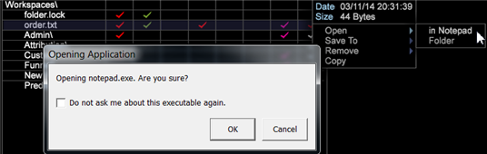

# Data Workbench-Version 6.21{#data-workbench-update}

Data Workbench 6.2.1 bietet neue Funktionen und Fehlerkorrekturen.

## Neue Funktionen {#section-1aacfe9a6a964c91b1d24fc1b181db34}

Data Workbench 6.2.1 umfasst die folgenden neuen Funktionen:

<table id="table_E28A6D31E7D941F7A0C2048F0F0F7838"> 
 <thead> 
  <tr> 
   <th colname="col1" class="entry"> Funktionen  </th> 
   <th colname="col2" class="entry"> Beschreibung </th> 
  </tr> 
 </thead>
 <tbody> 
  <tr> 
   <td colname="col1"> Vertikale Bildlaufleiste im Text und in Textumbruchfunktionen </td> 
   <td colname="col2"> Textfelder verfügen jetzt über vertikale Bildlaufleisten und umgebrochenen Text. 
  
 </td> 
  </tr> 
  <tr> 
   <td colname="col1"> Sortierung von Miniaturansichten auf der Arbeitsfläche </td> 
   <td colname="col2"> Die auf der Arbeitsfläche sortierten Namen unterscheiden sich nun nicht mehr von der Schreibweise des Zeichens, sondern von ABCDabcd . 
  
 </td> 
  </tr> 
  <tr> 
   <td colname="col1"> Suchdimension basierend auf übergeordneter Dimension </td> 
   <td colname="col2"> 
Im Suchbereich können Sie nun einen Rechtsklick auf die Registerkarte „Dimensionen“ ausführen und dann „Dimensionstyp“ &gt; „Übergeordnet“ auswählen. Eine Liste der zählbaren Dimensionen der obersten Ebene wird angezeigt. Wenn Sie eine dieser übergeordneten Dimensionen auswählen, wird einer Liste ihrer untergeordneten Dimensionen in den Suchergebnissen angezeigt. 
  </td> 
  </tr> 
  <tr> 
   <td colname="col1"> Dialogfeld zum Öffnen einer externen Anwendung </td> 
   <td colname="col2"> 
Beim ersten Versuch, eine externe Anwendung in Data Workbench zu öffnen, wird Ihnen nun ein Dialogfeld angezeigt. 
 
Wenn Sie beispielsweise eine Textdatei in Notepad öffnen, erhalten Sie folgende Meldung. 
  
Außerdem wird eine lokale Datei namens InsightSES.dat erstellt, die im Installationsordner des Clients gespeichert wird. 
 </td> 
  </tr> 
  <tr> 
   <td colname="col1"> Ändern von Symbolleisten zu Schaltflächen </td> 
   <td colname="col2"> You can opt out of using the new toolbar icons provided in Data Workbench 6.2. by changing the  Toolbar Icons  argument in the  insight.cfg  file to  false . <code> Toolbar&amp;nbsp;Icons&amp;nbsp;=&amp;nbsp;bool:&amp;nbsp;false&amp;nbsp;&amp;nbsp;&amp;nbsp;&amp;nbsp;&amp;nbsp;&amp;nbsp; </code> 
Damit die Änderung übernommen wird, müssen Sie den Client neu starten. 
 </td> 
  </tr> 
  <tr> 
   <td colname="col1"> Optionen in Propensity-Scoring und Entscheidungsstruktur zurücksetzen aktualisiert </td> 
   <td colname="col2"> In the <a href="https://docs.adobe.com/content/help/en/data-workbench/using/client/analysis-visualizations/visitor-propensity/c-visitor-propensity.html" format="http" scope="external"> Propensity Scoring </a> (  Tools &gt; Predictive Analytics &gt; Propensity Score ) and the <a href="https://docs.adobe.com/content/help/en/data-workbench/using/client/analysis-visualizations/decision-trees/c-decision-trees.html" format="http" scope="external"> Decision Tree </a> (  Visualizations &gt; Predictive Analytics &gt; Classifications &gt; Decision Tree Builder ) visualizations, you now have two reset options: 
<b>Zurücksetzungsmodelle</b> – Löscht das Modell, aber behält die Einstellungen und Eingaben bei. Die Schaltfläche <b>Gehe zu</b> wird aktiviert. 
 
<b>Alle</b>Einstellungen zurücksetzen - Setzt alle Einstellungen zurück (wie im vorherigen Entwurf). 
 </td> 
  </tr> 
 </tbody> 
</table>

## Fehlerkorrekturen {#section-8704a9ac358246cd81233dd0982d534f}

* Die Dateien **[!UICONTROL Browsers]** und **[!UICONTROL Operating Systems]** Lookup werden nicht im alten **[!UICONTROL Traffic]** Profil aktualisiert (z. B. [!DNL Lookups\Traffic\Browsers.txt)]). Instead, configuration of the **[!UICONTROL Traffic]** profile will utilize the DeviceAtlas bundle ( [!DNL Lookups\DeviceAtlas\DeviceAtlas.bundle]) to provide this configuration information.
* Data Workbench 6.2.1 ist die letzte Version, die einen Download der 32-Bit-Clientanwendung umfasst. Alle zukünftigen Clientanwendungs-Downloads werden 64-Bit sein und Windows 7 oder höher erfordern. Die Speicherbeschränkungen der 32-Bit-Anwendung werden mit Einführung der 64-Bit-Anwendung ab Version 6.1 behoben.

   >[!NOTE]
   >
   >Bei der 32-Bit-Version der Data Workbench-Clientanwendung treten möglicherweise Probleme im Zusammenhang mit Speicherbeschränkungen auf, wenn Prognosemodelle mit den Clustering- und Bewertungsfunktionen ausgeführt werden.

