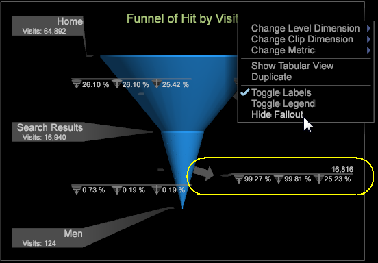

# Data Workbench 6.1 Release Notes{#data-workbench-release-notes}

Die Versionshinweise zu Data Workbench 6.1 umfassen neue Funktionen, Aktualisierungsanforderungen, Fehlerkorrekturen und bekannte Probleme.

## Neue Funktionen {#section-1225066ea8f44cf68e42e019d0bca816}

Data Workbench 6.1 umfasst die folgenden neuen Funktionen:

| Funktionen  | Beschreibung |
|--- |--- |
| 64-Bit-Windows-Aktualisierung | Die Komponenten Data Workbench Server, Berichtsserver und Client werden aktualisiert, um nur auf 64-Bit-Windows-Betriebssystemen ausgeführt zu werden. |
| Tendenzauswertung | Durch die Bewertung Ihrer Zielgruppe können Sie die Kundentreue identifizieren und statistisch feststellen, wer wahrscheinlich einen Verkauf umsetzen oder mit einer Geschichte oder Kampagne interagieren wird. Die Tendenzauswertung umfasst jetzt diese Visualisierungen, um Modelle anzuzeigen und die sich ändernde Korrelation der ausgewählten Metriken anzuzeigen.<ul><li>Der Modell-Viewer untersucht ein logistisches Regressionsmodell, das mit Propensity-Scoring generiert wurde, und zeigt die Gewichte der einzelnen Eingabevariablen (einschließlich des Konstantenbegriffs) und ihren statistischen Fehlerbereich an. </li><li>Lift- und Gewinn-Diagramme werden zur Bewertung der potenziellen Steigerung eines bewerteten Datenmodells verwendet.</li><li>Die Verwechslungsmatrix gibt vier Werte aus der Kombination von &quot;Aktiv Positiv (AP)&quot;, &quot;Aktiv Negativ (AN)&quot;, &quot;Vorhersage Positiv (PP)&quot;und &quot;Vorhersage Negativ&quot;(PN).</li> <li>Ab Version 6.1 haben Sie jetzt eine Speicheroption, um Tendenzwerte basierend auf zwei Typen zu speichern: Dimensionen oder Dimensionen und Metriken.</li><li>Sie können jetzt Strg-Alt klicken und per Drag &amp; Drop Elemente in Propensity Scoring und Cluster Builder hinzufügen. Zuvor mussten Sie Tabellenelemente aus der Tabelle in das Feld &quot;Elemente&quot;ziehen.</li></ul> |
| Data Workbench jetzt auf Chinesisch | Data Workbench unterstützt jetzt vereinfachtes Chinesisch für die Clientanwendung. Data Workbench unterstützt auch den Eingabemethoden-Editor (IME) als sekundären Texteingabeprozess für internationale Sprachen. |
| mathematische Funktionen | Sie können jetzt mathematische Funktionen zu Metriken, Mathematik-Transformationen und Arbeitsblattzellen hinzufügen, um Datensätze weiter zu berechnen. |
| Statistische Berechnungen | Tabellen bieten jetzt einen Zusammenfassungs-Abruf für Statistiken für Metrikspalten. Der Abruf kann den Mittelwert, die Standardabweichung, die Mindest- und Höchstwerte, die Varianz und die Gesamtanzahl für die Spalte anzeigen. Sie kann bei jeder Auswahl und Bewertung berücksichtigt werden. |
| Korrelationsmatrix-Filter | Die Korrelationsmatrix wurde mit einem Binärfilter aktualisiert, damit Sie Werte für eine oder beide korrelierte Metriken einschränken können, sodass Sie den Vergleich besser fokussieren können. Außerdem können Sie jetzt Dimensionselemente aus einer Dimensionstabelle hinzufügen, indem Sie Strg+Alt klicken und Elemente in die auszuwertende Matrixspalte oder -zeile ziehen. |
| Fallout-Beschriftung in Trichtervisualisierung ausblenden | Wechsel zwischen dem Anzeigen und Ausblenden von Fallout-Beschriftungen in einer Trichtervisualisierung durch Rechtsklicken auf den Titel und Auswahl von Fallout ausblenden. |

## Sortieren von Tabellenspalten{#sorting-table-columns}

Sortieren Sie Tabellenspalten alphabetisch oder durch Ordinalzeichen.

Um Elemente in einer Dimensionstabelle besser auszuwählen, können Sie die erste Spalte alphabetisch oder durch Ordinalzeichen ordnen, indem Sie die **[!UICONTROL Sort]** Menüoption auswählen.

Das Zeichen # wird angezeigt, wenn eine Spalte nach Ordinalzeichen sortiert wird (Standard).

**Sortieroption auswählen**

Um die Sortieroptionen zwischen Ordentlich und Alphabet zu ändern, klicken Sie mit der rechten Maustaste und wählen Sie **[!UICONTROL Sort]**. Klicken Sie auf den Pfeil, um die Reihenfolge umzukehren.

>[!NOTE]
>
>Sie können andere Spalten Ordentlich sortieren, indem Sie auf den Namen der Spalte klicken.

## Trichteranalysebeschriftungen im Trichter ausblenden

Wechsel zum Öffnen von Fallout-Beschriftungen in einer Trichtervisualisierung.

Die Trichtervisualisierung identifiziert, wo ein Kunde eine Marketingkampagne aufgibt oder von einem definierten Konversionspfad abweicht, während er mit Ihrer Website oder Ihrer kanalübergreifenden Kampagne interagiert. Auf der linken Seite der Trichtervisualisierung werden die Ergebnisse eines Besuchs oder von Besuchern angezeigt, auf der rechten Seite die Trichteranalyse derjenigen, die einen bestimmten Pfad verlassen.

Bei einer **[!UICONTROL Funnel]** Visualisierung können Sie mit der rechten Maustaste auf den Titel klicken und im Menü die Option zum Ausblenden **[!UICONTROL Hide Fallout]** der Fallout-Beschriftungen auswählen.

## Bekannte Probleme {#section-ff2180c6871c413480e15fa915c253b9}

* Beim Importieren einer Arbeitsfläche wird eine Fehlermeldung angezeigt, auch wenn der Import erfolgreich war.

   Problemumgehung: Klicken Sie auf OK, um den Fehler zu ignorieren. Die Arbeitsfläche wurde erfolgreich importiert.

**Probleme mit der vereinfachten chinesischen Lokalisierung**

* Der Dialogtitel und die Meldung, die nach dem Klicken auf &quot;Senden&quot;angezeigt werden, wenn das Ziel in der Scoring-Visualisierung festgelegt wird, sind unleserlich.

   Problemumgehung: Keine.
* Bei Verwendung des Wortumbruchs in der Arbeitsblattvisualisierung werden lokalisierte Wörter nicht korrekt umgebrochen. Der Zeichenfolge werden zusätzliche Leerzeichen hinzugefügt.

   Problemumgehung: Keines
* Der Installationsordner kann nicht gestartet werden, [!DNL Insight.exe] wenn der Name des Installationsordners nicht englische Zeichen enthält.

   Problemumgehung: Behalten Sie Standardnamen oder Umbenennungen nur mit englischen Zeichen im Ordnerpfad bei, um ausführbare Dateien zu starten.
