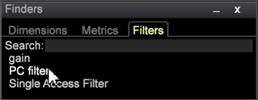

# Finder{#finders}

Verwenden Sie Finder-Bedienfelder in Data Workbench, um Metriken, Dimensionen und Filter auszuwählen. Diese Bedienfelder bieten Suchunterstützung, Sortierungsoptionen und Drag &amp; Drop-Funktionen.

Ein Finder-Bedienfeld kann in der linken Seitenleiste oder in einem Arbeitsbereich geöffnet werden.

<table id="table_3E43DBA0646842898F14F31374F9E39C"> 
 <thead> 
  <tr> 
   <th colname="col1" class="entry"> Dimension Finder </th> 
   <th colname="col2" class="entry"> Metriksuche </th> 
   <th colname="col3" class="entry"> Filter Finder </th> 
  </tr>
 </thead>
 <tbody> 
  <tr> 
   <td colname="col1"> 
Eine Liste aller Dimensionen in Ihrem Abfragemodell. 
 </td> 
   <td colname="col2"> 
Eine Liste aller Metriken in Ihrem Abfragemodell. 
 </td> 
   <td colname="col3"> 
Eine Liste aller für Ihre Organisation erstellten Filter. 
 </td> 
  </tr> 
 </tbody> 
</table>

**So öffnen Sie einen Finder:**

* Klicken Sie mit der rechten Maustaste in einen Arbeitsbereich und wählen Sie **[!UICONTROL Tools]** > **[!UICONTROL Finder]** aus.

   Der Finder-Bereich mit Registerkarten für Metriken, Dimensionen und Filter wird im Arbeitsbereich geöffnet.

* Klicken Sie mit der rechten Maustaste in die linke Seitenleiste und wählen Sie **[!UICONTROL Add]** > **[!UICONTROL Finder]** aus.

   Der Finder-Bereich wird im linken Bereich geöffnet.

**Finder** umfasst die folgenden Funktionen:

<table id="table_072047E919204577AE85789BAE0F4EE8"> 
 <thead> 
  <tr> 
   <th colname="col1" class="entry"> Finder-Funktionen </th> 
   <th colname="col2" class="entry"> Details </th> 
  </tr>
 </thead>
 <tbody> 
  <tr> 
   <td colname="col1"><b>Drag &amp; Drop</b> </td> 
   <td colname="col2"> 
 Sie können Dimensionen oder Metriken per Drag-and-Drop aus dem Bedienfeld in eine Visualisierung im Arbeitsbereich ziehen, um die Dimension zu ändern oder neue Metriken hinzuzufügen. 
 
    <ol id="ol_612DC76EC04C4FCE938B20B388C43CE8"> 
     <li id="li_7F73B781141E4B8CAE9800F580F62E44">Halten Sie die Schlüssel  &lt;Strg&gt; und  &lt;Alt&gt; gedrückt und wählen Sie die Dimension oder Metrik aus dem Finder-Bereich aus. </li> 
     <li id="li_631D57976F71415AA61F33EBBFDD128A">Ziehen Sie eine neue Dimension aus dem Bereich und legen Sie sie in der Visualisierung ab, um Dimensionen zu ändern oder hinzuzufügen. </li> 
     <li id="li_5329FB82225F46EBBE3A996A641058DE">Um Metriken hinzuzufügen, ziehen Sie eine neue Metrik aus dem Bereich und legen Sie sie in der Metrikkopfzeile der ausgewählten Visualisierung ab. </li> 
    </ol> 
Dies funktioniert für alle relevanten Visualisierungen, einschließlich Tabellen, Besuchercluster, Korrelationsmatrix, Streudiagramme und des 2D-Balkendiagramms (je nach Achse). 
 </td> 
  </tr> 
  <tr> 
   <td colname="col1"><b>Durchsuchen</b> </td> 
   <td colname="col2">Mit einem Feld  Suchen in den Finder-Bereichen können Sie Namen nach Dimensionen, Metriken und Filtern filtern. 
    <ul id="ul_0F6F377E9906472E99008EBE7483F689"> 
     <li id="li_75857895EDB045C8B2960393854B257D"> 
Musterabgleich (einfache glob-Suche). Beginnen Sie mit der Eingabe des Namens einer erforderlichen Dimension, Metrik oder Filterentität in das Suchfeld. Nur übereinstimmende Zeichenfolgen, die an einer beliebigen Stelle im Namen enthalten sind, werden gefiltert und im Bereich Finder angezeigt. 
 
Geben Sie beispielsweise Folgendes ein: 
 <code><b>Search:</b>click</code> 
Sie können die folgenden Ergebnisse im Dimensionen-Finder erhalten: 
 
 
 
Bei der Standardmusterübereinstimmung können Sie die Platzhalterzeichen verwenden, z. B. . (Punkt), "?" , und "*" (Stern). 
 </li> 
     <li id="li_044F9EC1399B44CD81E1852F85137704"> 
Reguläre Ausdrücke. Komplexere reguläre Ausdrücke werden auch für zusätzliche Suchfunktionen unterstützt. Fügen Sie das Präfix "re:"vor Ihrem Suchbegriff (keine Leerzeichen) hinzu, um es als regulären Ausdruck zu interpretieren. 
 
Geben Sie beispielsweise Folgendes ein: 
 <code><b>Search:</b>re.*ip</code> 
Sie können die folgenden Ergebnisse im Dimensionen-Finder erhalten: 
 
 
 </li> 
    </ul> 
Detaillierte Suchinformationen finden Sie unter <a href="https://docs.adobe.com/content/help/en/data-workbench/using/dataset/c-reg-exp.html" format="http" scope="external"> reguläre Ausdrücke</a>. 
 </td> 
  </tr> 
  <tr> 
   <td colname="col1"><b>Dimension Typ</b> </td> 
   <td colname="col2">Im Tab Dimension können Sie mit der rechten Maustaste auf die Registerkartenüberschrift klicken, um sie nach Dimensionstyp zu sortieren. 
 
     <ul id="ul_D36B8474730F4859BC7AA015CC1B8EF0"> 
      <li id="li_4AE1D5699D0E45AF880A134F886B8B19">Attribute: Dimensionen, die auf den Eigenschaften des Besuchers, der Produkte, der Geografie, der Zeit, des Videos und anderen Attributen basieren. </li> 
      <li id="li_0B2A08F8CBE94356AC506F95DC268C47">Cluster - Dimensionen, die im Cluster-Builder erstellt wurden. </li> 
      <li id="li_4BC3396A680B49A4B6BDAAD066826864">Bewertungen - Dimensionen, die innerhalb der Tendenzauswertung erstellt wurden. </li> 
     </ul> 
 </td> 
  </tr> 
  <tr> 
   <td colname="col1"><b>Beschriftung</b> </td> 
   <td colname="col2">In jeder Registerkarte können Sie mit der rechten Maustaste klicken und  Beschriftung auswählen, um den Finder-Bereich umzubenennen. 
 
 
Die Standardbezeichnungen für Dimensionen, Metriken und Filter können in einen Registerkartennamen geändert werden, der den Konventionen Ihres Unternehmens entspricht. 
 </td> 
  </tr> 
  <tr> 
   <td colname="col1"><b>Element hinzufügen</b> </td> 
   <td colname="col2">Sie können auf jeder Registerkarte mit der rechten Maustaste klicken und  Element hinzufügen auswählen, um eine Tabelle zu öffnen und Dimensionen, Metriken und Filter manuell hinzuzufügen. </td> 
  </tr> 
  <tr> 
   <td colname="col1"><b>Suchleiste</b> </td> 
   <td colname="col2">Klicken Sie mit der rechten Maustaste in die Leiste  Finders in der linken Seitenleiste, um ein Menü für zusätzliche Funktionen zu öffnen. 
 
 </td> 
  </tr> 
  <tr> 
   <td colname="col1"><b>Close</b> </td> 
   <td colname="col2">Klicken Sie mit der rechten Maustaste in die Leiste  Finders und wählen Sie  Schließen aus, um einen Finder-Bereich zu schließen. </td> 
  </tr> 
  <tr> 
   <td colname="col1"><b>Speichern</b> </td> 
   <td colname="col2">Speichern Sie die Liste lokal, indem Sie mit der rechten Maustaste in die Kopfzeilenleiste klicken und die Option  Speichern auswählen. </td> 
  </tr> 
  <tr> 
   <td colname="col1"><b>Exportieren</b> </td> 
   <td colname="col2">Sie können eine Liste ausgewählter Dimensionen, Metriken oder Filter aus dem Finder-Bereich exportieren, indem Sie mit der rechten Maustaste in der Suchleiste klicken und  Export aus dem Menü auswählen. 
 Fügen Sie einen Namen hinzu und exportieren Sie diese in Microsoft Excel. 
 </td> 
  </tr> 
  <tr> 
   <td colname="col1"><b>Copy</b> </td> 
   <td colname="col2"> Kopieren Sie eine Liste mit Dimensionen, Metriken oder Filtern. Sie können als Datei oder als Grafik in dunklem Hintergrund, heller Hintergrund oder Monochrom kopieren. </td> 
  </tr> 
  <tr> 
   <td colname="col1"><b>Minimieren</b> </td> 
   <td colname="col2"> Minimieren Sie den Finder-Bereich. Es wird nur die Suchleiste angezeigt. </td> 
  </tr> 
  <tr> 
   <td colname="col1"><b>Borderless</b> </td> 
   <td colname="col2"> Zeigt einen Bereich ohne Randlinien für Finder im Arbeitsbereich an (jedoch nicht in der linken Seitenleiste). </td> 
  </tr> 
 </tbody> 
</table>

