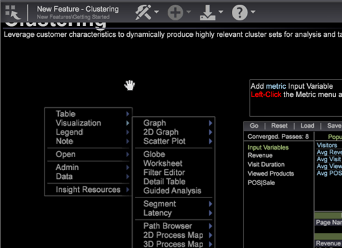

# Versionshinweise zu Data Workbench 6.2{#data-workbench-release-notes}

Versionshinweise zu Data Workbench 6.2 umfassen neue Funktionen, Aktualisierungsanforderungen, Fehlerkorrekturen und bekannte Probleme.

## Neue Funktionen {#section-1225066ea8f44cf68e42e019d0bca816}

Data Workbench 6.2 umfasst die folgenden neuen Funktionen:

| Funktionen | Beschreibung |
|--- |--- |
| Entscheidungsbäume | Entscheidungsbäume sind eine Visualisierung der Analyse, die zur Auswertung von Merkmalen und Beziehungen der Besucher verwendet wird. Der Entscheidungsbaum-Aufbau erzeugt eine Entscheidungsbaumdarstellung basierend auf einem angegebenen positiven Fall und einer Reihe von Eingaben. |
| Aktualisieren auf Binärfilter in Korrelationsmatrix | Der Binärfilter wurde mit neuen Funktionen aktualisiert, sodass Sie jede Korrelationsmatrix mit einem Binärfilter neu erstellen müssen, der in früheren Versionen erstellt wurde. |
| Dichtekarte | Die Dichtekarte ist eine Visualisierung, bei der Elemente als schattierte Rechtecke innerhalb einer Quadratkarte angezeigt werden. |
| Attributionsprofil | Zur schnellen Analyse der Zuordnungswerte (Ereignisse, die die Verantwortung für eine erfolgreiche Konvertierung oder einen erfolgreichen Verkauf zuweisen) stellt die Data Workbench ein regelbasiertes Zuordnungs-Profil mit Funktionen zur Verfügung, mit denen der Architekt die Zuordnungsberichte einrichten und der Analyst die Berichte ausführen kann. |
| Analyseberichte | Berichtsvorlagen standardisieren Adobe Analytics-Berichte für Benutzer der Data Workbench, die das Adobe SC-Profil verwenden. Diese Berichte sind identisch mit den Berichten, die in Marketing Reports &amp; Analysen (früher SiteCatalyst) verwendet werden. |
| 3D-Streudiagramme | Ein 3D-Streudiagramm zeichnet die Elemente einer Datendimension (z. B. Tage oder Referrer-Site) in einem dreidimensionalen Raster auf, wobei die X-, Y- und Z-Achsen verschiedene Metriken darstellen. |

## Aktualisierungen der Benutzeroberfläche von Data Workbench Client{#data-workbench-client-ui-updates}

Data Workbench 6.2 umfasst neue Aktualisierungen der Benutzeroberfläche für das Lesezeichenbedienfeld, neue Symbole in der Symbolleiste des Arbeitsbereichs, die Möglichkeit, den Arbeitsbereich innerhalb eines Bildschirms zu ziehen, neue Schnellschlüssel und Aktualisierungen für die Visualisierung des Kreisdiagramms.

## Neue Funktionen für Lesezeichen {#section-e361b605441540ca8213c3fddb5e0718}

Sie können nun Lesezeichen für wichtige Arbeitsbereiche erstellen, um schnell zwischen Visualisierungen und Berichten zu wechseln, die in Ihrem Arbeitsablauf verwendet werden.

**Arbeiten mit Lesezeichen**

1. Markieren Sie einen Arbeitsbereich mit einem Lesezeichen, indem Sie auf das Lesezeichen-Symbol  in der oberen rechten Ecke der Symbolleiste klicken.
1. Klicken Sie auf **[!UICONTROL Add]** > **[!UICONTROL Bookmarks Panel]** , um eine Liste von Lesezeichen zu öffnen.

   

1. Um einen mit Lesezeichen versehenen Arbeitsbereich zu öffnen, klicken Sie auf einen Arbeitsflächennamen in der **[!UICONTROL Bookmark Panel]**.

   

   Der ausgewählte Arbeitsbereich wird geöffnet. Wenn Sie auf einen anderen mit Lesezeichen versehenen Arbeitsbereich klicken, wird der vorherige Arbeitsbereich geschlossen und der neu ausgewählte Arbeitsbereich wird geöffnet, sodass Sie schnell durch Ihren Arbeitsablauf navigieren können.

**So löschen Sie ein Lesezeichen:**

* Klicken Sie im Lesezeichenbedienfeld mit der rechten Maustaste und wählen Sie &quot; **Entfernen&quot;,`<bookmark title>`** um ein ausgewähltes Lesezeichen zu löschen, oder wählen Sie **[!UICONTROL Clear All Bookmarks]** zum Löschen aller Lesezeichen aus.

* Sie können auch mit der rechten Maustaste auf den Arbeitsbereich in der Miniaturansicht-Ansicht auf der Arbeitsfläche klicken und **[!UICONTROL Clear Bookmark]** auswählen.

>[!IMPORTANT]
>
>* 25 Lesezeichen können gespeichert werden.
>* Wenn Sie ein Lesezeichen hinzufügen und dann die Position der Arbeitsfläche verschieben, ist das Lesezeichen ungültig und muss aus dem Lesezeichenbedienfeld gelöscht und zurückgesetzt werden.

>

## Neue Symbole in Workspace {#section-c108bbd1661249e79c146727ff3d2470}

Data Workbench 6.2 ersetzt jetzt den Text im Arbeitsbereich durch Symbole. Sie können immer noch den Mauszeiger darüber halten und die QuickInfo-Meldung anzeigen, die das Symbol einschließlich **[!UICONTROL File]**, **[!UICONTROL Add]** und **[!UICONTROL Export]** angibt.

Ein neues **[!UICONTROL Help]** Symbol wird hinzugefügt, um auf die Dokumentation und andere Wissenszentren zuzugreifen, einschließlich der folgenden Links:

<table id="table_64BBC67B1BB44B1197FF7E5E7B067696"> 
 <thead> 
  <tr> 
   <th colname="col1" class="entry"> Dokumentationslinks </th> 
   <th colname="col2" class="entry"> Beschreibung </th> 
  </tr>
 </thead>
 <tbody> 
  <tr> 
   <td colname="col1"> Marketing Reports &amp; Analytics  </td> 
   <td colname="col2">Öffnen Sie die Hilfeseite  Adobe Marketing Reports &amp; Analysen . </td> 
  </tr> 
  <tr> 
   <td colname="col1"> Ideenbörse </td> 
   <td colname="col2">Öffnen Sie die  Idea Exchange-Anmeldung. Dieses Online-Portal ermöglicht es Benutzern, aktualisierte Änderungen und Verbesserungsvorschläge für Data Workbench bereitzustellen. Über diese kundenorientierten Ideen können dann alle Benutzer abstimmen. </td> 
  </tr> 
  <tr> 
   <td colname="col1"> Hilfe </td> 
   <td colname="col2">Öffnen Sie die Dokumentation zur  Data Workbench. 
Sie können auch  &lt;F1&gt; drücken, um die Hilfe in einem Arbeitsbereich zu öffnen. 
 </td> 
  </tr> 
  <tr> 
   <td colname="col1"> Info </td> 
   <td colname="col2">Öffnen, um die  Clientversion von Data Workbench zu identifizieren. </td> 
  </tr> 
 </tbody> 
</table>

>[!NOTE]
>
>Sie können die Dokumentation auch über `<F1>` eine Arbeitsfläche öffnen.

## Arbeitsbereich-Ansichten ziehen {#section-9129c340c21d45a3864c923884cd4382}

Wenn eine Arbeitsfläche größer als der sichtbare Bildschirm ist, können Sie die Ansicht verschieben, um alle Elemente im Arbeitsbereich anzuzeigen. Sie können im Hintergrund (außerhalb der Visualisierungen und Tabellen) klicken und den Bildschirm ziehen, um den sichtbaren Bereich innerhalb des Arbeitsbereichs zu verschieben. Der Cursor ändert sich in ein Handsymbol, wenn die Ansicht innerhalb des Arbeitsflächenrahmens gezogen wird.

## Schnelltasten zum Ändern der Workspace-Ansichten {#section-d8322f72423f437aa2e34f2188b1341c}

Mit den neuen QuickKeys können Sie die Größe und Größe von Arbeitsbereichen zwischen Fenster- und ganzseitigen Ansichten ändern.

<table id="table_A01C514C99F043338D183A6839E03DEA"> 
 <thead> 
  <tr> 
   <th colname="col1" class="entry"> Befehle </th> 
   <th colname="col2" class="entry"> Schnelltasten </th> 
   <th colname="col3" class="entry"> Kombinierte Menübefehle </th> 
  </tr>
 </thead>
 <tbody> 
  <tr> 
   <td colname="col1"><b>Ansicht</b>im Vollbildmodus. Workspace füllt den Bildschirm aus und nimmt die neue Größe an. </td> 
   <td colname="col2"><b>Strg+</b> 
Strg + (auf der Tastatur) 
 
<i>oder</i> 
 
Strg+Umschalt+5 (auf der Tastatur) 
 </td> 
   <td colname="col3"> 
    <ul id="ul_C7C731B894D946D9916F50806F015857"> 
     <li id="li_452B4C119B1A40038A408CFFC53653A9">Datei &gt; Seitengröße &gt; Füllbildschirm 
<i>gefolgt von</i> 
 </li> 
     <li id="li_DE9B8B31B9F24A6AA68A1D0DB886B501">Datei &gt; Arbeitsbereich umbenennen </li> 
    </ul> </td> 
  </tr> 
  <tr> 
   <td colname="col1"><b>Ansicht</b>des Fensters. Workspace wird in einer Ansicht des Standardfensters angezeigt und bezieht sich auf die neue Größe. </td> 
   <td colname="col2"><b>Strg minus</b> 
Strg - 
 </td> 
   <td colname="col3"> 
    <ul id="ul_3474B9EFD69343C09BC84E485D896C28"> 
     <li id="li_820BAED76FF24A5785E6D89C5C692DD5">Datei &gt; Seitengröße &gt; Standard 
<i>gefolgt von</i> 
 </li> 
     <li id="li_337789F282CE4C2C990C67B115782454">Datei &gt; Arbeitsbereich umbenennen </li> 
    </ul> </td> 
  </tr> 
 </tbody> 
</table>

## Fehlerkorrekturen {#section-8704a9ac358246cd81233dd0982d534f}

* Die Suchdatei von Visual Site wurde aktualisiert, um Suchmaschinenänderungen am Suchbegriff Abfrage zu beheben.
* Die Fehlermeldung &quot;Arbeitsbereich konnte nicht importiert werden&quot;wurde korrigiert, wenn ein Arbeitsbereich auf der Client-Workstation importiert wurde, obwohl der Import erfolgreich war.
* Der Workstation-Verbindungsfehler, der die Meldung &quot;412 Konfigurationskonflikt&quot;anzeigt, wird jetzt durch eine benutzerfreundliche Meldung ersetzt, die die Systemaktion identifiziert.
* In Report Server kann jetzt der Befehl „post“ ausgeführt werden.
* Korrektur von Benutzeroberflächenfehlern in der Client-Benutzeroberfläche für vereinfachtes Chinesisch.
* Adobe Analytics hat den Data Feed aktualisiert, der Data Workbench befähigt, Profil und Audiencen zu nutzen, die in das Adobe Experience Cloud integriert sind. Alle Nutzer der Data Workbench mussten ihre Umgebung bis zum 21. April 2014 auf diese Transition vorbereiten.

   Profile und Audiencen wurden eingeführt, um eine vollständige Ansicht der Kunden in Adobe Analytics zu bieten. Dieser neue Dienst ist innerhalb der Adobe Experience Cloud verfügbar, um die Analysewerkzeuge noch wertvoller zu gestalten und so die Grundlage für diese Funktionen in Analytics zu schaffen. Die neue Experience Cloud-Besucher-ID wird dem Datenfeed zusammen mit anderen Verbesserungen und Verbesserungen hinzugefügt, um sich an den neuen Datenfeed und die globale Besucher-ID anzupassen.
* Beim Importieren einer Arbeitsfläche wird eine Fehlermeldung angezeigt, auch wenn der Import erfolgreich war.

## Upgrade-Voraussetzung {#section-3cc74d08f7454d698b5a6d3f1dcde282}

* Das Attribution-Profil ist für Benutzer konfiguriert, die das Adobe SC-Profil implementiert haben, um den Analytics-(SC/Insight-)Datenfeed zu verwenden. Standardmäßig werden die Ereignis Marketing und Konversion als Standardinteraktionen verwendet, die in den regelbasierten Modellen ausgewertet werden.
* Wenn Sie die Standardkonfigurationen nicht verwenden, überprüfen Sie bei Adobe SC Profil-Upgrade auf Data Workbench 6.2, ob der [!DNL x-bot_id] Dateiwert richtig dekodiert wird und ob das [!DNL SC Fields.cfg] Feld ordnungsgemäß in den Dateien [!DNL x-bot_id] und [!DNL Decoding Instructions.cfg] [!DNL Exclude Hit.cfg] Dateien aufgeführt ist. Dies ist nur dann ein Problem, wenn Sie die Konfigurationsdatei aus der Standardkonfiguration geändert haben.

* Wenn Sie ungenutzte Felder im Profil **[!UICONTROL Dataset]** > **[!UICONTROL Log Processing]** > **[!DNL SC Fields.cfg]** für das Adobe SC gelöscht haben, müssen Sie die aktualisierten Feldwerte für das Profil Attribution aktualisieren.

## Bekannte Probleme {#section-dbb307639835493a83409f5f461932b8}

* Wenn die Visualisierung des 3D-Streudiagramms Berechnungen enthält, werden im Zoom möglicherweise auch Diagramme außerhalb des Randes der Visualisierung angezeigt.

   Problemumgehung: Zoomen Sie zuerst den Streudiagramm und fügen Sie dann der Visualisierung Aufschlüsselungen hinzu.
* Wenn Sie die Metrik aus dem Finder-Bedienfeld in die MetrikLegende außerhalb der Metrikspalte ziehen, wird die Metriklegende aus dem Arbeitsbereich gelöscht.

   Problemumgehung: Benutzer, die Metriken in die Metriklegende ziehen möchten, sollten in der ersten Spalte (Metrikspalte) ablegen.
* Drucken Sie Arbeitsbereich mit der Seitenleiste und Beide Optionen enthalten keine Copyright-Informationen auf der gedruckten Seite.
* Die Verwendung von Workstation in einer Remote-Desktop-Sitzung stürzt beim Umbenennen von Arbeitsbereichen ab.
* (In vereinfachter chinesischer Version) Die tatsächlichen Berichtausgaben sind im Berichtsserver gültig, aber Betreffzeilen und Dateinamen von Anlagen sind beschädigt.
* (In vereinfachter Chinesisch-Version) Bei Verwendung von Wortumbrüchen in der Arbeitsblatt-Visualisierung werden lokalisierte Wörter nicht korrekt umgebrochen, was dazu führt, dass der Zeichenfolge Leerzeichen hinzugefügt werden.
* (In vereinfachter Chinesisch-Version) Insight.exe kann nicht gestartet werden, wenn der Installationsordner mit nicht-englischen Zeichen benannt ist.

   Problemumgehung: Behalten Sie Standardnamen oder Umbenennungen nur mit englischen Zeichen im Ordnerpfad bei, um ausführbare Dateien zu starten.

