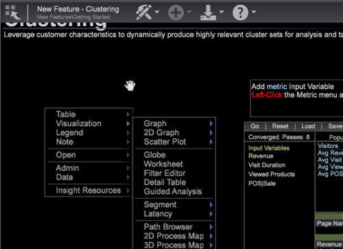

# Aktualisierungen der Benutzeroberfläche von Data Workbench{#data-workbench-client-ui-updates}

Data Workbench 6.2 umfasst neue Aktualisierungen der Benutzeroberfläche des Lesezeichenbedienfelds, neue Symbole in der Workspace-Symbolleiste, die Möglichkeit, den Arbeitsbereich in einen Bildschirm zu ziehen, neue Schnellschlüssel und Aktualisierungen der Kreisdiagrammdarstellung.

## Neue Funktionen für Lesezeichen {#section-e361b605441540ca8213c3fddb5e0718}

Sie können nun Lesezeichen für wichtige Arbeitsbereiche erstellen, um schnell zwischen Visualisierungen und Berichten zu wechseln, die in Ihrem Arbeitsablauf verwendet werden.

**Arbeiten mit Lesezeichen**

1. Markieren Sie einen Arbeitsbereich mit einem Lesezeichen, indem Sie auf das Lesezeichen-Symbol  in der oberen rechten Ecke der Symbolleiste klicken.
1. Klicken Sie auf **[!UICONTROL Add]** > **[!UICONTROL Bookmarks Panel]** , um eine Liste der Lesezeichen zu öffnen.

   

1. Um einen mit Lesezeichen versehenen Arbeitsbereich zu öffnen, klicken Sie auf einen Arbeitsflächennamen in der **[!UICONTROL Bookmark Panel]**.

   

   Der ausgewählte Arbeitsbereich wird geöffnet. Wenn Sie auf einen anderen mit Lesezeichen versehenen Arbeitsbereich klicken, wird der vorherige Arbeitsbereich geschlossen und der neu ausgewählte Arbeitsbereich wird geöffnet, sodass Sie schnell durch Ihren Arbeitsablauf navigieren können.

**So löschen Sie ein Lesezeichen:**

* Klicken Sie im Lesezeichenbedienfeld mit der rechten Maustaste und wählen Sie **[!UICONTROL Entfernen<bookmark title>]**zum Löschen eines ausgewählten Lesezeichens oder zum Löschen aller Lesezeichen **[!UICONTROL Clear All Bookmarks]**auswählen.

* Sie können auch mit der rechten Maustaste auf den Arbeitsbereich in der Miniaturansicht auf der Arbeitsfläche klicken und **[!UICONTROL Clear Bookmark]** die Option auswählen.

>[!IMPORTANT]
>
>* 25 Lesezeichen können gespeichert werden.
>* Wenn Sie ein Lesezeichen hinzufügen und dann die Position der Arbeitsfläche verschieben, ist das Lesezeichen ungültig und muss aus dem Lesezeichenbedienfeld gelöscht und zurückgesetzt werden.
>

## Neue Symbole in Workspace {#section-c108bbd1661249e79c146727ff3d2470}

Data Workbench 6.2 ersetzt jetzt den Text im Arbeitsbereich durch Symbole. Sie können immer noch den Mauszeiger darüber halten und die QuickInfo-Meldung anzeigen, die das Symbol einschließlich **[!UICONTROL File]**, **[!UICONTROL Add]** und **[!UICONTROL Export]** angibt.

Ein neues **[!UICONTROL Help]** Symbol wird hinzugefügt, um auf die Dokumentation und andere Wissenszentren zuzugreifen, einschließlich der folgenden Links:

<table id="table_64BBC67B1BB44B1197FF7E5E7B067696"> 
 <thead> 
  <tr> 
   <th colname="col1" class="entry"> Dokumentationslinks </th> 
   <th colname="col2" class="entry"> Beschreibung </th> 
  </tr>
 </thead>
 <tbody> 
  <tr> 
   <td colname="col1"> Marketing Reports &amp; Analytics </td> 
   <td colname="col2">Öffnen Sie die Hilfeseite  Adobe Marketing Reports &amp; Analysen . </td> 
  </tr> 
  <tr> 
   <td colname="col1"> Ideenaustausch </td> 
   <td colname="col2">Öffnen Sie die  Idea Exchange-Anmeldung. Dieses Online-Portal ermöglicht es Benutzern, aktualisierte Änderungen und Verbesserungsvorschläge für Data Workbench bereitzustellen. Über diese kundenorientierten Ideen können dann alle Benutzer abstimmen. </td> 
  </tr> 
  <tr> 
   <td colname="col1"> Hilfe </td> 
   <td colname="col2">Öffnen Sie die  Data Workbench-Dokumentation. 
Sie können auch  &lt;F1&gt; drücken, um die Hilfe in einem Arbeitsbereich zu öffnen. 
 </td> 
  </tr> 
  <tr> 
   <td colname="col1"> Info </td> 
   <td colname="col2">Öffnen, um die  Clientversion von Data Workbench zu identifizieren. </td> 
  </tr> 
 </tbody> 
</table>

>[!NOTE]
>
>Sie können die Dokumentation auch über `<F1>` eine Arbeitsfläche öffnen.

## Ansichten in Arbeitsbereich ziehen {#section-9129c340c21d45a3864c923884cd4382}

Wenn eine Arbeitsfläche größer als der sichtbare Bildschirm ist, können Sie die Ansicht verschieben, um alle Elemente im Arbeitsbereich anzuzeigen. Sie können im Hintergrund (außerhalb der Visualisierungen und Tabellen) klicken und den Bildschirm ziehen, um den sichtbaren Bereich innerhalb des Arbeitsbereichs zu verschieben. Der Cursor ändert sich in ein Handsymbol, wenn Sie die Ansicht innerhalb des Arbeitsflächenrahmens ziehen.

## Schnelltasten zum Ändern der Workspace-Ansichten {#section-d8322f72423f437aa2e34f2188b1341c}

Mit den neuen QuickKeys können Sie die Größe und Größe von Arbeitsbereichen zwischen Fenster- und Vollseitenansichten ändern. Weitere Tastenkombinationen finden Sie in der [Kurzübersicht](https://docs.adobe.com/content/help/en/data-workbench/using/client/visualizations/c-qk-ref.html) .

<table id="table_A01C514C99F043338D183A6839E03DEA"> 
 <thead> 
  <tr> 
   <th colname="col1" class="entry"> Befehle </th> 
   <th colname="col2" class="entry"> Schnelltasten </th> 
   <th colname="col3" class="entry"> Kombinierte Menübefehle </th> 
  </tr>
 </thead>
 <tbody> 
  <tr> 
   <td colname="col1"><b>Vollbildansicht</b>. Workspace füllt den Bildschirm aus und nimmt die neue Größe an. </td> 
   <td colname="col2"><b>Strg+</b> 
Strg + (auf der Tastatur) 
 
<i>oder</i> 
 
Strg+Umschalt+5 (auf der Tastatur) 
 </td> 
   <td colname="col3"> 
    <ul id="ul_C7C731B894D946D9916F50806F015857"> 
     <li id="li_452B4C119B1A40038A408CFFC53653A9">Datei &gt; Seitengröße &gt; Füllbildschirm 
<i>gefolgt von</i> 
 </li> 
     <li id="li_DE9B8B31B9F24A6AA68A1D0DB886B501">Datei &gt; Arbeitsbereich umbenennen </li> 
    </ul> </td> 
  </tr> 
  <tr> 
   <td colname="col1"><b>Fensteransicht</b>. Workspace wird in einer Standardansicht des Fensters angezeigt und bezieht sich auf die neue Größe. </td> 
   <td colname="col2"><b>Strg minus</b> 
Strg - 
 </td> 
   <td colname="col3"> 
    <ul id="ul_3474B9EFD69343C09BC84E485D896C28"> 
     <li id="li_820BAED76FF24A5785E6D89C5C692DD5">Datei &gt; Seitengröße &gt; Standard 
<i>gefolgt von</i> 
 </li> 
     <li id="li_337789F282CE4C2C990C67B115782454">Datei &gt; Arbeitsbereich umbenennen </li> 
    </ul> </td> 
  </tr> 
 </tbody> 
</table>

