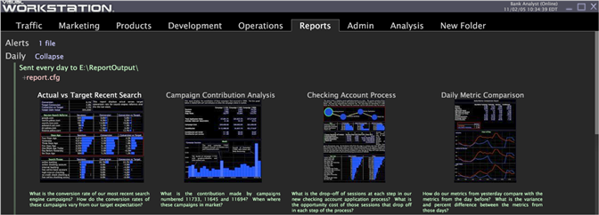

# Überprüfen des Report Server- und Berichtssatzstatus{#reviewing-report-status}

Informationen zum Status Ihres Berichtsservers und zum Berichtssatzstatus.

* [Berichtsserverstatus](../../../home/c-rpt-oview/c-admin-rpt/c-rev-rpt-st.md#section-1a84f22439ee4a4ba2b3434e51e82ce0)
* [Berichtsstatus](../../../home/c-rpt-oview/c-admin-rpt/c-rev-rpt-st.md#section-8569b94266b74a1f85d2a85106a2aaef)

## Berichtsserverstatus {#section-1a84f22439ee4a4ba2b3434e51e82ce0}

**Empfohlene Häufigkeit:** Nur bei Bedarf

[!DNL Report] sendet alle zwei Minuten Statusinformationen zum Status des  [!DNL Report] Servers an den Data Workbench-Server. Diese Informationen werden unter dem Knoten [!DNL Report Server Status] in der [!DNL Detailed Status]-Schnittstelle angezeigt.

**So öffnen Sie die  [!DNL Detailed Status] Visualisierung**

1. Klicken Sie in Data Workbench mit der rechten Maustaste in einen Arbeitsbereich und klicken Sie auf **[!UICONTROL Admin]** > **[!UICONTROL Servers]**.

1. Klicken Sie in der [!DNL Servers]-Schnittstelle mit der rechten Maustaste auf das Symbol des Data Workbench-Servers, mit dem der [!DNL Report]-Computer eine Verbindung herstellt, und klicken Sie auf **[!UICONTROL Detailed Status.]**

1. Klicken Sie auf **[!UICONTROL Report Server Status]**.

Wenn mehr als ein [!DNL Report] mit dem Data Workbench-Server verbunden ist, wird für jedes [!DNL Report Server] im Statusvektor ein Eintrag angezeigt. Das zweiminütige Intervall kann überschrieben werden, indem ein Wert im Parameter &quot;Statusintervall (seconds)&quot;im Knoten [!DNL Reporting] der Datei [!DNL ReportServer.cfg] angegeben wird.

Weitere Informationen zur Datei [!DNL ReportServer.cfg] finden Sie unter [Berichtssatz konfigurieren](../../../home/c-rpt-oview/c-work-rpt-sets/t-create-rpt-set/t-config-rpt-set/t-config-rpt-set.md#task-cfb2fd0c28bc48c2acdd582fe0d670d0). Weitere Informationen zum Konfigurieren von [!DNL Report] finden Sie unter [Bericht](../../../home/c-rpt-oview/c-inst-rpt/c-inst-rpt.md#concept-3b8696a5b7f04ebfaafec7ff55890d91) installieren.

Weitere Informationen zu [!DNL Detailed Status] finden Sie im Kapitel &quot;Verwaltungsschnittstellen&quot;des *Data Workbench-Benutzerhandbuchs*.

## Berichtssatzstatus {#section-8569b94266b74a1f85d2a85106a2aaef}

**Empfohlene Häufigkeit:** Nur bei Bedarf

[!DNL Report] Sendet Statusinformationen für jeden Bericht, der auf den Data Workbenchs-Server eingestellt ist. Grundlegende Informationen, z. B. wann ein Bericht generiert und wo er verteilt wird, werden in der Data Workbench über dem Berichtssatz in grünem Text angezeigt. Bei der Ausführung von Berichten gibt [!DNL Report] der Server alle zwei Minuten eine Meldung aus, die angibt, wie viel Prozent der aktuellen Abfragen abgeschlossen sind. Dieses zweiminütige Intervall kann überschrieben werden, indem ein Wert im Parameter &quot;Intervall für Abschlussmeldung (Sekunden)&quot;im Knoten [!DNL Reporting] der Datei [!DNL ReportServer.cfg] angegeben wird.

>[!NOTE]
>
>Wenn beim Ausführen eines Berichts ein Fehler aufgetreten ist, wird der Fehler in rotem Text unter der Miniaturansicht des Berichts angezeigt. Sie können mit der rechten Maustaste auf den Arbeitsbereich klicken, um die vollständige Fehlermeldung anzuzeigen.
